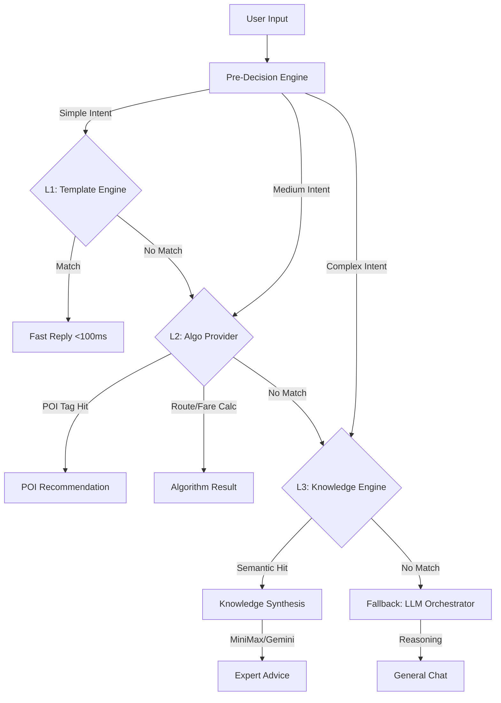

# Hybrid Decision Flow

本文件定義 LUTAGU 的 AI 混合決策漏斗 (Decision Funnel)。
目標是將 80% 的流量保留在低成本、高回應速度的層級，僅將 20% 的複雜問題導向 LLM。

## 🌊 決策漏斗 (The Funnel)

## 🏗️ 5層架構詳解

### Layer 1: Template Engine (樣板引擎)
*   **Cost**: Zero Token
*   **Latency**: < 50ms
*   **用途**: 高頻固定問答、招呼語、錯誤訊息。
*   **範例**: "你好", "系統錯誤"

### Layer 2: Algorithm & POI Tags (演算法層)
*   **Cost**: Zero Token (DB Query)
*   **Latency**: < 200ms
*   **用途**: 
    1. **POI Tags**: 搜尋「拉麵」、「廁所」（使用 L1 Tagging 系統）。
    2. **Hard Calc**: 計算票價、查詢時刻表、最短路徑 (Dijkstra)。

### Layer 3: Knowledge Base (知識庫層)
*   **Cost**: Low (Vector Search + Summarization)
*   **Latency**: ~1.5s
*   **用途**: RAG 檢索。查詢「如何搭新幹線」、「西瓜卡怎麼退」。
*   **機制**: 搜尋相似知識片段 -> LLM 合成回覆。

### Layer 4: Reasoning & Orchestrator (推理中樞)
*   **Model**: **MiniMax-M2.1** (Primary)
*   **Cost**: High
*   **Latency**: > 2s
*   **用途**: 複雜決策、處理這裡沒定義的 Edge Cases、多步驟推理。

### Layer 5: Safety & Fallback (安全層)
*   **用途**: 阻擋惡意 Prompt、災難應對建議 (L5)、最後一道防線。

---

## 🚦 關鍵規則

1. **AI-First but Cost-Aware**: 雖然稱為 AI-First，但必須優先嘗試非 LLM 的解法。
2. **Deterministic Priority**: 票價和時刻表必須準確，**嚴禁**使用 LLM 幻覺生成，必須走 L2 Algorithm。
3. **Context Injection**: 進入 L3/L4 時，必須注入 `User Context` (時間、位置、天氣)。
