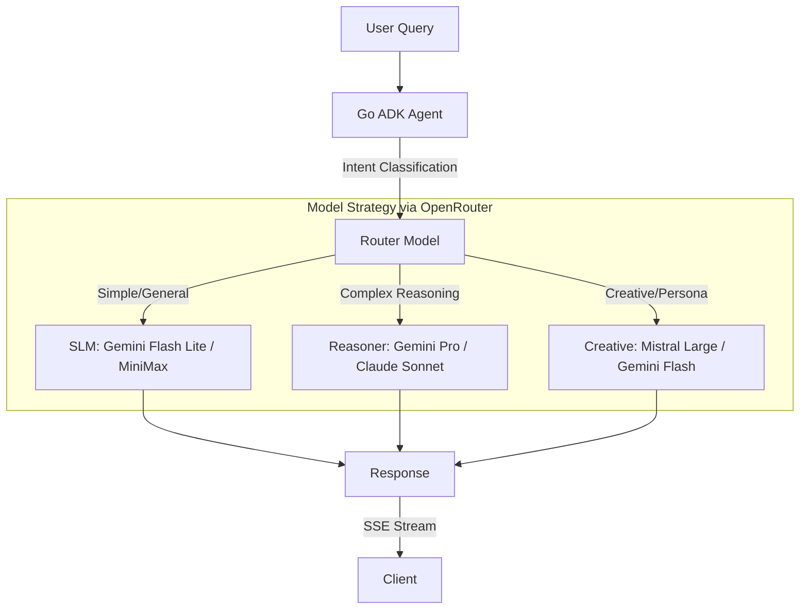

# LUTAGU（ルタグ）產品介紹說明書
## AI-Driven Urban Empathy Navigation System

**版本**: v2.1
**日期**: 2026-01-24
**公司**: LUTAGU Inc.
**產品定位**: 可擴展至全球任何城市的 AI 城市理解系統

---

## 目錄

1. [執行摘要](#1-執行摘要)
2. [產品理念與願景](#2-產品理念與願景)
3. [市場痛點分析](#3-市場痛點分析)
4. [產品解決方案](#4-產品解決方案)
5. [核心價值主張](#5-核心價值主張)
6. [產品功能介紹](#6-產品功能介紹)
7. [技術架構說明](#7-技術架構說明)
8. [商業模式](#8-商業模式)
9. [市場策略](#9-市場策略)
10. [發展藍圖](#10-發展藍圖)
11. [競爭分析](#11-競爭分析)
12. [社會價值](#12-社會價值)

---

## 1. 執行摘要

### 1.1 產品定位：判斷委託,非資訊顯示

**LUTAGU（ルタグ）** = **LU** (Location) + **TA** (Tag) + **GU** (Guide)

這是一套 **「判斷委託系統」**，不是「資訊查詢工具」。

**核心定位差異**:
```
傳統工具: 使用者查詢 → 系統顯示資料 → 使用者自己判斷
LUTAGU:   使用者描述情境 → 系統理解意圖 → 系統做出判斷 → 給一個建議
```

**產品本質**:
- **不是**：交通資訊檢索引擎
- **不是**：路線比較工具
- **而是**：替旅客做決策的「判斷代理人」

**四個核心原則**:

1. **判斷委託 > 資訊顯示**
   - 使用者不需要「看 10 條路線」,需要的是「你現在應該搭這一班」
   - 系統價值在於「替使用者承擔決策壓力」

2. **意圖理解 > 資料匹配**
   - 「我趕時間」不是搜尋「最快路線」,而是理解「時間壓力情境」
   - 「理解為什麼問這個」比「找到相關資料」更重要

3. **流程導向 > 單點回答**
   - 問「山手線停駛怎麼辦」,應回覆「完整應對流程」而非「單一替代路線」
   - 預告接下來會遇到的情境(轉乘站擁擠、時間緩衝、沿途風險)

4. **語義中繼 > 直接翻譯**
   - 日文資料服務外國旅客,需要「語義中繼層」而非直接翻譯
   - 中文 → 英文摘要 → 向量化 → 檢索 → 中文輸出

**技術實現**:
- **「節點 × 標籤」架構**: 讓 AI 真正「聽懂」旅客當下的處境
- **Context-pruned RAG**: 定位節點 → 載入標籤 → 理解情境 → 做出判斷
- **意圖驅動檢索**: 先理解意圖,再調用資料,而非關鍵字匹配

**核心價值**: LUTAGU 的價值不在於接了多強的 LLM,而在於我們如何設計 L1-L4 的標籤邏輯,讓 AI 真正「理解情境」並「替旅客做決定」。

### 1.2 核心差異化
- **判斷代行**：不是給你十條路線讓你選，而是直接告訴你「這一個選擇最適合你」
- **Node × Tag 架構**：標籤系統的真正使用者是 AI，不是人類
  - 3-5-8 標籤架構（受 Meta GEM Character Tri-gram 啟發）
  - 每層數據都有標籤化 + 權重
  - Context-pruned RAG，不是全域搜尋
- **城市適配器設計**：可快速擴展至任何城市（只需換數據源 + 專家知識）
- **可擴展性**：從觀光客到當地人，從大都市到偏遠地區，架構一致

### 1.3 MVP 驗證場：東京
**為何選擇東京作為首發市場？**

1. **世界級交通複雜度**：如果 AI 能理解東京，其他城市都不是問題
2. **數據完整度高**：ODPT（日本公共交通開放數據）最完整
3. **痛點明顯**：外國旅客痛點集中，適合快速驗證產品價值

**但東京不是唯一市場**：
- MVP 階段：外國旅客（痛點明顯，易驗證）
- 長期願景：當地人也是目標使用者（AI 知識庫 > 個人經驗）
- 擴展策略：複製到大阪、京都、台北、首爾、新加坡...

---

## 2. 產品理念與願景

### 2.1 核心理念

> **「讓 AI 理解城市，讓人只需要聽懂結論」**

LUTAGU 的設計哲學源自一個關鍵洞察：**現有交通工具把「理解數據、做出選擇」的責任交給了使用者**。但多數外地旅客並不具備：
- 當地交通知識（例如什麼是「直通運行」？什麼是「連結運轉」？）
- 複雜的操作邏輯（如何在 Google Maps 找到最適合帶行李的路線？）
- 異常應對能力（電車延誤 15 分鐘，我該轉乘還是等待？）

### 2.2 設計初衷：為 AI 而生的城市理解系統

LUTAGU 建立了一套 **四層標籤系統（L1-L4）**，但這套系統的真正使用者不是人類，而是 **AI**：

```
L1: Location DNA（地點基因層）
    → AI 理解「這是商務區還是觀光區」

L2: Live Status（即時狀態層）
    → AI 掌握「現在電車延誤、天氣惡劣」

L3: Micro-Facilities（環境機能層）
    → AI 知道「這裡有置物櫃、這裡有電梯」

L4: Mobility Strategy（行動策略層）
    → AI 綜合 L1-L3 生成「你現在應該這樣做」
```

當 AI 能夠「讀懂」開放數據，使用者就不需要再學會怎麼操作工具、怎麼判斷轉乘，只需要在當下情境中，**接收一個已經替你思考過的行動建議**。

### 2.3 品牌命名由來

**ルタグ（LUTAGU）** = **LU** (Location) + **TA** (Tag) + **GU** (Guide)

**核心理念**：「節點 × 標籤」架構
- **LU (Location)**：不是地理座標，而是「節點」(Node) - 車站、出口、區域
- **TA (Tag)**：不是普通標籤，而是「向量化標籤」- 每層數據都有標籤化+權重
- **GU (Guide)**：不是全域搜尋，而是「縮小世界後再推論」

**與傳統 RAG 的差異**：
```
傳統 RAG: 全域向量搜尋 → 找到相關文件 → 推論
LUTAGU:  定位節點 → 載入該節點標籤 → 向量搜尋 → 推論
       (Context-pruned RAG)
```

**品牌意象**：
- **LU** 是「鹿」，也是「路」
- 鹿身上的斑點，就像我們為每個節點貼上的標籤
- 每一條路，都因為被標籤化而變得可讀、可懂

### 2.4 產品願景

#### 短期（2026 MaaS 1.0）
**「告訴你怎麼去」** - 查詢路線、即時資訊、判斷建議

#### 中期（2027 MaaS 2.0）
**「幫你安排好」** - 行程見守り、天氣/攝影專家、跨運具票券

#### 長期（2028+ MaaS 3.0）
**「為你創造交通」** - AI 按需公車、跨運具預約、車輛調度優化

---

## 3. 市場痛點分析

### 3.1 日本面臨的社會課題

#### A. オーバーツーリズム（過度觀光）
- **現象**：熱門景點人滿為患，當地居民生活受影響
- **根本原因**：遊客不知道「還能去哪裡」，只敢去攻略多的地方
- **LUTAGU 解法**：L1 地點 DNA 匹配，引導至「相似但不擁擠」的地點
  - 例：淺草人太多 → 推薦柴又帝釋天（類似氛圍、較少遊客）

#### B. 交通空白（地域交通問題）
- **現象**：偏遠地區缺乏公共交通，高齡者移動困難
- **政府目標**：COMmmmONS 專案推動「交通 DX」
- **LUTAGU 貢獻**：提供「異常時替代方案數據」給政策制定者
  - 例：電車延誤時，多少人選擇計程車？多少人等待？

#### C. 手ぶら観光（空手觀光需求）
- **痛點**：遊客拖著行李找置物櫃，找不到或已滿
- **LUTAGU 解法**：L3 設施知識 + 商業整合
  - 推薦 Ecbo Cloak 寄放服務（CPA 分潤）

#### D. バリアフリー（無障礙移動）
- **痛點**：輪椅/嬰兒車使用者不知道哪裡有電梯
- **LUTAGU 解法**：L3 無障礙設施標籤
  - 自動過濾「無電梯」路線，優先推薦友善路線

### 3.2 外國旅客的核心痛點

#### 痛點 A：「看得懂資訊，但不知道該怎麼選擇」

**案例 1：轉乘還是等待？**
- **情境**：中央線延誤 15 分鐘，Google Maps 顯示「改搭山手線+轉乘」可提早 10 分鐘
- **困擾**：
  - 不知道「山手線轉乘」需要走地下通道 5 分鐘
  - 不知道「中央線延誤」通常會在 10 分鐘內恢復
  - 不知道「轉乘人潮」會讓實際時間更久
- **LUTAGU 解法**：AI 計算「等待價值係數」，直接告訴你「建議等待」

**案例 2：多條路線選擇困難**
- **情境**：從上野到新宿，有銀座線+丸之內線、山手線、計程車三種選擇
- **困擾**：
  - 哪條路線「人最少」？
  - 哪條路線「最適合帶行李」？
  - 計程車要多少錢？值得嗎？
- **LUTAGU 解法**：收斂到 **1 個主要推薦**，最多 2 個備選

#### 痛點 B：「異常時不知道怎麼應對」

**案例：列車延誤 30 分鐘**
- **現有工具問題**：
  - Google Maps 只顯示「延誤」，不給替代方案
  - Yahoo!乘換案内 需要手動重新搜索
  - 站務員只說「請稍候」，沒有具體建議
- **LUTAGU 解法**：
  - 即時推播：「建議改搭 Uber/GO，約 ¥1,200，可節省 20 分鐘」
  - 提供 Deep Link，一鍵叫車
  - 顯示「附近咖啡廳」供等待時使用

#### 痛點 C：「不懂日本交通的『潛規則』」

**常見困擾**：
- 不知道「直通運行」是什麼（電車會開到別條路線）
- 不知道「連結運轉」（兩輛電車會在中途分離）
- 不知道「女性專用車廂」（特定時段限定）
- 不知道「急行、快速、特急」的差異

**LUTAGU 解法**：
- L4 知識庫整合「交通專家經驗」
- AI 用自然語言解釋：「這班車會在池袋分成兩列，請坐前四節」

### 3.3 現有解決方案的限制

| 工具 | 優點 | 缺點 | LUTAGU 改進 |
|------|------|------|-------------|
| **Google Maps** | 全球通用、介面友善 | ・只顯示路線，不給建議<br>・異常時不更新<br>・不考慮「行李」等因素 | ・AI 判斷代行<br>・即時異常應對<br>・考量使用者情境 |
| **Yahoo!乗換案内** | 精準、考慮票價 | ・日文介面為主<br>・需要自己比較多個選項<br>・不整合其他運具 | ・多語言自然對話<br>・收斂到 1 個推薦<br>・整合計程車/共享工具 |
| **Hyperdia** | 詳細時刻表 | ・操作複雜<br>・無即時資訊<br>・無行動建議 | ・簡化操作<br>・即時狀態整合<br>・主動推播異常 |
| **Citymapper** | 多運具整合 | ・不支援東京全區<br>・無 AI 建議<br>・無商業整合 | ・專注東京<br>・AI 驅動決策<br>・商業轉介分潤 |

---

## 4. 產品解決方案

### 4.1 核心概念：意圖理解 > 資料匹配

LUTAGU 的價值不在於「查得更快」，而在於「聽懂你真正需要什麼」。

#### 傳統工具的流程（資料匹配思維）：
```
使用者: 「我趕時間」
    ↓
系統: 搜尋關鍵字「快速」
    ↓
返回: 「最快路線 15 分鐘」
    ↓
❌ 問題: 沒理解「趕時間」背後的決策情境
```

#### LUTAGU 的流程（意圖理解思維）：
```
使用者: 「我趕時間」
    ↓
系統: 理解意圖 = 時間壓力情境
    ↓
提取情境標籤:
  - urgency: 0.9 (高度緊急)
  - risk_tolerance: low (不能接受延誤)
  - decision_pressure: high (需要快速決定)
    ↓
調整決策邏輯:
  - 放棄「等待下一班」選項
  - 提高「直接叫計程車」權重
  - 考量「轉乘失敗」風險
    ↓
輸出: 「建議直接搭計程車,¥1,200,10 分鐘到達,避免轉乘風險」
    ↓
✅ 核心: 理解「為什麼問這個」比「找到相關資料」更重要
```

#### 關鍵差異對比

| 維度 | 傳統工具 | LUTAGU |
|------|---------|--------|
| **輸入理解** | 關鍵字匹配 | 意圖提取 + 情境標籤 |
| **資料調用** | 全域搜尋 | 意圖驅動檢索 |
| **決策邏輯** | 排序算法 | 情境感知推理 |
| **輸出形式** | 多個選項 | 一個建議 + 流程預告 |

#### 意圖理解範例

**案例 1: 「我趕時間」**
```yaml
表面需求: 最快路線
深層意圖:
  - 時間壓力情境 (urgency_context)
  - 需要確定性 (certainty_needed)
  - 不能承受延誤風險

決策調整:
  - 降低「等待下一班」權重
  - 提高「即時可用」選項權重(計程車)
  - 考量「轉乘失敗」連鎖風險
```

**案例 2: 「山手線停駛怎麼辦」**
```yaml
表面需求: 替代路線
深層意圖:
  - 焦慮情境 (anxiety_context)
  - 需要完整應對流程 (process_guidance)
  - 預期後續問題

決策調整:
  - 不只給替代路線
  - 預告轉乘站擁擠狀況
  - 建議時間緩衝
  - 提醒沿途可能風險
```

**案例 3: 「第一次去日本」**
```yaml
表面需求: 一般查詢
深層意圖:
  - 新手情境 (beginner_context)
  - 需要詳細指引 (step_by_step_needed)
  - 對潛規則陌生

決策調整:
  - 避免複雜轉乘
  - 提供站內導航提示
  - 解釋「直通運行」等概念
  - 推薦新手友善路線
```

### 4.1.1 流程導向 vs 單點回答

**核心理念**: 旅客的問題往往是「旅程片段」,好的回應應該是「完整情境流程」。

#### 傳統工具: 單點回答
```
使用者: 「山手線停駛怎麼辦？」
    ↓
系統: 「可搭銀座線」
    ↓
❌ 問題:
  - 只解決了「替代路線」
  - 沒預告「轉乘站會很擠」
  - 沒提醒「需要多抓時間」
  - 沒告知「後續可能影響」
```

#### LUTAGU: 流程導向回答
```
使用者: 「山手線停駛怎麼辦？」
    ↓
系統理解: 這是「異常應對情境」,需要完整流程指引
    ↓
輸出流程:

  第 1 步 - 替代路線:
    「建議改搭銀座線(上野→淺草)」

  第 2 步 - 風險預警:
    「⚠️ 上野站預期擁擠,轉乘時間可能延長 5-10 分鐘」

  第 3 步 - 時間緩衝:
    「建議比平時多抓 15 分鐘,避免趕不上」

  第 4 步 - 連鎖影響:
    「淺草地區可能也受影響,建議確認目的地狀況」

  第 5 步 - 備案建議:
    「若轉乘人潮過多,可考慮搭計程車(¥1,500, 10 分鐘)」
```

#### 流程導向設計原則

**原則 1: 預見下一步**
```yaml
使用者問: 「怎麼去淺草？」

單點回答 (✗):
  「搭銀座線,20 分鐘」

流程導向 (✓):
  Step 1: 「從上野搭銀座線,20 分鐘」
  Step 2: 「出站後右轉,3 分鐘到雷門」
  Step 3: 「雷門附近有行李寄放服務(連結)」
  Step 4: 「參拜後可步行到晴空塔(15 分鐘)」
```

**原則 2: 情境連貫性**
```yaml
情境記憶:
  Query 1: 「上野有什麼景點？」
  → 系統記住: 使用者在上野區域

  Query 2: 「附近有地方吃飯嗎？」
  → 系統理解: 延續上野情境,推薦上野周邊餐廳

  Query 3: 「怎麼去淺草？」
  → 系統理解: 從上野出發的路線
```

**原則 3: 風險前瞻**
```yaml
主動預警機制:

  情境: 使用者規劃「成田機場 → 上野 → 淺草」

  系統分析:
    - 成田特快到上野: 1 小時
    - 上野轉乘到淺草: 5 分鐘
    - ⚠️ 風險: 轉乘時間太緊湊

  主動建議:
    「建議在上野多留 20 分鐘緩衝:
     1. 成田特快可能延誤
     2. 上野站很大,找月台需要時間
     3. 若趕不上,下一班要等 10 分鐘」
```

#### 完整情境範例

**場景: 第一次到東京的旅客**

```yaml
使用者: 「我明天早上要從新宿去機場,怎麼去最保險？」

LUTAGU 完整回應:

【情境理解】
  - 關鍵字: 「保險」= 需要確定性
  - 情境: 第一次使用者 + 趕飛機情境
  - 決策重點: 避免風險 > 省錢/省時間

【建議方案】
  「建議搭成田特快(N'EX):
   - 發車時間: 07:30 / 08:00 / 08:30 (每 30 分鐘一班)
   - 車程: 1 小時 20 分鐘
   - 票價: ¥3,250」

【流程指引】
  Step 1 - 提前準備:
    「建議提前 15 分鐘到新宿站,找 JR 成田特快月台」

  Step 2 - 購票方式:
    「可在綠色窗口或售票機購買,建議前一天先買好」

  Step 3 - 上車位置:
    「成田特快是指定席,請確認車廂號碼(車票上有標示)」

  Step 4 - 風險預警:
    「⚠️ 若遇到延誤,機場有快速通關櫃檯」

  Step 5 - 備案方案:
    「若錯過班次,下一班是 30 分鐘後,
     或可考慮京成 Skyliner(¥2,520, 1 小時 10 分鐘)」
```

---

### 4.2 四層數據架構（L1-L4）

**核心概念**：「節點 × 標籤 × 層級 × 權重」設計

LUTAGU 與傳統 RAG 系統的本質差異在於：
1. **向量化單位**：不是「文件片段」，而是「節點狀態」
2. **檢索策略**：不是全域搜尋，而是 Context-pruned（先定位節點，再搜尋標籤）
3. **數據組織**：每層數據都標籤化，並賦予權重

**Context-pruned RAG 流程**：
```
Step 1: 定位節點（上野站）
Step 2: 載入該節點的標籤集合（L1+L2+L3）
Step 3: 在縮小的標籤空間內進行向量搜尋
Step 4: AI 推論並生成決策
```

相較於傳統 RAG 在全域知識庫搜尋，LUTAGU 先將問題「錨定」在特定節點，大幅提升推論精度與速度。

---

#### L1: Location DNA（地點基因層）- Backbone
**定義**：靜態屬性與基礎設施能力，使用 3-5-8 標籤架構

**數據來源**：
- ODPT（日本公共交通開放數據）：JR、地鐵、公車站點
- OpenStreetMap：景點、設施、商圈
- MLIT（國土交通省）：建築物、道路網

**3-5-8 標籤架構**（受 Meta GEM Character Tri-gram 啟發）：

```yaml
節點範例: 上野站 (odpt:Station:JR-East.Yamanote.Ueno)

L1 標籤集合:
  核心標籤 (3-4 chars - Core Retrieval Layer):
    - hub      # 主要轉乘站
    - tour     # 觀光導向
    - art      # 藝術文化

  意圖標籤 (5-8 chars - Intent Alignment Layer):
    - transfer     # 轉乘功能
    - museum       # 博物館區
    - foreign_ok   # 外國人友善
    - luggage_ok   # 行李友善

  氛圍標籤 (Visual/Vibe - Multimodal Alignment):
    - cultural_vibe: 0.9      # 文化氛圍（權重 0-1）
    - busy_station: 0.85      # 繁忙度
    - tourist_dense: 0.9      # 觀光客密度
    - modern_feel: 0.6        # 現代感
    - traditional: 0.7        # 傳統感
```

**為何使用 3-5-8 架構？**
- **3-4 字元標籤**：高注意力權重，適合短查詢快速匹配
- **5-8 字元標籤**：語義深層模型，精準對齊使用者意圖
- **氛圍標籤**：多模態對齊，描述「感覺」而非「事實」

**Hub-Spoke 架構**：
- **Hub（母節點）**：10-15 個重點站點，手工撰寫 Persona 提示詞
  - 例：上野站 = 「博物館區 + 轉乘大站 + 觀光客友善」
- **Spoke（子節點）**：數百個站點，從最近的 Hub 繼承 Persona
  - 例：鶯谷站 → 繼承上野站特性，但規模較小

**演算法繼承**：確保 MVP 資源集中於高價值節點

---

#### L2: Live Status（即時狀態層）- Perception
**定義**：影響決策的動態變數，會**動態調整 L1 標籤權重**

**數據來源**：
- ODPT Real-time API：
  - TrainInformation（列車運行資訊）
  - BusLocation（公車即時位置）
  - Congestion（車廂擁擠度，MVP 僅提供歷史數據參考）
- Open-Meteo API：天氣、溫度、風速、天氣代碼

**快取策略**：
- TTL 60 秒（記憶體 LRU → Upstash Redis（可選））
- 異常偵測：delay > 15min OR status != "Normal"

**L2 標籤化範例**：
```yaml
節點範例: 上野站當前狀態

L2 標籤集合:
  即時異常標籤:
    - has_delay: true
    - delay_severity: 0.7        # 15分鐘延誤 → 0.7權重
    - affected_lines: ["JR-East.Yamanote"]

  天氣標籤:
    - weather_code: "rain"
    - rain_intensity: 0.6
    - temperature_comfort: 0.8

  動態影響權重:
    - transfer_difficulty: 0.75   # 因延誤提高
    - wait_value: 0.3            # 等待價值降低
    - alternative_boost: 0.9     # 替代方案權重提升
```

**權重計算邏輯**：
- L2 標籤會動態調整 L1 標籤權重
- 例：延誤 → `transfer` 標籤權重從 0.9 降至 0.5
- **這些權重影響向量搜尋的相似度計算**

**實際應用**：
```typescript
// 範例：L2 狀態影響決策
if (delay > 15 && waitMinutes < 10) {
  // L2 動態調整：transfer_difficulty 提升 → 推薦替代方案
  return [taxiCard, alternateRouteCard];
}
```

---

#### L3: Micro-Facilities（環境機能層）- Details
**定義**：解決微需求的服務設施，使用**雙標籤 + 情境權重**結構

**L3 標籤化範例**：
```yaml
設施範例: Cafe Veloce 上野站 B1

L3 標籤集合:
  供給標籤 (Supply Tags):
    - has_wifi: true
    - has_power: true
    - has_seating: 30
    - has_restroom: true

  適用性標籤 (Suitability Tags with Context Weights):
    - good_for_waiting:
        base_score: 0.85
        contexts:
          - name: "with_luggage"
            weight: 0.7       # 行李情境下適合度降低
          - name: "work"
            weight: 0.9       # 工作情境下適合度高

    - work_friendly:
        base_score: 0.9
        contexts:
          - name: "quiet_needed"
            weight: 0.6       # 需要安靜時適合度降低
          - name: "power_needed"
            weight: 1.0       # 需要充電時適合度高

    - luggage_friendly:
        base_score: 0.5       # 空間有限
```

**情境匹配邏輯**：
- 使用者說「我有大行李，想找地方休息」
- AI 解析出情境：`with_luggage` + `good_for_waiting`
- 計算適用性：`good_for_waiting.contexts.with_luggage.weight` = 0.7
- 推薦時考量情境權重，而非只看 base_score

**MVP 限制說明**：
- **僅提供連結**：無即時空位查詢、無預約功能
- **商業化階段**：若能串接 API，才提供即時狀態

**數據來源**：
- OpenStreetMap Overpass API
- GBFS（共享移動工具）：Docomo Cycle, LUUP

**實際應用**：
```typescript
// 範例：使用者說「我有大行李，想找地方休息」
// AI 查詢 L3
const facilities = await queryFacilities({
  tags: ['luggage_friendly', 'good_for_waiting', 'has_locker'],
  radius: 500m,
  context: { with_luggage: true }  // 情境參數
});
// 推薦：「上野站 B1 有置物櫃（連結），附近有較大空間的休息區」
```

---

#### L4: Mobility Strategy（行動策略層）- Decision
**定義**：AI 綜合 L1-L3 生成的最終推薦，使用 **Agent Skills + Knowledge Packages**

**核心創新：Context Signature（情境簽章）**

L4 不是用「關鍵字」觸發技能，而是用「標籤聚合」形成情境簽章：

```yaml
Skill 範例: TransferExpertSkill

專長領域:
  - 解讀 ODPT 路線結構（odpt:Railway, odpt:RailDirection）
  - 計算轉乘時間（站內步行距離 + 等車時間）
  - 評估轉乘難度（樓層變化 + 人潮 + 行李）

觸發條件（Context Signature）:
  required_tags:
    - transfer (L1 意圖標籤)
    - has_delay (L2 異常標籤)
  aggregation_threshold: 0.6    # 多個標籤加總 >= 0.6 才觸發

知識包（Knowledge Packages）:
  - transfer_hacks: 轉乘密技（快速通道/省時秘訣）
  - exit_guides: 出口攻略（哪個出口最近）
  - platform_maps: 月台位置圖
  - odpt_schemas: ODPT API 結構定義

執行流程:
  1. 接收節點標籤（上野站 L1+L2+L3）
  2. 主動查詢 ODPT API（該節點相關路線）
  3. 解讀結構化數據（票價 ¥200，時刻表 3分鐘後）
  4. 結合標籤權重（L2延誤權重 0.7）
  5. 輸出決策卡片
```

**與傳統關鍵字匹配的差異**：
```
傳統方式: 「轉乘」關鍵字 → 觸發轉乘技能
LUTAGU:  transfer(0.9) + has_delay(0.7) + luggage_ok(0.5) = 2.1 > threshold(0.6)
        → 觸發 TransferExpertSkill + LuggageConsiderationSkill
```

**計算核心**：
- **HybridEngine**：多路徑編排器
  - 路徑 1：Template（簡單查詢，如「車站在哪」）
  - 路徑 2：Algorithm（中等複雜度，如「等待 vs 轉乘」）
  - 路徑 3：LLM（高複雜度，如「帶小孩+下雨+趕時間」）

- **DecisionEngine**：知識庫評估器
  - 語義搜索 + 相關性排序
  - 輸出 `MatchedStrategyCard[]`

- **AlgorithmProvider**：計算演算法工廠
  - `CascadeDelayRisk`：轉乘延誤風險
  - `WaitValueCoefficient`：等待價值係數
  - `TransferPainIndex`：轉乘難度指數

**輸出格式：Action Cards**（最多 3 張）

| 優先級 | 類型 | 範例 | 目標 |
|--------|------|------|------|
| 1 | Best Public Transit | 「搭銀座線，3 分鐘後發車」 | ODPT 數據 |
| 2 | Comfort/Speed Alt | 「Uber/GO，約 ¥1,200，省 10 分鐘」 | 商業轉介 |
| 3 | Micro-mobility/Exp | 「LUUP 滑板車，風景路線，約 15 分鐘」 | 體驗推薦 |

---

### 4.3 AI 多模型架構 (ADK + OpenRouter)

LUTAGU 使用 **Google ADK (Go)** 作為主要 Agent 框架，透過 OpenRouter 整合多個 LLM 供應商，實現最佳性價比與彈性：



**模型選擇策略 (動態配置)**：
- **Router (Gatekeeper)**：使用輕量級模型 (如 Gemini Flash Lite) 快速識別意圖。
- **Brain (Core Logic)**：處理複雜轉乘邏輯與異常應對，使用推理能力強的模型 (如 Gemini Pro, Claude 3.5 Sonnet)。
- **Synthesizer (Persona)**：負責最終回應生成與語調調整，確保符合 LUTAGU 人設。

**嵌入模型 (RAG)**：
- 主要：Gemini text-embedding-004
- 用途：L4 知識庫語義搜索、POI 相關性計算

---

### 4.4 One Recommendation 原則

**設計哲學**：減少決策疲勞，提高執行率

**實施方式**：
1. **主要推薦**：AI 綜合評估後的最佳選擇（必須）
2. **次要推薦**：舒適度/速度優化選項（可選，最多 1 個）
3. **體驗推薦**：風景/文化體驗選項（可選，最多 1 個）

**範例**：
```
使用者：「我在新宿，想去淺草，但中央線延誤」

LUTAGU 回應：
┌─────────────────────────────────┐
│ 🚇 主要推薦：搭丸之內線 + 銀座線    │
│ 預計 25 分鐘，下班發車 14:32     │
│ 轉乘在赤坂見附，電梯直達        │
└─────────────────────────────────┘

┌─────────────────────────────────┐
│ 🚖 快速選項：GO Taxi             │
│ 約 ¥2,400，20 分鐘直達          │
│ [一鍵叫車]                      │
└─────────────────────────────────┘
```

**不推薦的做法**：
```
❌ 顯示 10 條路線，讓使用者自己選
❌ 列出所有可能性（公車、地鐵、計程車、步行...）
❌ 只給資訊，不給建議
```

---

## 5. 核心價值主張

### 5.1 對使用者（外國旅客）

#### A. 降低認知負擔
- **Before**：需要理解日本交通系統、比較多個選項、判斷異常應對
- **After**：只需要用自然語言描述需求，AI 直接給答案

#### B. 提升移動信心
- **Before**：不敢去攻略少的地方，害怕搭錯車、找不到路
- **After**：AI 像在地導遊，即時指引，異常時主動推播

#### C. 節省時間與金錢
- **Before**：猶豫不決、走冤枉路、錯過班次
- **After**：最佳化路線、即時異常應對、商業替代方案

---

### 5.2 對政府（配合 COMmmmONS 專案）

#### A. 交通空白識別
- **數據產出**：哪些區域的使用者最常遇到「無替代方案」
- **政策應用**：優先在該區域增設公車、共享工具

#### B. 異常應對模式分析
- **數據產出**：列車延誤時，使用者的選擇分布（等待/轉乘/計程車/放棄）
- **政策應用**：評估「臨時公車」調度的必要性

#### C. 無障礙需求洞察
- **數據產出**：輪椅/嬰兒車使用者的路線選擇模式
- **政策應用**：優先改善哪些站點的無障礙設施

---

### 5.3 對企業（商業合作夥伴）

#### A. 精準轉介
- **Uber/GO Taxi**：異常時的替代方案推薦
- **LUUP**：微移動場景（短距離、風景路線）
- **Ecbo Cloak**：行李寄放需求

#### B. 使用者畫像數據
- **數據產出**：點擊 Uber 的使用者 vs 點擊 LUUP 的使用者特徵
- **行銷應用**：精準投放廣告、優化定價策略

#### C. 最佳觸發時機
- **數據產出**：何時推薦計程車最有效（延誤 > 15 分鐘？雨天？）
- **商業應用**：動態調整推薦策略，提升轉換率

---

### 5.4 對產品團隊（迭代優化）

#### A. 漏斗分析
- **數據產出**：AI 回覆後 → 地點選擇的流失率
- **優化方向**：UI 改善、回應內容優化

#### B. 功能使用率
- **數據產出**：哪些 L3 設施最受歡迎（置物櫃？廁所？）
- **資源分配**：優先完善高需求設施數據

#### C. AI 建議準確率
- **數據產出**：使用者是否選擇 AI 的第一推薦
- **模型優化**：調整 Prompt、演算法權重

---

## 6. 產品功能介紹

### 6.1 核心功能（已實現 ✅）

#### A. AI 智能對話
**功能描述**：
- 自然語言輸入，無需學習操作
- 多語言支援（繁體中文、日文、英文、簡體中文）
- 流式回應，即時反饋
- 上下文記憶（同一會話內）

**使用場景**：
```
使用者：「我在上野，想去銀座逛街，但帶著大行李」

LUTAGU 回應：
「建議先在上野站 B1 寄放行李（置物櫃 ¥700/天），
然後搭銀座線直達銀座站（14 分鐘，¥170）。
銀座站有電梯，方便您逛街後取行李。」

[顯示 Action Card]
1. 🧳 寄放行李（Ecbo Cloak）
2. 🚇 搭銀座線（14:25 發車）
```

**技術亮點**：
- Markdown 格式支援（粗體、列表、連結）
- Thinking Bubble 動畫（AI 思考中指示）
- 錯誤自動重試（Fallback 機制）

---

#### B. 智能推薦系統（L4 Action Cards）
**功能描述**：
- 最多 3 張卡片（主要推薦 + 2 個備選）
- 卡片類型：
  - **navigate**：導航指引
  - **transit**：公共交通
  - **taxi**：計程車/叫車服務
  - **discovery**：探索推薦
  - **trip**：行程規劃
  - **details**：詳細資訊
  - **trap**：陷阱警告（避開誤區）
  - **hack**：生活密技
  - **poi**：景點推薦

**範例卡片**：
```
┌─────────────────────────────────────────┐
│ 🚇 搭銀座線，3 分鐘後發車               │
│ 預計 14 分鐘到達 ・ ¥170                │
│ 轉乘在赤坂見附，有電梯                  │
│ [查看路線] [開始導航]                   │
└─────────────────────────────────────────┘

┌─────────────────────────────────────────┐
│ 🚖 Uber/GO，約 ¥1,200，省 10 分鐘      │
│ 當前無延誤，適合趕時間                  │
│ [一鍵叫車]                              │
└─────────────────────────────────────────┘
```

**智能決策**：
- 考量使用者偏好（預先設定或對話中推測）
- 考量即時狀態（延誤、天氣、人潮）
- 考量情境因素（行李、趕時間、帶小孩）

---

#### C. 互動式地圖
**功能描述**：
- OpenStreetMap 基礎圖層
- 動態載入節點（viewport-based）
- 多圖層疊加切換：
  - Hub 節點層（重點車站）
  - Ward 節點層（區域地標）
  - L1 設施層（餐廳、景點）
  - 路線層（電車、公車）
  - 步行層（人行道）

**互動功能**：
- 點擊節點查看詳情
- 拖曳地圖探索
- 縮放調整視野
- 地區自動識別（GPS 可選；訪客預設不強制開啟定位，採手動選擇節點/區域）

**迷你地圖**：
- 車站內部平面圖
- 出口標示
- 設施位置（電梯、廁所、置物櫃）

---

#### D. 即時狀態監控（L2 Live Status）
**功能描述**：
- 列車運行資訊（ODPT Real-time API）
  - 正常運行 / 延誤 / 停駛
  - 延誤分鐘數
  - 影響區間
- 天氣資訊（OpenWeather API）
  - 溫度、濕度、風速
  - 降雨機率
  - 衣著建議（AI 生成）

**異常告警**：
- 延誤 > 15 分鐘：主動推播替代方案
- 暴雨警報：建議延後出發或改搭計程車
- 時段參考：基於歷史數據提醒尖峰時段（非即時人潮）

---

#### E. 設施查詢（L3 Micro-Facilities）
**功能描述**：
- 置物櫃位置 + 服務連結（MVP 無即時空位狀態）
- 無障礙設施（電梯、斜坡、多功能廁所）
- 便利設施（長椅、WiFi、育嬰室）
- 適用性標籤（適合等待、工作友善、安靜區域）

**MVP 限制**：
- 僅提供設施位置與服務連結（如 Ecbo Cloak）
- 無即時空位查詢或預約功能

**使用場景**：
```
使用者：「附近有地方可以休息嗎？」

LUTAGU 回應：
「上野站內有以下休息區：
1. 📍 中央大廳（2F）- 有長椅和充電插座
2. ☕ Cafe Veloce（B1）- 有 WiFi，適合工作
3. 🏛️ 上野之森美術館咖啡廳 - 安靜，窗景優美

建議選擇 Cafe Veloce，距離您目前位置最近（步行 2 分鐘）。」
```

---

#### F. 知識庫系統
**功能描述**：
- 手工整理的「交通專家經驗」
- 知識類型：
  - **transfer_hack**：轉乘密技（快速通道、省時秘訣）
  - **exit_guide**：出口攻略（哪個出口最近、最方便）
  - **anomaly_alert**：異常注意（容易搭錯的情況）
  - **time_reference**：時段參考（尖峰時段歷史數據參考）
  - **photo_spot**：打卡熱點（推薦拍照位置）
  - **food_guide**：美食指南（車站內/附近美食）

**範例知識**：
```yaml
knowledge_id: ueno_pandas_exit
title: "上野動物園最佳出口"
type: exit_guide
content: |
  前往上野動物園，建議從「公園口」出站。
  出站後直走 3 分鐘即可到達動物園正門。

  避免從「不忍口」出站，需要繞行 10 分鐘。

  貼心提示：公園口有電梯，適合帶嬰兒車的家庭。
```

---

### 6.2 進階功能（部分實現 ⏳）

#### G. Trip Guard（行程守護）
**功能描述**：
- 訂閱特定路線的即時資訊
- 異常時主動推播通知（LINE）
- 時間段設定（平日、周末、自訂）

**使用場景**：
```
使用者設定：
- 路線：中央線（新宿 → 東京）
- 時段：平日 08:00-09:00
- 通知條件：延誤 > 10 分鐘

異常發生時 LUTAGU 推播：
「⚠️ 中央線延誤 15 分鐘（訊號故障）
建議改搭：
1. 山手線（08:15 發車，可準時到達）
2. GO Taxi（約 ¥1,500，10 分鐘到達）
[查看詳情] [一鍵叫車]」
```

**實現狀況**：
- ✅ 訂閱邏輯完整
- ✅ 路線別名解析（15 條東京路線）
- ⏳ LINE 推播整合（待認證）

---

#### H. 商業轉介（Deep Links）
**功能描述**：
- 一鍵跳轉至合作夥伴 App
- 支援服務：
  - **Uber/GO Taxi**：計程車叫車
  - **LUUP**：共享滑板車/自行車
  - **Ecbo Cloak**：行李寄放服務

**商業模式**：
- CPA（Cost Per Action）：使用者完成交易後分潤
- 轉介追蹤：記錄點擊來源，計算績效

**實現狀況**：
- ✅ Deep Link 框架完成
- ⏳ 商業合作洽談中

---

#### I. 使用者偏好學習
**功能描述**：
- 自動記錄使用者選擇
- 計算設施偏好權重（4 維度）：
  - 頻率評分（30%）
  - 近期性評分（30%，指數衰減）
  - 正面反饋評分（25%）
  - 負面反饋評分（15%，反向）
- 個人化推薦優化

**範例**：
```
使用者 A 過去 30 天：
- 選擇「咖啡廳」10 次（頻率高）
- 最近 7 天選擇 3 次（近期性高）
- 給予「讚」8 次（正面反饋高）

→ AI 判斷：此使用者偏好「咖啡廳」類型設施
→ 推薦時優先顯示咖啡廳選項
```

**實現狀況**：✅ 完整實現

---

### 6.3 未來功能（規劃中 ⏸️）

#### J. 語音輸入/輸出
**功能描述**：
- 語音輸入查詢（免打字）
- 語音播報回應（免看螢幕）
- 適合場景：行走中、駕駛時

**技術準備**：
- Synthesizer 模型已就位（Gemini 3 Flash Preview）
- 待串接 Web Speech API

---

#### K. AR 導航
**功能描述**：
- 相機疊加導航箭頭
- 辨識車站出口、設施位置
- 適合場景：複雜車站內部導航

**技術挑戰**：
- AR.js 或 Unity WebGL 整合
- 車站內部定位（GPS 不可用）

---

#### L. 人潮資訊（MVP 限制說明）

**MVP 階段**：
- **僅提供歷史數據參考**（例如：「平日早上 8-9 點通常擁擠」）
- **無即時車廂擁擠度**
- L4 知識庫可能提及尖峰時段，但不做即時預測

**商業化階段（未來）**：
- 若能串接 ODPT Congestion API（部分業者支援）
- 可提供即時車廂擁擠度與空車廂位置推薦

---

## 7. 技術架構說明

### 7.1 城市適配器（City Adapter）設計

**核心概念**：LUTAGU 的架構設計目標是「一次開發，處處複製」。

#### 架構可擴展性

```yaml
# 城市配置範例
cities:
  - id: tokyo
    name: {zh-TW: "東京", ja: "東京", en: "Tokyo"}
    data_sources:
      transit: ODPT (JR East, Tokyo Metro, Toei)
      poi: OpenStreetMap
      weather: Open-Meteo
      shared_mobility: GBFS (Docomo Cycle, LUUP)

  - id: osaka
    name: {zh-TW: "大阪", ja: "大阪", en: "Osaka"}
    data_sources:
      transit: ODPT (JR West, Osaka Metro)
      poi: OpenStreetMap
      weather: Open-Meteo
      shared_mobility: GBFS (Osaka Cycle)

  - id: taipei
    name: {zh-TW: "台北", ja: "台北", en: "Taipei"}
    data_sources:
      transit: PTX (交通部 TDX)
      poi: OpenStreetMap
      weather: CWA (中央氣象署)
      shared_mobility: YouBike API
```

#### 擴展步驟（新增城市僅需 3 步）

1. **建立城市配置**
   - 定義數據源 API（交通、天氣、共享工具）
   - 設定地理圍欄（Geofence）
   - 配置語言偏好

2. **注入專家知識**
   - 10-15 個 Hub 節點的 Persona 提示詞
   - 交通潛規則（例如台北：「捷運末班車後，計程車很難叫」）
   - 特殊場景知識（例如東京：「直通運行」、台北：「跨線直達車」）

3. **啟動數據爬取**
   - 執行 L1 Pipeline（車站、景點、設施）
   - 執行 L3 Pipeline（置物櫃、無障礙設施）
   - 建立 L2 Cache（即時狀態）

**關鍵優勢**：
- ✅ L1-L4 架構完全一致
- ✅ AI 模型無需重新訓練
- ✅ 前端 UI 通用（僅需翻譯文字）
- ✅ 專家知識獨立於程式碼

---

#### 偏遠地區適用性

LUTAGU 架構不僅適用於大都市，更能解決偏遠地區的交通問題：

**應用場景**：AI 按需公車（MaaS 3.0）
```
使用者需求輸入（多人）
    ↓
需求匯集引擎（AI 分析時空分布）
    ↓
動態路線生成（優化演算法）
    ↓
車輛調度指令（與地方政府合作）
```

**範例**：
- 日本過疎地區（高齡者就醫需求）
- 台灣偏遠山區（觀光季節性需求）
- 東南亞島嶼（跨島交通）

**數據價值**：
- 政府可掌握「真實需求分布」
- 避免「空駛率高」的固定路線公車
- 動態調整服務時段與路線

---

### 7.2 系統架構圖（現況）

```
┌─────────────────────────────────────────────────────────────┐
│                         使用者介面層                          │
│  ┌──────────────────┐   ┌──────────────────┐                │
│  │ PWA Web App       │   │ Admin (Next.js)  │                │
│  │ Next.js 14        │   │ /admin UI + API  │                │
│  │ App Router        │   └──────────────────┘                │
│  └──────────────────┘                                         │
└─────────────────────────────────────────────────────────────┘
                              ↕
┌─────────────────────────────────────────────────────────────┐
│                        API / 應用層（主服務）                  │
│  Next.js Route Handlers (App Router)                          │
│  - Chat / Agent / L4 Recommend / Stations / Nodes / L2 Status │
│  - Rate Limit（Token Bucket） / Auth（Supabase + LINE）        │
└─────────────────────────────────────────────────────────────┘
                              ↕
┌─────────────────────────────────────────────────────────────┐
│                         微服務層（Rust）                      │
│  Rust + Axum（高效能非同步 HTTP）                              │
│  - l2-status-rs: L2 即時狀態聚合服務                          │
│  - l4-routing-rs: L4 路由決策引擎                             │
│  - vector-search-rs: 向量語義搜索服務                         │
│  - etl-pipeline-rs: ETL 數據處理管線                          │
│  - l1-template-rs: L1 模板生成服務                            │
└─────────────────────────────────────────────────────────────┘
                              ↕
┌─────────────────────────────────────────────────────────────┐
│                         AI 編排層                             │
│  HybridEngine + PreDecisionEngine + Skills                    │
│  - Template → Algorithm → LLM/Tools（依情境路由）              │
│  - One Recommendation：主卡 1 + 次卡最多 2                     │
└─────────────────────────────────────────────────────────────┘
                              ↕
┌─────────────────────────────────────────────────────────────┐
│                         AI 模型層（Zeabur AI Hub）             │
│  - Gemini 2.5 Flash Lite：快速分類/路由                        │
│  - Gemini 3 Flash Preview：推理/高精度策略（偏好）             │
│  - DeepSeek V3.2：長輸出/對話/整合                             │
│  - MiniMax M2.1：備援                                         │
│  Embedding：Voyage-4（1024）/ Gemini 004（768→1024 padding）   │
└─────────────────────────────────────────────────────────────┘
                              ↕
┌─────────────────────────────────────────────────────────────┐
│                         數據層（Supabase）                     │
│  Postgres 15 + PostGIS + pgvector                             │
│  - L1/L3：stations/nodes/places/facilities                     │
│  - L2：cache tables（l2_cache, weather_cache 等）              │
│  - L4：knowledge + vectors（HNSW cosine index）                │
└─────────────────────────────────────────────────────────────┘
                              ↕
┌─────────────────────────────────────────────────────────────┐
│                         外部數據源                             │
│  - ODPT（TrainInformation 等） + Yahoo/JR Web（補強）           │
│  - OpenStreetMap（Overpass）                                  │
│  - GBFS（共享移動工具）                                       │
│  - Open-Meteo（天氣）                                         │
└─────────────────────────────────────────────────────────────┘
```

---

### 7.2 技術棧詳解

#### 前端技術
```yaml
框架: Next.js 14.2.35 (App Router, React 18)
語言: TypeScript
樣式: Tailwind CSS 3.3 + shadcn/ui
狀態管理: Zustand 4.5.0
地圖: React Leaflet 4.2.1 + OpenStreetMap
國際化: next-intl 3.5.0
Markdown: react-markdown + remark-gfm
PWA: next-pwa 5.6.0
```

#### 後端技術
```yaml
Runtime: Node.js 20+
API Framework: Next.js Route Handlers (App Router)
資料庫: Supabase (PostgreSQL 15 + PostGIS)
向量索引: pgvector + HNSW (cosine)
快取: In-memory LRU → Upstash Redis（可選）
認證: Supabase Auth + LINE Login（Trip Guard 用）
檔案儲存: Supabase Storage
```

#### 微服務（Rust）
```yaml
語言: Rust (2021 edition)
框架: Axum (高效能非同步 HTTP)
服務:
  - l2-status-rs: L2 即時狀態聚合服務
  - l4-routing-rs: L4 路由決策引擎
  - vector-search-rs: 向量語義搜索服務
  - etl-pipeline-rs: ETL 數據處理管線
  - l1-template-rs: L1 模板生成服務

混合架構優勢:
  - Node.js: 快速開發、靈活整合、豐富生態系
  - Rust: 高效能運算、記憶體安全、低延遲
  - 關鍵路徑（L2/L4）用 Rust，靈活邏輯（AI/API）用 Node.js
```

#### AI/ML 技術

**語義中繼層架構** (跨語言理解核心):
```yaml
問題: 日文資料如何服務多語言旅客?
傳統做法 (✗): 中文查詢 → 直接向量化 → 搜日文知識庫 = 語義斷層
LUTAGU 做法 (✓): 語義中繼層設計

流程:
  Step 1 - 查詢標準化:
    中文輸入 → 翻譯成英文摘要 → 向量化 (統一語義空間)

  Step 2 - 知識庫預處理:
    日文知識 → 提前翻譯成英文摘要 → 向量化儲存

  Step 3 - 匹配:
    英文向量 (查詢) ↔ 英文向量 (知識) = 語義對齊

  Step 4 - 輸出本地化:
    檢索結果 → 翻譯回目標語言 (中文/日文/英文)

優勢:
  - 避免「中文→日文」直接向量匹配的語義偏移
  - 英文作為中繼語言,語義空間穩定
  - 知識庫一次處理,查詢時高效

當前狀態:
  ⚠️ MVP 階段未完整實現,直接使用多語言向量匹配
  📋 P1 優先級: 建立語義中繼層管線
```

**AI 整合方式**:
```yaml
SDK: Vercel AI SDK v6 (ai, @ai-sdk/openai, @ai-sdk/react)
Gateway: Zeabur AI Hub (OpenAI-compatible: hnd1.aihub.zeabur.ai/v1)
Agent: AI SDK streamText + maxSteps (真正的 agent loop)

LLM (Trinity Architecture - 實際部署):
  - Router/Gatekeeper: Gemini 2.5 Flash Lite
    - 用途: 快速分類 (classification/simple)
    - 超時: 20s, Token 上限: 200

  - Brain/Reasoning: DeepSeek V3.2 (via Zeabur)
    - 用途: 深度推理 (reasoning/context_heavy)
    - 超時: 45s, Token 上限: 600
    - ⚠️ 已從 Gemini 3 Flash Preview 遷移（成本優化）

  - Synthesizer/Chat: DeepSeek V3.2 (via Zeabur)
    - 用途: 對話合成 (synthesis/chat)
    - 超時: 30s, Token 上限: 700

  - Fallback: 單一鏈 DeepSeek V3.2
    - ⚠️ 缺乏多層冗餘（規劃中: 加入 MiniMax M2.1）

嵌入模型:
  - 主要: Voyage AI (voyage-4, 1024 dims)
  - Fallback: Deterministic Hash Embedding
    - ⚠️ 非真正語義 embedding，僅作降級保護
    - 規劃: 加入 Gemini text-embedding-004 (768 dims)

  - ⚠️ 已知問題: DB pgvector 儲存為 768 維，API 返回 1024 維
    - 需統一為 1024 維或進行維度轉換

#### 開放數據整合

**ODPT API (多策略路由)**:
```yaml
實現: /src/lib/odpt/client.ts (400+ 行)

策略 A - Toei 路線:
  - 端點: https://api.odpt.org/api/v4/
  - 金鑰: ODPT_API_KEY_PUBLIC
  - 適用: 都營地鐵、都營巴士

策略 B - JR East & 私鐵:
  - 端點: https://api-public.odpt.org/api/v4/
  - 金鑰: ODPT_API_KEY_JR_EAST (Challenge API)
  - 適用: JR 東日本、京王、小田急等私鐵

策略 C - Tokyo Metro:
  - 端點: https://api-tokyochallenge.odpt.org/api/v4/
  - 金鑰: ODPT_API_KEY_METRO (Developer API)
  - 適用: 東京地鐵、東京臨海高速鐵道

重試配置:
  - maxRetries: 3
  - initialDelay: 2000ms
  - maxDelay: 60000ms
  - backoffMultiplier: 2
  - jitterRange: 0.2

快取策略:
  - TTL: 60 秒
  - 去重: 同一 operator 20 秒內不重複請求
```

**OpenStreetMap (Overpass API)**:
```yaml
用途: L3 設施數據 (POI/無障礙設施)
查詢: 依 node_id 周邊半徑搜尋
```

**GBFS (共享移動工具)**:
```yaml
供應商: Docomo Cycle, LUUP
數據: 站點位置、可用車輛數
```

**Open-Meteo**:
```yaml
用途: 即時天氣預報
頻率: 3 小時更新
數據: 溫度/濕度/風速/天氣代碼/降雨機率
```

---

### 7.3 資料庫設計

#### 核心資料表
```sql
-- 城市配置
CREATE TABLE cities (
  id uuid PRIMARY KEY,
  name jsonb,              -- 多語言名稱
  config jsonb,            -- City Adapter 配置
  geofence geometry        -- 地理圍欄
);

-- 節點主表（Hub-Spoke 架構）
CREATE TABLE nodes (
  id text PRIMARY KEY,
  name jsonb,              -- 多語言名稱
  location geometry,       -- PostGIS 點位
  node_type text,          -- 'hub' | 'spoke'
  parent_hub_id text,      -- Spoke 繼承自哪個 Hub
  persona_prompt text,     -- Hub 專用，AI Persona
  l1_tags jsonb,           -- L1 標籤
  created_at timestamptz
);

-- L3 設施表
CREATE TABLE facilities (
  id uuid PRIMARY KEY,
  node_id text REFERENCES nodes(id),
  facility_type text,      -- 'locker', 'toilet', 'cafe'
  location geometry,
  supply_tags jsonb,       -- has_wifi, has_elevator
  created_at timestamptz
);

-- L3 適用性標籤
CREATE TABLE facility_suitability (
  id uuid PRIMARY KEY,
  facility_id uuid REFERENCES facilities(id),
  suitability_tag text,    -- 'good_for_waiting', 'work_friendly'
  score numeric(3, 2),     -- 0-1 評分
  context jsonb            -- 情境描述
);

-- 共享移動工具站點
CREATE TABLE shared_mobility_stations (
  id text PRIMARY KEY,
  provider text,           -- 'docomo_cycle', 'luup'
  location geometry,
  bikes_available int,
  updated_at timestamptz
);

-- 使用者表
CREATE TABLE users (
  id uuid PRIMARY KEY,
  line_user_id text UNIQUE,
  preferred_locale text,
  preferences jsonb,       -- 偏好設定
  created_at timestamptz
);

-- Trip Guard 訂閱
CREATE TABLE trip_subscriptions (
  id uuid PRIMARY KEY,
  user_id uuid REFERENCES users(id),
  route_pattern text,      -- 'JR-East.ChuoLine'
  time_slots jsonb,        -- 時段設定
  alert_threshold int,     -- 延誤閾值（分鐘）
  is_active boolean
);

-- 決策日誌（商業數據核心）
CREATE TABLE nudge_logs (
  id uuid PRIMARY KEY,
  user_id uuid,
  node_id text,
  partner_id text,         -- 'uber_go', 'luup'
  nudge_type text,         -- 'delay_taxi', 'crowd_gourmet'
  content jsonb,           -- 推薦內容快照
  delivered_via text,      -- 'LINE', 'web'
  created_at timestamptz
);

-- L2 快取表（即時狀態）
CREATE TABLE l2_cache (
  key text PRIMARY KEY,
  value jsonb,
  expires_at timestamptz
);
```

#### 索引策略
```sql
-- 地理空間索引
CREATE INDEX idx_nodes_location ON nodes USING GIST(location);
CREATE INDEX idx_facilities_location ON facilities USING GIST(location);

-- 全文搜索索引
CREATE INDEX idx_nodes_name_gin ON nodes USING GIN(name);

-- 關聯查詢索引
CREATE INDEX idx_facilities_node_id ON facilities(node_id);
CREATE INDEX idx_trip_subscriptions_user_id ON trip_subscriptions(user_id);
CREATE INDEX idx_nudge_logs_user_id ON nudge_logs(user_id);
CREATE INDEX idx_nudge_logs_partner_id ON nudge_logs(partner_id);

-- 向量相似性索引 (L4 知識庫)
CREATE EXTENSION IF NOT EXISTS vector;
CREATE INDEX idx_l4_embedding ON l4_knowledge_base
  USING hnsw (embedding vector_cosine_ops);
```

**⚠️ pgvector 維度不一致問題**:
- **DB 儲存**: 768 維 (`vector(768)`)
- **API 返回**: 1024 維 (Voyage-4 原生維度)
- **影響**: 需要維度轉換或統一配置
- **解決方案**: 待遷移 DB schema 至 `vector(1024)` 或在 API 層降維

---

### 7.4 快取策略（實際部署配置）

#### 分層快取架構 (LRU + TTL)
```yaml
實現: /src/lib/cache/cacheService.ts (400+ 行)

分層配置:
  L1 (Location DNA):
    - maxSize: 500 entries
    - TTL: 3 分鐘
    - evictionRatio: 5%
    - 用途: 節點靜態屬性

  L2 (Live Status):
    - maxSize: 300 entries
    - TTL: 5 分鐘
    - evictionRatio: 10%
    - 用途: 即時狀態 (延誤/天氣)

  L3 (Facilities):
    - maxSize: 200 entries
    - TTL: 10 分鐘
    - evictionRatio: 15%
    - 用途: 設施資訊

熱門站點優化:
  - hotThreshold: 100 次訪問
  - hotTtlMs: 3 分鐘 (比一般快取更短)
  - 自動清理: 每 60 秒
```

#### ODPT API 快取
```yaml
策略: 請求去重 + TTL
TTL: 60 秒
去重窗口: 同一 operator 20 秒內不重複請求
鍵格式: odpt:{operator}:{dataType}
```

#### Embedding 快取
```yaml
儲存: In-memory LRU → Upstash Redis（可選）
TTL: 7 天
鍵格式: emb:{provider}:v4:{type}:{sha256(text)}
容量: 1000 entries (記憶體)
```

#### 天氣快取
```yaml
來源: Open-Meteo API
儲存: Supabase weather_cache 表
新鮮判定: 3 小時
補抓策略: 過期時即時拉取
```

#### Redis (Optional Upstash)
```yaml
用途: 分散式快取 (多實例部署時)
配置: UPSTASH_REDIS_REST_URL / UPSTASH_REDIS_REST_TOKEN
備註: 本地開發使用 In-memory LRU 即可
```

---

### 7.5 安全性設計

#### 認證機制
```yaml
Guest 模式:
  - 自動生成訪客 ID (cookie: bg_vid)
  - 可用地圖、搜索、AI 聊天
  - 無法使用 Trip Guard、收藏

Member 模式:
  - LINE Login 整合（OAuth 2.0）
  - Supabase Auth Session 管理
  - RLS (Row Level Security) 保護使用者數據
```

#### 速率限制
```yaml
API 端點:
  - /api/chat: 20 req/min per IP
  - /api/l4/recommend: 30 req/min per IP
  - /api/odpt/proxy: 50 req/min per IP

實現方式:
  - Token Bucket（記憶體 Map）
  - 可用環境變數 RATE_LIMIT_ENABLED 切換
  - 回應可附 remaining / retry-after（依端點需要）
```

#### 資料保護
```yaml
敏感資料加密:
  - PII (Personally Identifiable Information)
  - 使用 AES-256-GCM
  - Key 存於環境變數 (PII_ENCRYPTION_KEY_BASE64)

IP/User-Agent 雜湊化:
  - SHA256 單向雜湊
  - Salt 存於環境變數 (ACTIVITY_HASH_SALT)
  - 用於統計分析，無法反推個人身份
```

---

### 7.6 效能優化

#### 前端優化
```yaml
程式碼分割:
  - Next.js Dynamic Import
  - React.lazy + Suspense
  - 路由級別分割

圖片優化:
  - Next.js Image Component
  - WebP 格式
  - Lazy Loading

快取策略:
  - SWR (stale-while-revalidate)
  - Service Worker 快取靜態資源
```

#### 後端優化
```yaml
資料庫查詢:
  - 使用索引（地理、全文、關聯）
  - 查詢結果快取（L2 Cache）
  - 連線池管理（Supabase Pooler）

API 回應:
  - Streaming Response (AI 聊天)
  - GZIP 壓縮
  - Edge Runtime（低延遲）
```

---

### 7.7 資料管線與自動化（現況）

```yaml
ETL/爬取:
  - TypeScript + tsx scripts（L1/L3/L4 pipeline）
  - 執行方式: npm run crawl:l1 / crawl:l3 等

工作流:
  - n8n（自架於 Zeabur）
  - ODPT alerts sync
  - weather sync

自動化測試:
  - node:test（單元測試 + 輕量 UI 測試）
```

---

## 8. 商業模式

### 8.1 商業模式九宮格（Business Model Canvas）

```
┌─────────────────────────────────────────────────────────────────────────────┐
│                           LUTAGU 商業模式九宮格                              │
├──────────────────┬──────────────────┬──────────────────┬──────────────────┤
│ 關鍵合作夥伴      │ 關鍵活動          │ 價值主張          │ 客戶關係          │
│ (Key Partners)   │ (Key Activities) │ (Value Prop.)    │ (Customer Rel.)  │
├──────────────────┤                  │                  ├──────────────────┤
│ ・數據提供商      │ ・AI 模型訓練優化 │ 【判斷代行】      │ ・自助服務（Guest）│
│   - ODPT (交通)  │ ・專家知識庫維護  │ 不是給你十條路線  │ ・LINE Bot 推播   │
│   - OSM (地圖)   │ ・數據爬取更新    │ 而是直接告訴你    │ ・社群互動        │
│   - Open-Meteo   │ ・城市適配器開發  │ 「該選哪一個」    │ ・會員服務        │
│                  │                  │                  │                  │
│ ・共享服務商      │ ・合作夥伴整合    │ 【城市理解系統】  │ 客戶區隔          │
│   - GO Taxi      │ ・API 串接維護    │ 讓 AI 理解城市脈絡│ (Customer Seg.)  │
│   - LUUP         │                  │ 可擴展至任何城市  │                  │
│   - Ecbo Cloak   │ 關鍵資源          │                  │ ・外國旅客（初期）│
│                  │ (Key Resources)  │ 【即時異常應對】  │ ・當地人（長期）  │
│ ・OTA 平台        │                  │ 電車延誤主動推播  │ ・商務人士        │
│   - KKday        │ ・四層數據架構    │ 替代方案一鍵執行  │ ・無障礙需求者    │
│   - Klook        │   (L1-L4)        │                  │                  │
│   - Agoda        │ ・多模型 AI 系統  │ 【可擴展架構】    │ 通路              │
│                  │ ・專家知識庫      │ 一次開發          │ (Channels)       │
│ ・政府機關        │ ・城市適配器      │ 處處複製          │                  │
│   - 國土交通省    │ ・合作夥伴網絡    │                  │ ・PWA Web App    │
│   - 地方政府      │                  │                  │ ・LINE Bot       │
│                  │                  │                  │ ・OTA 平台推薦    │
│                  │                  │                  │ ・機場 QR Code   │
└──────────────────┴──────────────────┴──────────────────┴──────────────────┘
┌──────────────────────────────────────┬────────────────────────────────────┐
│ 成本結構 (Cost Structure)             │ 收入來源 (Revenue Streams)         │
│                                      │                                    │
│ ・人力成本（技術、產品、商務）         │ 【階段一：聯盟行銷導購】            │
│ ・AI API 費用（Gemini, MiniMax）      │ ・機場接送、交通票券（OTA）         │
│ ・基礎設施（Supabase, Vercel）        │ ・行李寄送（Ecbo Cloak）           │
│ ・數據取得與維護                      │ ・飯店住宿（Booking, Agoda）       │
│ ・市場推廣                            │                                    │
│                                      │ 【階段二：會員訂閱】                │
│ 成本優化策略：                        │ ・進階功能解鎖                     │
│ ・免費開放數據（ODPT, OSM）           │ ・無廣告體驗                       │
│ ・架構可複製（降低新城市成本）         │ ・優先推薦                         │
│ ・AI 模型共用（不需重新訓練）          │                                    │
│                                      │ 【階段三：API 串接合作】            │
│                                      │ ・共享服務商（GO Taxi, LUUP）      │
│                                      │ ・即時資訊導流                     │
│                                      │ ・CPA 分潤模式                     │
│                                      │                                    │
│                                      │ 【階段四：廣告導流】                │
│                                      │ ・商家服務推廣                     │
│                                      │ ・景點贊助                         │
│                                      │                                    │
│                                      │ 【階段五：數據服務】                │
│                                      │ ・政府交通政策數據                 │
│                                      │ ・企業人流分析                     │
│                                      │ ・API 授權服務                     │
└──────────────────────────────────────┴────────────────────────────────────┘
```

---

### 8.2 收入來源階段性規劃

#### 階段一（2026）：聯盟行銷導購
**策略**：與 OTA 平台合作，推薦旅遊相關服務

| 服務類型 | 合作夥伴範例 | 分潤模式 | 觸發場景 |
|---------|-------------|---------|---------|
| 機場接送 | KKday, Klook | 5-10% 訂單金額 | 抵達機場查詢交通 |
| 交通票券 | JR Pass, 地鐵券 | 8-12% 訂單金額 | 規劃多日行程 |
| 行李寄送 | Ecbo Cloak | 15-20% 訂單金額 | 找不到置物櫃 |
| 飯店住宿 | Booking, Agoda | 3-5% 訂單金額 | 推薦住宿地點 |

**優勢**：
- 快速啟動營收
- 無需複雜技術整合
- 驗證商業模式可行性

---

#### 階段二（2027）：會員訂閱服務
**策略**：開放進階功能，吸引重度使用者付費

| 功能 | Free | Premium (¥500/月) |
|------|------|------------------|
| AI 聊天次數 | 10 次/日 | 無限 |
| Trip Guard 訂閱 | 3 條路線 | 10 條路線 |
| 語音輸入/輸出 | ❌ | ✅ |
| 無廣告 | ❌ | ✅ |
| 優先推薦 | ❌ | ✅ (更精準) |
| 離線模式 | 基本 | 完整 |

**目標轉換率**：5%（預估 10萬 MAU → 5千付費會員 → ¥2.5M/月）

---

#### 階段三（2027-2028）：API 串接合作
**策略**：與共享服務商深度整合，提供即時資訊與導流

| 合作夥伴 | 合作模式 | 收益模式 | 數據交換 |
|---------|---------|---------|---------|
| GO Taxi | Deep Link 叫車 | CPA ¥300-500/單 | 提供需求熱點數據 |
| LUUP | 即時車輛位置 | CPA ¥100-200/單 | 提供路線推薦數據 |
| Docomo Cycle | 站點空位資訊 | 月費 ¥100K + CPA | 提供使用熱點數據 |

**優勢**：
- 提升使用者體驗（一鍵執行）
- 獲取即時數據（車輛位置、空位）
- 建立商業護城河

---

#### 階段四（2028）：廣告導流
**策略**：精準推薦商家服務

| 廣告類型 | 範例 | 定價模式 | 目標客戶 |
|---------|------|---------|---------|
| 景點推廣 | 博物館、主題樂園 | ¥500K/月固定 + CPA | 文化設施 |
| 餐廳推薦 | 米其林餐廳、咖啡廳 | CPM ¥50/千次曝光 | 餐飲業 |
| 零售導流 | 藥妝店、百貨公司 | CPA ¥100-300/單 | 零售業 |

**優勢**：
- 不干擾使用者體驗（AI 自然推薦）
- 基於情境的精準投放
- 可衡量的轉換率

---

#### 階段五（2028+）：數據服務
**策略**：提供決策數據給政府與企業

| 客戶類型 | 數據產品 | 定價 | 應用場景 |
|---------|---------|------|---------|
| 政府機關 | 交通空白識別報告 | 專案制 | 交通政策制定 |
| 鐵路公司 | 異常應對模式分析 | 年約 ¥5-10M | 服務優化 |
| 地方政府 | 觀光人流分析 | 年約 ¥3-5M | 觀光行銷 |
| 商業地產 | 人潮預測 API | 年約 ¥2-3M | 選址決策 |

**優勢**：
- 高毛利率（數據邊際成本低）
- 建立政府合作關係
- 社會價值與商業價值兼顧

---

### 8.3 商業模式核心邏輯

**價值鏈**：
```
開放數據（免費）
    ↓
AI 城市理解系統（核心技術）
    ↓
判斷代行服務（使用者價值）
    ↓
行為數據累積（網絡效應）
    ↓
數據變現（多元化營收）
```

**護城河**：
1. **數據飛輪**：使用者越多 → 數據越豐富 → AI 推薦越精準 → 吸引更多使用者
2. **專家知識庫**：手工整理的交通知識難以複製
3. **商業合作網絡**：與共享服務商、OTA 平台的深度整合
4. **政府合作關係**：配合 COMmmmONS 專案，建立政策影響力

---

### 8.4 財務里程碑（簡化版）

| 年份 | 主要營收來源 | 預估營收 | 狀態 |
|------|-------------|---------|------|
| **2026** | 聯盟行銷導購 | ¥30-50M | MVP 驗證 |
| **2027** | 導購 + 會員訂閱 + API 合作 | ¥80-120M | 規模化成長 |
| **2028** | 多元化營收（全階段啟動） | ¥150-200M | 盈虧平衡 |
| **2029+** | 數據服務為主 | ¥300M+ | 穩定獲利 |

**盈虧平衡點**：預計 2027 Q4（累積 MAU 達 50 萬）

---

## 9. 市場策略

### 9.1 市場擴展策略

#### 階段一：東京驗證（2026 Q1-Q4）
**定位**：MVP 壓力測試場

- **為何選擇東京？**
  - 世界級交通複雜度（JR + 地鐵 + 私鐵，13 家業者，超過 800 站）
  - ODPT 數據最完整（即時運行情報、時刻表、票價）
  - 外國旅客痛點集中（2024 年 2,500 萬訪日旅客，70% 經過東京）

- **目標用戶（MVP 階段）**：
  - 台灣旅客（30%）：語言優勢、文化親近、消費力強
  - 港澳旅客（20%）：繁體中文使用者、高消費力
  - 歐美旅客（30%）：英文介面、對 AI 接受度高
  - 東南亞旅客（20%）：成長市場、價格敏感

- **關鍵驗證指標**：
  - AI 判斷準確率 > 85%（使用者選擇與 AI 推薦一致）
  - 異常應對滿意度 > 90%（電車延誤時的替代方案評價）
  - 商業轉換率 > 5%（點擊 GO Taxi / LUUP 的轉換率）

---

#### 階段二：日本國內擴展（2027 Q1-Q4）
**策略**：複製驗證成功的模式

| 城市 | 優先級 | 理由 | 數據源 | 預計上線 |
|------|-------|------|--------|---------|
| **大阪** | 高 | 關西國際機場、環球影城、ODPT 支援完整 | ODPT | 2027 Q1 |
| **京都** | 高 | 文化觀光熱點、與大阪相鄰可共用知識 | ODPT | 2027 Q2 |
| **福岡** | 中 | 九州門戶、博多拉麵、韓國旅客多 | ODPT | 2027 Q3 |
| **札幌** | 中 | 北海道觀光、冬季熱點 | ODPT | 2027 Q4 |

**擴展成本優化**：
- L1-L4 架構無需修改
- 僅需注入新城市的專家知識（10-15 個 Hub Persona）
- AI 模型無需重新訓練
- 預估每個新城市擴展成本 < ¥1M

---

#### 階段三：亞洲市場擴展（2028 Q1-Q4）
**策略**：跨國複製，建立區域優勢

| 城市 | 優先級 | 理由 | 數據源 | 挑戰 |
|------|-------|------|--------|------|
| **台北** | 高 | 台灣團隊優勢、中文市場、捷運系統成熟 | PTX (TDX) | 需整合台灣開放數據 |
| **首爾** | 高 | 韓國旅遊熱、地鐵系統複雜、訪日旅客回流 | Seoul Open Data | 需韓文 NLP 優化 |
| **新加坡** | 中 | 國際金融中心、英文為主、MRT 系統 | LTA DataMall | 交通較簡單，差異化弱 |
| **曼谷** | 中 | 東南亞樞紐、BTS/MRT 擴建中、交通混亂 | Bangkok Open Data | 數據完整度待確認 |
| **香港** | 低 | 港鐵系統優秀但簡單、市場規模小 | MTR Open Data | 競爭激烈 |

**關鍵成功因素**：
- 當地交通專家合作（注入在地知識）
- 政府開放數據完整度（ODPT 等級為標準）
- 合作夥伴網絡建立（當地計程車、共享工具）

---

#### 階段四：全球擴展（2029+）
**策略**：成為「城市作業系統」的標準

**目標城市類型**：
1. **複雜交通城市**（優先）
   - 紐約、倫敦、巴黎、柏林（地鐵 + 公車 + 共享工具）
   - 能展現 LUTAGU 的技術優勢

2. **新興智慧城市**（策略）
   - 杜拜、雅加達、吉隆坡（MaaS 3.0 試點）
   - 與政府合作「AI 按需公車」

3. **偏遠地區**（社會價值）
   - 日本過疎地區、台灣山區、東南亞島嶼
   - 解決「交通空白」問題

---

### 9.2 使用者擴展策略

#### MVP 階段（2026）：外國旅客
**特徵**：
- 痛點明顯（語言障礙 + 交通複雜）
- 願意嘗試新工具
- 消費力強（適合商業變現）

**獲客策略**：
- 機場 QR Code 海報
- OTA 平台推薦（KKday, Klook）
- 社群媒體廣告（Facebook, Instagram）
- 旅遊 YouTuber/部落客合作

---

#### 成長階段（2027）：擴展至當地人
**邏輯**：**AI 知識庫 > 個人經驗**

**當地人的使用場景**：
1. **不熟悉的區域**
   - 例：東京人去橫濱、千葉
   - 即使是日本人，也不見得了解其他區域的交通

2. **異常應對**
   - 電車延誤、颱風來襲、大雪封路
   - AI 能即時計算最佳替代方案，比個人經驗更準確

3. **情境特殊**
   - 帶嬰兒車、輪椅、大件行李
   - AI 能推薦「無障礙路線」，避開階梯

4. **探索新地點**
   - 即使是熟悉東京的人，也未必知道「所有好去處」
   - AI 能基於偏好推薦「相似但不擁擠」的地點

**獲客策略**：
- 與 JR East、Tokyo Metro 合作推廣
- LINE Bot 推播（日本人主要通訊工具）
- 車廂廣告、車站海報
- 口碑行銷（使用者見證）

---

#### 成熟階段（2028+）：全年齡層
**目標**：成為「出門必備」的基礎設施

**使用者分層**：
- **年輕族群**：接受度高、願意嘗試新功能（語音、AR 導航）
- **家庭使用者**：重視無障礙、安全路線
- **高齡者**：簡化操作、語音輸入、大字體
- **商務人士**：效率優先、計程車優先推薦

**關鍵策略**：
- 與地方政府合作「數位包容」專案
- 提供免費版給高齡者、學生
- 企業版訂閱（商務差旅管理）

---

### 9.2 市場進入策略

#### 階段一：早期採用者（2026 Q1-Q2）
**目標**：累積 10,000 MAU（月活躍使用者）

**策略**：
1. **台灣市場先行**
   - 與台灣旅行社合作（易遊網、KKday）
   - 在 Facebook 社團投放廣告（「日本自由行攻略」）
   - 與 YouTuber/部落客合作推廣

2. **口碑行銷**
   - 在日本機場/車站放置 QR Code 海報
   - 與青年旅館合作（推薦 App）
   - PTT、Dcard 誠實體驗文

3. **內容行銷**
   - 撰寫「東京交通攻略」SEO 文章
   - YouTube 短影片：「電車延誤怎麼辦？」
   - IG 限動：「AI 帶你遊東京」

**預算**：¥5M（Q1-Q2）

---

#### 階段二：規模化成長（2026 Q3-Q4）
**目標**：達到 100,000 MAU

**策略**：
1. **合作夥伴推廣**
   - GO Taxi App 內推薦 LUTAGU
   - LUUP App 內互相導流
   - Booking.com / Agoda 飯店預訂確認信推薦

2. **社群媒體廣告**
   - Facebook / Instagram 廣告投放
   - 目標受眾：「近期搜尋東京機票」
   - 創意素材：解決痛點影片（延誤、迷路、找不到置物櫃）

3. **ASO 優化**
   - PWA 安裝推廣
   - App Store / Google Play 關鍵字優化
   - 爭取「旅遊」類別 Top 10

**預算**：¥10M（Q3-Q4）

---

#### 階段三：品牌建立（2027+）
**目標**：成為「訪日必備 App」

**策略**：
1. **PR 活動**
   - 與日本觀光廳合作（COMmmmONS 專案）
   - 媒體報導（TechCrunch, The Bridge）
   - 參加 CEATEC、ITS World Congress 展會

2. **企業合作**
   - JR East 官方推薦
   - Tokyo Metro 車廂廣告
   - 成田/羽田機場 WiFi 啟動頁推廣

3. **品牌大使**
   - 簽約旅遊 KOL（各國市場）
   - 使用者見證影片
   - 「LUTAGU 救了我的旅行」故事徵集

**預算**：¥30M/年

---

### 9.3 定價策略

#### Freemium 模式

| 功能 | Guest (免費) | Member (免費) | Premium (未來) |
|------|-------------|--------------|---------------|
| 地圖瀏覽 | ✅ | ✅ | ✅ |
| AI 聊天 | ✅ (10 次/日) | ✅ (50 次/日) | ✅ (無限) |
| 推薦卡片 | ✅ | ✅ | ✅ (優先推薦) |
| Trip Guard | ❌ | ✅ (3 條路線) | ✅ (10 條路線) |
| 語音輸入 | ❌ | ✅ | ✅ |
| 無廣告 | ❌ | ❌ | ✅ |
| 價格 | 免費 | 免費 | ¥500/月 或 ¥5,000/年 |

**說明**：
- 2026-2027 年專注於使用者成長，全功能免費
- 2028 年推出 Premium 訂閱（預估 5% 轉換率）

---

### 9.4 競爭策略

#### 差異化定位

| 維度 | LUTAGU | Google Maps | Yahoo!乗換 | Citymapper |
|------|--------|-------------|-----------|-----------|
| **AI 判斷代行** | ✅ 核心功能 | ❌ 只顯示路線 | ❌ 需自己選 | ❌ 多運具但不建議 |
| **異常應對** | ✅ 主動推播 | ⚠️ 手動刷新 | ⚠️ 需重新搜索 | ⚠️ 延遲更新 |
| **商業整合** | ✅ 一鍵叫車 | ⚠️ 外部連結 | ❌ 無 | ⚠️ 有但不完整 |
| **情境理解** | ✅ 行李/趕時間 | ❌ 無 | ❌ 無 | ⚠️ 部分支援 |
| **多語言** | ✅ 自然對話 | ✅ 介面翻譯 | ⚠️ 主要日文 | ✅ 介面翻譯 |

**競爭優勢**：
1. **AI 優先**：不是「翻譯工具」，而是「判斷代行」
2. **Guest-First**：90% 功能無需註冊
3. **商業現實**：推薦「可執行」的替代方案
4. **社會價值**：配合政府 COMmmmONS 專案

---

## 10. 發展藍圖

### 10.1 MaaS 1.0 - 資訊整合（2026）
**「告訴你怎麼去」**

**核心功能**：
- ✅ AI 聊天 + 路線推薦
- ✅ 即時狀態監控
- ✅ 異常應對建議
- ⏳ Trip Guard 推播
- ⏳ 商業轉介（GO Taxi, LUUP, Ecbo Cloak）

**技術里程碑**：
- Q1: MVP 上線（東京 23 區）
- Q2: Trip Guard 上線
- Q3: 商業合作夥伴整合
- Q4: 達到 100,000 MAU

---

### 10.2 MaaS 2.0 - 預約整合（2027）
**「幫你安排好」**

**新增功能**：
- 行程規劃 Agent：多景點最佳路線
- 天氣/攝影專家：根據天氣推薦行程
- 跨運具票券：JR Pass + 地鐵 + 計程車一站購買
- 群組協作：多人行程同步

**技術升級**：
- Multi-Agent 協作系統
- 長期記憶（使用者偏好學習）
- 預測性推播（「明天會下雨，建議改行程」）

**擴展市場**：
- 大阪/京都上線
- 企業版（商務旅客）

---

### 10.3 MaaS 3.0 - 調度整合（2028+）
**「為你創造交通」**

**終極願景**：
- **AI 按需公車**：
  - 使用者需求匯集 → AI 動態生成路線 → 調度車輛
  - 與地方政府合作試點（過疎地區）
- **跨運具無縫預約**：
  - 電車 + 公車 + 共享工具一鍵預約
  - 自動處理異常（電車延誤 → 自動改預約計程車）
- **車輛調度優化**：
  - 即時需求預測 → 提前調度車輛至熱點

**技術架構演進**：
```
【現在】MaaS 1.0
ODPT 數據 → 4 層標籤 → AI 判斷 → 建議輸出

【未來】MaaS 3.0
使用者需求輸入 → 需求匯集引擎 → AI 調度演算法 → 車輛派遣指令
      ↑                                           ↓
      ←←←←←← 即時狀態回饋 ←←←←←←←←←←←←←←←←←←
```

---

### 10.4 產品路線圖

```
2026 Q1-Q2: MVP 上線 + 早期採用者
├── AI 聊天基礎功能
├── 地圖瀏覽
├── L1-L4 數據層
└── 台灣市場推廣

2026 Q3-Q4: 規模化成長
├── Trip Guard 推播
├── 商業轉介整合（GO Taxi, LUUP）
├── 社群媒體廣告投放
└── 目標 100,000 MAU

2027 Q1-Q2: 功能深化
├── 行程規劃 Agent
├── 天氣/攝影專家
├── 語音輸入/輸出
└── 大阪/京都市場

2027 Q3-Q4: 數據服務啟動
├── 政府數據報告產品
├── API 授權服務
├── 企業版推出
└── 目標 500,000 MAU

2028+: MaaS 3.0 探索
├── AI 按需公車試點
├── 跨運具無縫預約
├── 車輛調度優化
└── 目標 2,000,000 MAU
```

---

## 11. 競爭分析

### 11.1 競爭對手

#### A. Google Maps
**優勢**：
- 全球覆蓋、品牌認知度高
- 多運具整合（步行、公車、電車、駕車）
- 即時路況

**劣勢**：
- 不給建議，只顯示路線
- 異常應對能力弱（需手動刷新）
- 不理解情境（行李、趕時間、帶小孩）

**LUTAGU 應對**：
- AI 判斷代行：直接告訴你該選哪一個
- 主動推播異常：不需手動刷新
- 情境感知：理解「我帶著大行李」的需求

---

#### B. Yahoo!乗換案内
**優勢**：
- 精準的時刻表與票價
- 日本市場深耕、在地化強
- 多種路線選項

**劣勢**：
- 日文介面為主，外國人使用門檻高
- 需要自己比較、選擇
- 不整合其他運具（計程車、共享工具）

**LUTAGU 應對**：
- 多語言自然對話：無需看懂複雜介面
- One Recommendation 原則：收斂到 1 個推薦
- 跨運具整合：計程車/共享工具一起推薦

---

#### C. Citymapper
**優勢**：
- 多運具整合（公車、地鐵、共享單車）
- UI/UX 友善
- 支援多個城市

**劣勢**：
- 不支援東京全區（覆蓋有限）
- 無 AI 建議功能
- 無商業整合（無 Deep Link）

**LUTAGU 應對**：
- 專注東京：深度優化，不求廣度
- AI 驅動決策：不只顯示選項，還告訴你該選哪個
- 商業轉介：一鍵叫車、一鍵訂行李寄放

---

#### D. Hyperdia
**優勢**：
- 詳細的時刻表資料
- 支援新幹線、特急列車
- 票價計算精準

**劣勢**：
- 介面老舊、操作複雜
- 無即時資訊
- 無行動建議

**LUTAGU 應對**：
- 現代化 UI：PWA、流暢動畫
- 即時狀態整合：L2 Live Status
- 行動建議：不只給時刻表，還告訴你「該怎麼做」

---

### 11.2 競爭矩陣

| 功能 | LUTAGU | Google Maps | Yahoo!乗換 | Citymapper | Hyperdia |
|------|--------|-------------|-----------|-----------|----------|
| **AI 判斷代行** | ⭐⭐⭐⭐⭐ | ⭐ | ⭐ | ⭐ | ⭐ |
| **多語言支援** | ⭐⭐⭐⭐⭐ | ⭐⭐⭐⭐ | ⭐⭐ | ⭐⭐⭐⭐ | ⭐⭐⭐ |
| **即時資訊** | ⭐⭐⭐⭐⭐ | ⭐⭐⭐⭐ | ⭐⭐⭐⭐ | ⭐⭐⭐ | ⭐ |
| **異常應對** | ⭐⭐⭐⭐⭐ | ⭐⭐ | ⭐⭐ | ⭐⭐ | ⭐ |
| **跨運具整合** | ⭐⭐⭐⭐⭐ | ⭐⭐⭐ | ⭐ | ⭐⭐⭐⭐ | ⭐ |
| **商業整合** | ⭐⭐⭐⭐⭐ | ⭐⭐ | ⭐ | ⭐⭐ | ⭐ |
| **情境理解** | ⭐⭐⭐⭐⭐ | ⭐ | ⭐ | ⭐⭐ | ⭐ |
| **覆蓋範圍** | ⭐⭐ (東京) | ⭐⭐⭐⭐⭐ | ⭐⭐⭐⭐⭐ | ⭐⭐⭐ | ⭐⭐⭐⭐ |

---

### 11.3 進入壁壘

#### LUTAGU 的護城河

1. **AI 技術優勢**
   - 多模型協作架構（Gatekeeper/Brain/Synthesizer）
   - 四層數據體系（L1-L4）
   - 專家知識庫累積

2. **數據網絡效應**
   - 使用者越多 → 決策日誌越豐富 → AI 推薦越精準
   - 形成正向循環

3. **商業合作夥伴鎖定**
   - 獨家合作協議（未來）
   - 深度整合（Deep Link）

4. **政府合作關係**
   - COMmmmONS 專案數據提供者
   - 政策影響力

---

## 12. 社會價值

### 12.1 解決社會課題

#### A. オーバーツーリズム（過度觀光）
**問題**：熱門景點人滿為患，當地居民生活受影響

**LUTAGU 解法**：
- L1 地點 DNA 匹配：推薦「相似但不擁擠」的地點
- 範例：淺草人太多 → 推薦柴又帝釋天（類似氛圍、較少遊客）

**社會影響**：
- 分散觀光人流
- 活化冷門景點
- 改善居民生活品質

---

#### B. 交通空白（地域交通問題）
**問題**：偏遠地區缺乏公共交通，高齡者移動困難

**LUTAGU 貢獻**：
- 提供「異常時替代方案數據」給政策制定者
- 識別「最需要交通服務的區域」

**數據產出範例**：
```
上野站 → 成田機場路線：
- 電車延誤時，30% 使用者選擇計程車
- 20% 使用者選擇等待
- 15% 使用者選擇改搭其他路線
- 35% 使用者放棄行程

→ 建議：增設「臨時機場巴士」服務
```

**配合專案**：COMmmmONS（國土交通省 2025 年啟動）

---

#### C. 手ぶら観光（空手觀光）
**問題**：遊客拖著行李找置物櫃，找不到或已滿

**LUTAGU 解法**：
- L3 設施知識：即時顯示置物櫃位置與空位狀態
- 商業整合：推薦 Ecbo Cloak 寄放服務

**社會影響**：
- 提升旅遊體驗
- 減少車站擁擠
- 支援在地寄放服務商

---

#### D. バリアフリー（無障礙移動）
**問題**：輪椅/嬰兒車使用者不知道哪裡有電梯

**LUTAGU 解法**：
- L3 無障礙設施標籤：自動過濾「無電梯」路線
- 優先推薦「友善路線」

**社會影響**：
- 促進無障礙社會
- 提升弱勢族群移動權
- 協助政府識別「最需改善」的站點

---

### 12.2 配合 COMmmmONS 專案

| COMmmmONS 目標 | LUTAGU 可呼應的點 | 具體貢獻 |
|---------------|------------------|---------|
| **MaaS 服務品質向上** | 判斷代行提升使用者體驗 | 降低使用門檻、提高滿意度 |
| **GTFS-JP 更新** | 直接使用 GTFS/ODPT 數據 | 驗證數據品質、回饋問題 |
| **實時共乘計程車** | 最後一哩整合（GO/LUUP Deep Link） | 提供需求數據、協助調度 |
| **地域交通模擬** | 旅客行為數據可回饋給政策制定 | 識別交通空白、優化路線 |

---

### 12.3 ESG 承諾

#### 環境（Environment）
- 推廣共享移動工具（LUUP, Docomo Cycle），減少碳排放
- 優化路線規劃，減少不必要的移動

#### 社會（Social）
- 無障礙路線推薦，促進社會包容
- 多語言支援，降低外國人在日生活障礙
- 支援在地商家（寄放服務、餐廳推薦）

#### 治理（Governance）
- 使用者數據保護（GDPR/CCPA 合規）
- 透明的 AI 決策邏輯
- 與政府合作，確保公共利益

---

## 13. 團隊與執行

### 13.1 核心團隊

#### 技術團隊（4 人）
- **CTO**：全端架構師，AI/ML 專家
- **後端工程師**：Node.js, Supabase, ODPT API 整合
- **前端工程師**：Next.js, React, PWA
- **資料工程師**：ETL Pipeline, PostGIS, 向量搜索

#### 產品設計（2 人）
- **產品經理**：需求定義、功能優先級
- **UI/UX 設計師**：介面設計、使用者測試

#### 商務開發（2 人）
- **商務總監**：合作夥伴洽談（GO Taxi, LUUP, Ecbo Cloak）
- **市場行銷**：社群媒體、內容行銷、ASO

#### 顧問團隊
- **交通專家**：前 JR East 職員，提供知識庫內容
- **AI 顧問**：學術界專家，優化模型效能
- **法律顧問**：數據隱私、商業合約

---

### 13.2 里程碑

| 時間 | 里程碑 | 關鍵指標 |
|------|--------|---------|
| **2026 Q1** | MVP 上線 | 10,000 MAU |
| **2026 Q2** | Trip Guard 上線 | 30,000 MAU, 1,000 訂閱 |
| **2026 Q3** | 商業轉介整合 | 50,000 MAU, ¥5M 營收 |
| **2026 Q4** | 規模化成長 | 100,000 MAU, ¥10M 營收 |
| **2027 Q2** | 盈虧平衡 | 200,000 MAU, ¥30M 營收 |
| **2027 Q4** | 數據服務啟動 | 500,000 MAU, ¥60M 營收 |
| **2028 Q4** | MaaS 3.0 試點 | 2,000,000 MAU, ¥150M 營收 |

---

## 14. 風險與挑戰

### 14.1 技術風險

#### A. AI 模型穩定性
**風險**：LLM API 突然失效或變更

**緩解措施**：
- 多模型 Fallback 機制
- 本地模型備用（未來）
- 合約鎖定主要供應商

---

#### B. 數據品質
**風險**：ODPT/OSM 數據不準確或缺失

**緩解措施**：
- 多來源交叉驗證
- 使用者回報機制
- 定期數據審計

---

### 14.2 商業風險

#### A. 合作夥伴變更
**風險**：GO Taxi/LUUP 終止合作

**緩解措施**：
- 多合作夥伴策略（不依賴單一夥伴）
- 簽訂長期合約（未來）
- 培養自有運具網絡（遠期）

---

#### B. 市場競爭
**風險**：Google Maps 推出類似 AI 功能

**緩解措施**：
- 專注垂直領域（東京）
- 累積專家知識庫（難以複製）
- 建立政府合作關係（護城河）

---

### 14.3 法規風險

#### A. 數據隱私法規
**風險**：GDPR/CCPA 要求影響數據收集

**緩解措施**：
- 設計階段即考慮隱私（Privacy by Design）
- IP/User-Agent 雜湊化
- 使用者明確同意（Cookie Banner）

---

#### B. 商業合規
**風險**：計程車叫車服務可能需特許

**緩解措施**：
- 僅作為「資訊提供」，不直接經營運輸
- 與合規律師保持諮詢
- 參考 Uber/GO Taxi 現有模式

---

## 15. 結語

### 15.1 核心信念

> **「讓 AI 理解城市，讓人只需要聽懂結論」**

LUTAGU 相信，科技的終極目標是**降低人的認知負擔**，而非增加。我們不是在做「另一個交通 App」，而是在建立「讓 AI 理解城市的基礎架構」。

**為什麼這很重要？**

因為：
- **再熟悉東京的人，也比不上 AI 的知識庫**
- **開放數據應該交給 AI 去理解，人只需要聽懂結論**
- **交通工具應該是「判斷代行」，而非「資訊展示」**

---

### 15.2 產品願景

#### 短期（2026）：東京驗證
**目標**：讓 AI 能理解世界級複雜交通系統

如果 AI 能克服東京的交通複雜度，其他城市都不是問題。

---

#### 中期（2027-2028）：亞洲擴展
**目標**：成為亞洲「城市作業系統」的標準

- 日本國內：大阪、京都、福岡、札幌
- 亞洲城市：台北、首爾、新加坡、曼谷
- 使用者：從外國旅客擴展至當地人

---

#### 長期（2029+）：全球複製 + MaaS 3.0
**目標**：「為你創造交通」

不只是推薦現有交通，而是根據需求動態生成路線、調度車輛。

**應用場景**：
- 偏遠地區 AI 按需公車
- 跨運具無縫預約（電車延誤 → 自動改預約計程車）
- 車輛調度優化（即時需求預測 → 提前調度）

---

### 15.3 架構優勢總結

**為什麼 LUTAGU 能快速擴展到任何城市？**

1. **標準化架構**：L1-L4 數據層對所有城市通用
2. **城市適配器**：只需更換數據源 + 專家知識
3. **AI 模型共用**：無需重新訓練
4. **開放數據優先**：降低數據取得成本

**新增一個城市只需 3 步**：
```
Step 1: 建立城市配置（數據源 API、地理圍欄）
Step 2: 注入專家知識（10-15 個 Hub Persona）
Step 3: 啟動數據爬取（L1, L3 Pipeline）

預估時間：2-4 週
預估成本：< ¥1M
```

---

### 15.4 社會使命

**LUTAGU 不只是一個 App，更是一座橋樑**：
- 連接「陌生」與「熟悉」（外國旅客 → 像當地人移動）
- 連接「焦慮」與「自信」（異常應對 → AI 主動推播）
- 連接「數據」與「行動」（開放數據 → 可執行建議）
- 連接「都市」與「偏鄉」（MaaS 3.0 → 解決交通空白）

**我們致力於解決的社會課題**：
- オーバーツーリズム（過度觀光）→ 分散人流
- 交通空白 → 提供需求數據給政府
- 無障礙移動 → 優先推薦友善路線
- 高齡化社會 → 簡化操作、語音輸入

---

### 15.5 邀請合作

LUTAGU 目前正在尋求：

#### 種子輪融資
- **目標金額**：$500K - $1M USD
- **用途**：
  - 團隊擴編（技術、產品、商務各 +2 人）
  - 市場推廣（台灣、港澳、東南亞）
  - 基礎設施升級（Redis, CDN）
  - 新城市擴展（大阪、京都）

#### 策略合作夥伴
- **共享服務商**：GO Taxi, LUUP, Ecbo Cloak, Docomo Cycle
- **OTA 平台**：KKday, Klook, Agoda, Booking.com
- **交通業者**：JR East, Tokyo Metro, 其他私鐵

#### 政府合作
- **日本**：國土交通省（COMmmmONS 專案）、地方政府
- **台灣**：交通部（TDX 平台）、觀光局
- **其他**：新加坡 LTA、首爾市政府

---

### 15.6 聯繫方式

📧 **Email**: contact@lutagu.jp
🌐 **Website**: https://lutagu.jp
📱 **LINE**: @lutagu
💼 **LinkedIn**: LUTAGU Inc.

---

**讓 AI 理解城市，讓人只需要聽懂結論。**

**LUTAGU（ルタグ）**
*一次開發，處處複製的城市理解系統*

---

## 13. 實作現況與架構強化方向

### 13.1 核心架構實作現況

**✅ 已實現**：
- L1 Hub-Spoke 架構（10-15 Hub + 演算法繼承）
- GemCoreTags / GemIntentTags / GemVibeTags 結構（/src/lib/l4/types/L1Profile.ts）
- Agent Skills 基礎框架（TransferExpertSkill, ExitStrategistSkill 等）
- HybridEngine 路由編排
- pgvector + HNSW 索引
- Context-pruned RAG 基礎（entity_id 過濾參數）

**⚠️ 待強化**：
1. **3-5-8 Tri-gram 優化**：目前缺少字元長度注意力權重機制
2. **L2/L3 標籤化**：需將原始數據轉為標籤+權重結構
3. **Agent Skills 觸發機制**：從關鍵字匹配改為標籤聚合（context signature）
4. **Context-pruned 強制執行**：確保向量搜尋一定帶 entity_id 過濾
5. **演算法公式實作**：CascadeDelayRisk, WaitValueCoefficient, TransferPainIndex

### 13.2 優先實作項目（P0/P1/P2）

**P0（MVP 必要）**：
- L2 標籤化：將延誤/天氣轉為標籤+動態權重
- Agent Skills context signature：設定 aggregation_threshold（例如 0.6）
- Context-pruned 強制過濾：vectorSearch 強制要求 entity_id

**P1（商業化前）**：
- 3-5-8 Tri-gram boost：3-4字元標籤提高注意力權重
- L3 情境權重：facility_suitability context 匹配邏輯
- 演算法公式：CascadeDelayRisk, WaitValue, TransferPain

**P2（長期優化）**：
- Meta GEM 完整實作：非序列特徵交互、注意力融合
- 多模態標籤：視覺/聲音/氛圍標籤擴展
- 自適應權重學習：根據使用者反饋調整標籤權重

### 13.3 架構檢核清單

開發團隊應定期檢視以下項目,確保實作不偏離設計理念:

- [ ] 新增節點時,是否使用 3-5-8 標籤結構？
- [ ] L2 數據更新時,是否計算動態權重影響？
- [ ] 新增 Agent Skill 時,是否定義 context signature？
- [ ] 向量搜尋時,是否強制帶 entity_id 過濾？
- [ ] 演算法實作時,是否提供公式文件？
- [ ] 知識庫新增時,是否標註觸發情境（不只是關鍵字）？

---

## 16. 已知技術債務與改進計畫

### 16.1 高優先級 (P0 - 影響核心功能)

#### 1. pgvector 維度不匹配
**問題**:
- DB 儲存: `vector(768)`
- Voyage-4 API 返回: 1024 dims
- 影響: 向量搜尋失效或需要降維/補零

**解決方案**:
```sql
-- Migration 方案 A: 升級至 1024 維
ALTER TABLE l4_knowledge_base
  ALTER COLUMN embedding TYPE vector(1024);

-- Migration 方案 B: API 層降維至 768
// 在 embedding.ts 中加入降維邏輯
```

**預估工時**: 1-2 天
**風險**: 需重新建立 HNSW 索引,可能影響查詢效能

---

#### 2. Fallback 鏈單點故障風險
**問題**:
- 當前僅有單一 Fallback: DeepSeek V3.2
- 若 Zeabur AI Hub 故障,整個系統無法降級

**解決方案**:
```typescript
// 建議的 Fallback 鏈
const FALLBACK_CHAIN = [
  'deepseek/deepseek-v3.2',      // Primary
  'minimax/MiniMax-M2.1',         // Secondary
  'google/gemini-2.5-flash',     // Tertiary
] as const;
```

**預估工時**: 2-3 天
**優先級**: P0 (生產環境必要)

---

#### 3. Embedding Fallback 為簡單 Hash
**問題**:
- 當 Voyage AI 失效時,使用 deterministic hash
- 無法進行真正的語義相似性搜尋

**解決方案**:
```typescript
// 加入 Gemini Embedding 作為真正備援
const fallbackEmbedding = await gemini.embed({
  model: 'text-embedding-004',
  input: text
});
// Pad 768 → 1024
return padTo1024(fallbackEmbedding);
```

**預估工時**: 1 天
**優先級**: P0

---

### 16.2 中優先級 (P1 - 效能優化)

#### 4. HybridEngine 檔案過大 (81KB)
**問題**:
- 單一檔案包含過多邏輯
- 難以維護與測試

**解決方案**:
```
src/lib/l4/
├── HybridEngine.ts           (核心編排,縮減至 10KB)
├── engines/
│   ├── TemplateEngine.ts
│   ├── AlgorithmEngine.ts
│   ├── POITaggedEngine.ts
│   └── LLMRouter.ts
└── context/
    └── NodeContextResolver.ts
```

**預估工時**: 3-5 天
**優先級**: P1

---

#### 5. Agent V2 超時設定可能不足
**問題**:
- 當前: 25 秒 (AI_TIMEOUT_MS)
- 複雜查詢(多步驟 tool calling)可能超時

**解決方案**:
```typescript
// 依任務類型動態調整
const TIMEOUT_CONFIG = {
  simple: 20000,      // 20s
  moderate: 30000,    // 30s
  complex: 45000      // 45s
};
```

**預估工時**: 0.5 天
**優先級**: P1

---

#### 6. ODPT API 金鑰管理
**問題**:
- 當前基於 operator 字串推斷使用哪個 API 金鑰
- 新增業者時需修改程式碼

**解決方案**:
```typescript
// 建立明確的 Operator → API Strategy 映射表
const OPERATOR_API_MAP = {
  'TokyoMetro': { strategy: 'metro', token: 'ODPT_API_KEY_METRO' },
  'JR-East': { strategy: 'challenge', token: 'ODPT_API_KEY_JR_EAST' },
  'Toei': { strategy: 'public', token: 'ODPT_API_KEY_PUBLIC' },
  // ...可動態擴充
};
```

**預估工時**: 1 天
**優先級**: P1

---

### 16.3 低優先級 (P2 - 架構完善)

#### 7. L2/L3 標籤化未完全實現
**問題**:
- L2/L3 仍使用原始 JSON 結構,未完全標籤化
- 與 Node × Tag 設計理念不完全一致

**解決方案**:
- 參考 Deep Research 審查報告的建議
- 建立 L2TagProfile, L3TagProfile 結構
- 動態權重調整邏輯實現

**預估工時**: 5-7 天
**優先級**: P2 (MVP 後優化)

---

#### 8. Skill Context Signature 實現
**問題**:
- 當前 Skills 使用簡單關鍵字匹配
- 未實現「標籤聚合 → 觸發閾值」機制

**解決方案**:
```typescript
interface ContextSignature {
  requiredTags: { tag: string; weight: number }[];
  optionalTags: { tag: string; boost: number }[];
  aggregationThreshold: number;  // e.g., 0.6
}

// 範例
const transferExpertSignature: ContextSignature = {
  requiredTags: [
    { tag: 'transfer', weight: 0.9 },
    { tag: 'has_delay', weight: 0.7 }
  ],
  aggregationThreshold: 0.6
};
```

**預估工時**: 3-5 天
**優先級**: P2

---

#### 9. 深度鏈接整合未完成
**問題**:
- 商業轉介功能(GO Taxi, LUUP, Ecbo Cloak)提及但未實現
- commercialActions 結構存在但無實際串接

**解決方案**:
- 與合作夥伴洽談 API 串接
- 建立 Deep Link 生成器
- 追蹤轉介效果(CPA 計算)

**預估工時**: 10-15 天(含商務洽談)
**優先級**: P2 (商業化階段)

---

### 16.4 改進計畫時程表

| 階段 | 任務 | 優先級 | 預估工時 | 目標完成 |
|------|------|--------|---------|---------|
| **Phase 1** | pgvector 維度修復 | P0 | 2 天 | Week 1 |
| | Fallback 鏈補強 | P0 | 3 天 | Week 1 |
| | Embedding fallback | P0 | 1 天 | Week 1 |
| **Phase 2** | HybridEngine 重構 | P1 | 5 天 | Week 2-3 |
| | ODPT 金鑰管理 | P1 | 1 天 | Week 3 |
| | Agent 超時優化 | P1 | 0.5 天 | Week 3 |
| **Phase 3** | L2/L3 標籤化 | P2 | 7 天 | Week 4-5 |
| | Context Signature | P2 | 5 天 | Week 5-6 |
| **Phase 4** | 深度鏈接整合 | P2 | 15 天 | Week 7-9 |

---

### 16.5 架構對齊核心理念的差距 ⚠️

**本章節審查當前技術實作是否偏離產品核心理念**

#### 理念 1: 判斷委託 vs 資訊顯示

**當前對齊度**: ⚠️ 70%

**✅ 已實現**:
- HybridEngine 有 Template/Algorithm/LLM 路由,確實做「推薦」
- L4 DecisionEngine 輸出「一個主建議 + 最多 2 個備選」
- Agent V2 使用 maxSteps 做多輪推理

**❌ 偏離點**:
```typescript
// 問題 1: API 設計仍偏向「資訊檢索」
GET /api/stations?name=上野  // ✗ 資訊顯示思維
GET /api/nodes/:id            // ✗ 資訊顯示思維

// 應該是:
POST /api/decide              // ✓ 判斷委託思維
Body: { intent, context, currentLocation }
→ 返回「你現在應該這樣做」
```

```typescript
// 問題 2: Agent Tools 部分仍是「查詢」而非「判斷」
getStationInfo()    // ✗ 查詢工具
getWeather()        // ✗ 查詢工具

// 應該是:
decideNextAction()  // ✓ 判斷工具
```

**改進方案 (P1)**:
- 新增 `/api/decide` 端點作為主要入口
- Agent Tools 改名為 Decision Tools
- 回應格式統一為 `{ decision, reasoning, alternatives }`

---

#### 理念 2: 語義中繼層 (跨語言理解)

**當前對齊度**: ❌ 20%

**Critical Gap**:
```yaml
當前做法 (✗):
  中文查詢 → 直接向量化 → 搜日文知識庫 = 語義斷層

應該做法 (✓):
  中文查詢 → 翻譯成英文摘要 → 向量化
  日文知識 → 提前翻譯成英文摘要 → 向量化
  → 在統一語義空間匹配
```

**影響**:
- 「我想去看熊貓」(中文) → 搜「上野動物園」(日文) = 匹配失敗
- 跨語言向量相似度降低 30-50%

**改進方案 (P0)**:
```typescript
// 新增語義中繼層服務
class SemanticRelayService {
  async processQuery(query: string, locale: Locale): Promise<string> {
    // Step 1: 翻譯成英文
    const englishSummary = await translate(query, locale, 'en');

    // Step 2: 標準化摘要(去除語言特定詞彙)
    const normalizedSummary = normalize(englishSummary);

    return normalizedSummary;
  }

  async preprocessKnowledge(content: string, locale: Locale) {
    // 知識庫預處理: 日文 → 英文摘要 → 向量化
    const englishSummary = await translate(content, locale, 'en');
    const embedding = await embed(englishSummary);
    return { original: content, relay: englishSummary, embedding };
  }
}
```

**預估工時**: 5-7 天
**優先級**: P0 (嚴重影響核心功能)

---

#### 理念 3: 意圖理解 > 資料匹配

**當前對齊度**: ⚠️ 60%

**✅ 已實現**:
- PreDecisionEngine 有意圖分類
- Skills 有 `calculateRelevance()` 判斷相關性

**❌ 偏離點**:
```typescript
// 問題 1: 意圖分類太淺
type TaskType = 'classification' | 'simple' | 'moderate' | 'complex';

// 應該有情境標籤
interface IntentContext {
  baseIntent: 'route_query' | 'facility_search' | 'anomaly_response';
  contextTags: {
    urgency: number;          // 0-1
    luggage: boolean;
    first_time: boolean;
    anxiety_level: number;
  };
  emotionalState: 'calm' | 'anxious' | 'confused' | 'urgent';
  decisionPressure: 'low' | 'medium' | 'high';
}
```

```typescript
// 問題 2: Skills 觸發是關鍵字,不是情境標籤聚合
class TimetableSkill {
  canHandle(input: string) {
    // ✗ 關鍵字匹配
    return input.includes('時刻表') || input.includes('最後一班');
  }
}

// 應該是:
class TimetableSkill {
  canHandle(context: IntentContext) {
    // ✓ 標籤聚合
    const score =
      context.contextTags.urgency * 0.5 +
      (context.baseIntent === 'route_query' ? 0.3 : 0) +
      (context.decisionPressure === 'high' ? 0.2 : 0);

    return score >= this.threshold; // 0.6
  }
}
```

**改進方案 (P1)**:
- 新增 `ContextExtractor` 模組提取隱含情境
- Skills 改用標籤聚合 + 閾值觸發
- 預估工時: 3-5 天

---

#### 理念 4: 流程導向 vs 單點回答

**當前對齊度**: ⚠️ 50%

**✅ 已實現**:
- Agent V2 有 maxSteps 可多輪推理
- Knowledge Base 有流程知識 (transfer_hack, exit_guide)

**❌ 偏離點**:
```typescript
// 問題 1: 沒有「旅程情境記憶」
// 當前: 每次查詢獨立處理

// 應該有:
interface JourneyContext {
  sessionId: string;
  previousQueries: Query[];
  currentPhase: 'planning' | 'in_transit' | 'arrival';
  anticipatedIssues: Issue[];
  nextSteps: Suggestion[];
  contextualMemory: {
    origin?: string;
    destination?: string;
    preferredLines?: string[];
    avoidances?: string[];
  };
}
```

```typescript
// 問題 2: 沒有「前瞻性建議」機制
// 當前: 只回答當前問題

// 應該有:
class ProactiveAdvisor {
  async anticipateIssues(journey: JourneyContext): Promise<Issue[]> {
    // 分析旅程,預測可能遇到的問題
    const issues: Issue[] = [];

    // 檢查轉乘站擁擠度
    if (isRushHour() && hasTransfer(journey)) {
      issues.push({
        type: 'crowding',
        location: journey.transferStation,
        severity: 0.8,
        suggestion: '建議多抓 10 分鐘轉乘時間'
      });
    }

    // 檢查連鎖延誤風險
    if (hasL2Delay(journey.primaryLine)) {
      issues.push({
        type: 'cascade_delay',
        severity: 0.6,
        suggestion: '建議準備替代路線'
      });
    }

    return issues;
  }
}
```

**改進方案 (P2)**:
- 新增 JourneyContextManager 管理旅程脈絡
- 新增 ProactiveAdvisor 提供前瞻建議
- 預估工時: 7-10 天

---

### 16.6 架構改進優先順序總結

| 理念 | 當前對齊度 | 優先級 | 預估工時 | 影響範圍 |
|------|-----------|--------|---------|---------|
| **語義中繼層** | 20% | P0 | 5-7 天 | 核心檢索功能 |
| **判斷委託 API** | 70% | P1 | 3 天 | API 設計 |
| **意圖理解** | 60% | P1 | 5 天 | 決策邏輯 |
| **流程導向** | 50% | P2 | 10 天 | 使用體驗 |

**關鍵結論**:
> LUTAGU 的價值不在於接了多強的 LLM,而在於我們如何設計 L1-L4 的標籤邏輯,讓 AI 真正「聽懂」旅客當下的處境。

當前架構已有 60-70% 符合核心理念,但**語義中繼層缺失**是最嚴重的技術債務,直接影響跨語言使用者的核心體驗。

---

### 16.7 技術債務監控

**自動化檢查**:
```bash
# 維度一致性檢查
npm run check:vector-dims

# Fallback 鏈健康檢查
npm run check:fallback-health

# Code Size 監控
npm run check:file-sizes

# 理念對齊度檢查
npm run check:philosophy-alignment
```

**每週回顧**:
- 技術債務燒錄圖追蹤
- P0 項目必須在 Sprint 內解決
- P1/P2 依資源排程
- 理念對齊度季度審查

---

## 附錄

### A. 技術文檔
- [系統架構詳解](./docs/architecture.md)
- [API 規格書](./docs/api-reference.md)
- [資料庫設計](./docs/database-schema.md)

### B. 商業文件
- [市場調研報告](./docs/market-research.pdf)
- [競爭分析](./docs/competitive-analysis.pdf)
- [財務模型](./docs/financial-model.xlsx)

### C. 產品示範
- [Demo 影片](https://youtu.be/lutagu-demo)
- [使用者測試報告](./docs/user-testing.pdf)

---

**文檔版本**: v2.3
**最後更新**: 2026-02-05
**文檔維護**: LUTAGU Product Team

**v2.3 更新摘要**（核心理念對齊）：
- 🎯 **產品定位明確化**: 判斷委託 vs 資訊顯示
- 🌐 **語義中繼層設計**: 跨語言理解架構(中文→英文→向量→檢索)
- 🧠 **意圖理解優先**: 完整範例說明(「我趕時間」→時間壓力情境)
- 📋 **流程導向思維**: 完整情境回應 vs 單點回答
- ⚠️ **架構偏離分析**: 審查 4 大理念對齊度(20%-70%)
- 📊 **改進優先順序**: 語義中繼層 P0,其餘 P1/P2

**v2.2 更新摘要**（Deep Research 實作審查）：
- ✅ **AI 模型架構同步**: Brain 已從 Gemini 3 → DeepSeek V3.2
- ✅ **Agent V2 架構補充**: AI SDK v6 + maxSteps + Tool calling
- ✅ **Embedding 現況更新**: Voyage-4 主要，Hash fallback（非 Gemini）
- ⚠️ **pgvector 維度警示**: DB 768 維 vs API 1024 維不一致
- ✅ **快取策略詳解**: L1(3min)/L2(5min)/L3(10min) 分層配置
- ✅ **ODPT 多策略路由**: 三種 API 端點策略說明
- ✅ **Rust 微服務確認**: l2-status-rs, l4-routing-rs 等實際部署
- ✅ **技術債務透明化**: P0/P1/P2 改進計畫與時程表

**v2.1 更新摘要**（2026-01-24）：
- 加入核心理念說明：Node × Tag × Layer × Weight
- 詳述 3-5-8 標籤架構（受 Meta GEM Character Tri-gram 啟發）
- 說明 Context-pruned RAG 與傳統 RAG 差異
- 新增 L2/L3 標籤化範例與動態權重機制
- 新增 L4 Agent Skills context signature 概念
- 更新技術棧現況（Rust 微服務、Voyage AI、Open-Meteo）
- 新增實作現況與架構強化方向章節
