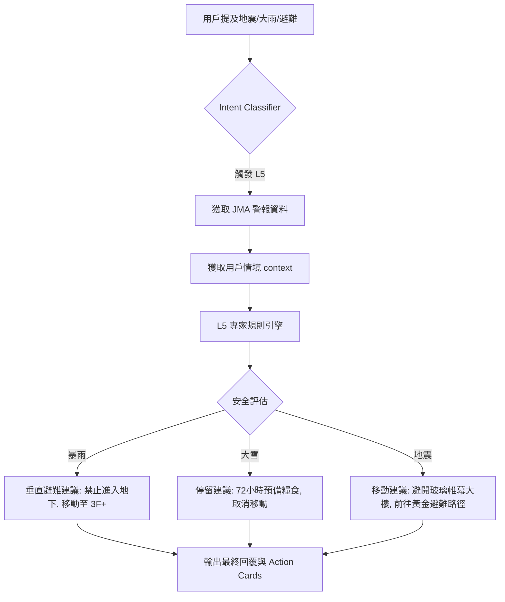

# lutagu AI 混合架構與避難方案 API 整理報告

本報告整理了 lutagu 專案中設計的 AI 混合架構（L1-L5）及其核心「避難方案（Evacuation Plan）」的 API 實現細節。

## 1. AI 混合分層架構 (L1 ~ L5)

我們的系統採用五層分級思考架構，確保在不同場景下提供最適當的反應速度與精準度：

| 層級 | 名稱 | 處理技術 | 適用場景 |
| :--- | :--- | :--- | :--- |
| **L1** | **簡單/模板層** | `TemplateEngine` | 常見問題 (FAQ)、打招呼、簡單指令。 |
| **L2** | **確定/演算法層** | `AlgorithmProvider` | 票價計算、最短路徑、POI 標籤檢索。 |
| **L3** | **設施層** | `stations_static` | 車站電梯、廁所、無障礙設施查詢。 |
| **L4** | **知識/策略層** | RAG (pgvector) + Expert Tools | 複雜轉乘建議 (TPI)、連鎖延誤風險 (CDR)、等待價值 (WVC)。 |
| **L5** | **決策/防災層** | `DecisionEngine` | 基於專家規則的極端天氣避難策略。 |

### 1.1 標籤系統優化：3-5-8 策略 (Global Tagging)

針對 Que2Search 論文與 GEM 多模態對齊邏輯，我們將 L1、L3、L4 的非結構化資訊统一採用「3-5-8 標籤架構」進行優化：

1.  **關鍵字層 (tags_core, 3-4字)**
    *   **L1**: `#拉麵`, `#露營`
    *   **L3**: `#電梯`, `#廁所`
    *   **L4**: `#轉乘`, `#防災`
2.  **意圖層 (tags_intent, 5-8字)**
    *   **L1**: `#深夜拉麵推薦`
    *   **L3**: `#親子友善廁所`, `#大型行李寄放`
    *   **L4**: `#省錢交通攻略`, `#雨天備案建議`
3.  **視覺層 (tags_visual)**
    *   **L1**: `#極簡風`, `#清水模建築`
    *   (L3/L4 暫不使用或僅用於特定場景)

---

## 2. 避難方案 API (Evacuation Plan API)

「避難方案」的核心在於 L5 決策引擎，它將即時防災數據與用戶個人化需求結合。

### 核心調用進入點
*   **工具名稱**: `check_safety` (封裝於 `reasoningTools.ts`)
*   **API 路徑**: `/api/hybrid/process` (統一調度入口)

### 決策流程 (Reasoning Flow)

### 關鍵技術組件

1.  **`evaluateEvacuationNeed`**: 判斷當前區域（Ward Code）是否達到警戒級別（Yellow/Orange/Red）。
2.  **`evacuationRules.ts`**: 實作專家知識規則，例如：
    *   **洪水規則**: 絕對禁止地下避難，目標海拔必須 > 浸水預期深度。
    *   **地震規則**: 避開高層玻璃大樓與老舊木造區。
3.  **生存清單 (Survival Kit)**: 根據災害類型自動生成建議清單（如暖暖包、離線地圖包）。

---

## 3. 技術實作參考位置

*   **五層架構核心**: [HybridEngine.ts](file:///Users/zhuangzixian/Documents/BambiGO_MVP/src/lib/l4/HybridEngine.ts)
*   **推理工具定義**: [reasoningTools.ts](file:///Users/zhuangzixian/Documents/BambiGO_MVP/src/lib/l4/reasoningTools.ts)
*   **避難決策邏輯**: [decisionEngine.ts](file:///Users/zhuangzixian/Documents/BambiGO_MVP/src/lib/l5/decisionEngine.ts)
*   **專家規則實作**: [evacuationRules.ts](file:///Users/zhuangzixian/Documents/BambiGO_MVP/src/lib/l5/evacuationRules.ts)
*   **API 入口**: [process/route.ts](file:///Users/zhuangzixian/Documents/BambiGO_MVP/src/app/api/hybrid/process/route.ts)

> [!TIP]
> 目前避難方案已整合至 AI Agent 的工具鏈中。當用戶詢問「現在下大雨，我該怎麼辦？」時，AI 會自動觸發 `check_safety` 並輸出包含垂直避難建議的結構化回覆。
