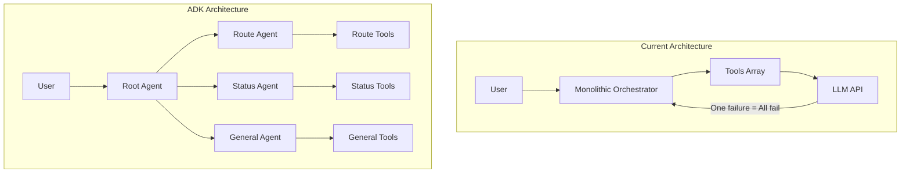
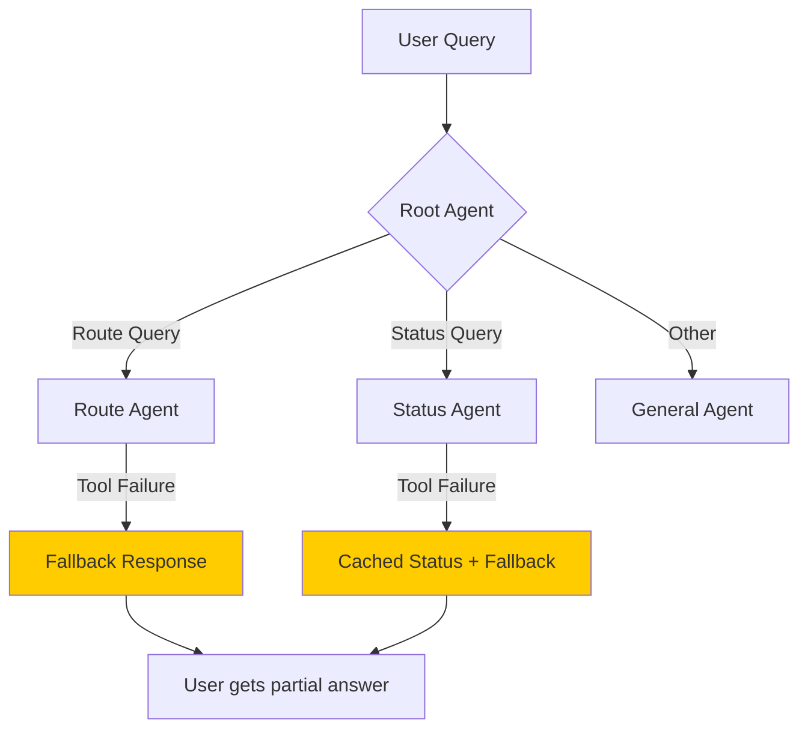

# Google ADK Agent Migration Plan

> **Version**: 2.0
> **Date**: 2026-01-30
> **Status**: ✅ APPROVED - Ready for Implementation

---

## 1. Executive Summary

本計畫旨在使用 **Google Agent Development Kit (ADK)** 取代現有的 AI Agent 架構。目標是建立一個**更穩健、更模組化**的 Agent 系統，解決目前「單點故障導致全部對話失效」的問題。

### 1.1 現有架構問題

| 問題 | 影響 | 根因 |
|------|------|------|
| **單點故障** | 任一 Tool 失敗會導致整個對話中斷 | 緊耦合的 Orchestrator Loop |
| **無容錯機制** | API 錯誤直接導致用戶看到錯誤訊息 | 缺乏 Graceful Degradation |
| **難以擴展** | 新增功能需要修改核心 Orchestrator | 非模組化設計 |
| **調試困難** | Tool 執行鏈路不透明 | 缺乏結構化日誌與追蹤 |

### 1.2 ADK 架構優勢



---

## 2. Deep Research Summary: Google ADK

### 2.1 核心概念

| 概念 | 說明 |
|------|------|
| **LlmAgent** | 使用 LLM 作為核心推理引擎的 Agent |
| **Workflow Agents** | Sequential, Parallel, Loop 三種流程控制 Agent |
| **Custom Agents** | 繼承 BaseAgent 實現自定義邏輯 |
| **Function Tools** | 將函數包裝為 Agent 可調用的工具 |
| **Multi-Agent Systems** | 透過 `sub_agents` 組成階層架構 |

### 2.2 Go SDK 安裝

```bash
go get google.golang.org/adk
```

**Prerequisites:**
- Go 1.24.4+
- ADK Go v0.2.0+

### 2.3 Go Agent 範例

```go
package main

import (
    "context"
    "log"
    "os"

    "google.golang.org/adk/agent"
    "google.golang.org/adk/agent/llmagent"
    "google.golang.org/adk/cmd/launcher"
    "google.golang.org/adk/cmd/launcher/full"
    "google.golang.org/adk/model/gemini"
    "google.golang.org/adk/tool"
    "google.golang.org/genai"
)

func main() {
    ctx := context.Background()
    
    model, err := gemini.NewModel(ctx, "gemini-3-pro-preview", &genai.ClientConfig{
        APIKey: os.Getenv("GOOGLE_API_KEY"),
    })
    if err != nil {
        log.Fatalf("Failed to create model: %v", err)
    }

    myAgent, err := llmagent.New(llmagent.Config{
        Name:        "lutagu_agent",
        Model:       model,
        Description: "Tokyo transit assistant",
        Instruction: "You are a helpful assistant for Tokyo transit...",
        Tools:       []tool.Tool{ /* custom tools */ },
    })
    if err != nil {
        log.Fatalf("Failed to create agent: %v", err)
    }

    config := &launcher.Config{
        AgentLoader: agent.NewSingleLoader(myAgent),
    }
    
    l := full.NewLauncher()
    if err = l.Execute(ctx, config, os.Args[1:]); err != nil {
        log.Fatalf("Run failed: %v", err)
    }
}
```

### 2.4 Multi-Agent System 設計

```go
// Root Agent with specialized sub-agents
rootAgent, _ := llmagent.New(llmagent.Config{
    Name: "lutagu_root",
    Model: model,
    Instruction: "Route user queries to specialized agents",
    SubAgents: []agent.Agent{
        routeAgent,   // Handles route planning
        statusAgent,  // Handles transit status
        facilityAgent, // Handles facility queries
    },
})
```

---

## 3. Proposed Architecture

### 3.1 Agent Hierarchy

```
lutagu_root (LlmAgent - Router)
├── route_agent (LlmAgent)
│   ├── findRoute tool
│   ├── getRailwayTopology tool
│   └── getStationInfo tool
├── status_agent (LlmAgent)
│   ├── getTransitStatus tool
│   ├── getDisruptionInfo tool
│   └── getWeatherImpact tool
├── facility_agent (LlmAgent)
│   ├── getFacilityInfo tool
│   ├── getLockerInfo tool
│   └── getToiletInfo tool
└── general_agent (LlmAgent)
    └── generalKnowledge tool
```

### 3.2 Go Service Structure

```
services/
└── adk-agent/
    ├── main.go                 # Entry point
    ├── go.mod
    ├── Dockerfile
    ├── agents/
    │   ├── root.go             # Root routing agent
    │   ├── route.go            # Route planning agent
    │   ├── status.go           # Transit status agent
    │   ├── facility.go         # Facility info agent
    │   └── general.go          # General Q&A agent
    ├── tools/
    │   ├── transit.go          # ODPT API tools
    │   ├── route.go            # Route calculation tools
    │   ├── facility.go         # Facility lookup tools
    │   └── weather.go          # Weather impact tools
    └── api/
        ├── server.go           # HTTP server (Gin/Chi)
        └── handlers.go         # Request handlers
```

### 3.3 Failure Isolation Strategy



**Key Principle:** Each sub-agent handles its own failures gracefully. A failing `route_agent` does NOT crash `status_agent`.

---

## 4. Implementation Plan

### Phase 1: ADK Project Setup & OpenRouter Integration (Day 1-2)

- [ ] Create `services/adk-agent/` directory
- [ ] Initialize Go module
- [ ] Implement OpenRouter client wrapper (using OpenAI SDK compatible mode)
- [ ] Set up Dockerfile for Cloud Run deployment
- [ ] **Deployment**: Use `mcp_cloudrun_deploy_local_folder` to deploy initial service
- [ ] Configure Environment Variables: `OPENROUTER_API_KEY`, `DATABASE_URL`, `UPSTASH_REDIS_URL`

### Phase 2: Core Agent Implementation (Day 3-5)

- [ ] Implement `root_agent` with routing logic
- [ ] Implement `route_agent` with existing route tools (ported from TS)
- [ ] Implement `status_agent` with ODPT integration
- [ ] Implement `facility_agent` with Supabase lookups

### Phase 3: Tool Migration (Day 6-8)

- [ ] Port `findRoute` tool from TypeScript to Go
- [ ] Port `getTransitStatus` tool to Go
- [ ] Port `getFacilityInfo` tool to Go
- [ ] Implement health check endpoints

### Phase 4: API Layer & Integration (Day 9-10)

- [ ] Create HTTP server with streaming support
- [ ] Implement SSE (Server-Sent Events) for real-time responses
- [ ] Connect Next.js frontend to new ADK backend
- [ ] Update environment variables and secrets

### Phase 5: Testing & Deployment (Day 11-14)

- [ ] Unit tests for each agent and tool
- [ ] Integration tests for multi-agent coordination
- [ ] Load testing for concurrent users
- [ ] Deploy to Cloud Run with gradual rollout
- [ ] A/B test: ADK vs. old architecture

---

## 5. Migration Strategy

### 5.1 Gradual Rollout

| Phase | Traffic | Rollback Trigger |
|-------|---------|------------------|
| Canary | 5% | Error rate > 5% |
| Beta | 25% | Error rate > 3% |
| GA | 100% | Error rate > 1% |

### 5.2 Feature Flag

```typescript
// In Next.js frontend
const USE_ADK_AGENT = process.env.NEXT_PUBLIC_USE_ADK_AGENT === 'true';

const agentEndpoint = USE_ADK_AGENT 
    ? 'https://adk-agent.lutagu.com/api/chat'
    : '/api/agent/v2';
```

---

## 6. ✅ Confirmed Decisions

### Decision 1: Standalone Cloud Run Deployment

**選擇**：獨立部署到 Cloud Run，建立全新服務

**理由分析**：
| 優勢 | 說明 |
|------|------|
| **完全隔離** | 與現有失敗模式完全分離 |
| **獨立擴展** | 可根據 Agent 負載獨立調整資源 |
| **乾淨代碼庫** | 無舊代碼干擾 |
| **Go 冷啟動優勢** | ~100ms 冷啟動（vs Node.js ~5s） |
| **簡易回滾** | 只需切換 DNS/Load Balancer |

**部署架構**：
```
┌─────────────────────────────────────────────────────────────┐
│                    Cloud Run (adk-agent)                     │
│                   adk-agent.lutagu.com                       │
├─────────────────────────────────────────────────────────────┤
│                                                              │
│  ┌─────────────────────────────────────────────────────┐    │
│  │           Root Agent (Gemini 3 Pro)                  │    │
│  │  - Query classification                              │    │
│  │  - Complex reasoning                                 │    │
│  │  - Safety-critical decisions                         │    │
│  └────────────────────┬────────────────────────────────┘    │
│                       │                                      │
│    ┌──────────────────┼──────────────────┐                  │
│    ▼                  ▼                  ▼                  │
│ ┌─────────┐    ┌─────────────┐    ┌─────────────┐          │
│ │ Route   │    │   Status    │    │  Facility   │          │
│ │ Agent   │    │   Agent     │    │   Agent     │          │
│ │ (Flash) │    │   (Flash)   │    │ (Lite/None) │          │
│ └────┬────┘    └──────┬──────┘    └──────┬──────┘          │
│      │                │                  │                  │
├──────┼────────────────┼──────────────────┼──────────────────┤
│      ▼                ▼                  ▼                  │
│  ┌─────────────────────────────────────────────────────┐    │
│  │               Data Access Layer (Go)                 │    │
│  │  ┌───────────┐  ┌───────────┐  ┌───────────────┐    │    │
│  │  │   Redis   │  │ Supabase  │  │   ODPT API    │    │    │
│  │  │  (Cache)  │  │  (Direct) │  │  (Real-time)  │    │    │
│  │  └───────────┘  └───────────┘  └───────────────┘    │    │
│  └─────────────────────────────────────────────────────┘    │
│                                                              │
└──────────────────────────────────────────────────────────────┘
```

---

### Decision 2: Tiered Model Strategy (OpenRouter Integration)

**選擇**：混合使用 Google Gemini 3 Pro 與 DeepSeek V3.2 (via OpenRouter)

**模型分配**：

| Agent | Model (OpenRouter ID) | 用途 | 成本/Query |
|-------|----------------------|------|-----------|
| **Root Agent** | `google/gemini-3-pro-preview` | 意圖分類、複雜推理、安全決策 | ~$0.0024 |
| **Route Agent** | `deepseek/deepseek-chat-v3-0324` | 路線規劃、結構化輸出 | **~$0.00014** |
| **Status Agent** | `deepseek/deepseek-chat-v3-0324` | 運行狀態分析與總結 | **~$0.00014** |
| **Facility Agent** | `google/gemini-2.5-flash-lite-preview-06-17` | 簡單設施查詢 | ~$0.00002 |
| **General Agent** | `deepseek/deepseek-chat-v3-0324` | 一般問答 | **~$0.00014** |

**成本優化效果**：
- DeepSeek V3.2 的引入將 Route/Status Agent 的推理成本降低 10 倍以上。
- 使用 OpenRouter 統一接口，簡化多模型管理。

**Go 實現策略**：
不需撰寫自定義 Adapter，直接使用 OpenAI Go SDK 指向 OpenRouter Endpoint。

```go
// OpenRouter Configuration
const OpenRouterBaseURL = "https://openrouter.ai/api/v1"

var ModelConfig = map[string]string{
    "root":     "google/gemini-3-pro-preview",
    "route":    "deepseek/deepseek-chat-v3-0324",
    "status":   "deepseek/deepseek-chat-v3-0324",
    "facility": "google/gemini-2.5-flash-lite-preview-06-17",
    "general":  "deepseek/deepseek-chat-v3-0324",
}
```

---

### Decision 3: Hybrid Data Access (Redis + Direct PostgreSQL)

**選擇**：Redis 快取 + 直連 Supabase PostgreSQL

**策略分析**：

| 資料類型 | 策略 | 預期延遲 |
|----------|------|----------|
| **靜態資料**（車站、設施） | Redis Cache (Upstash) | 1-5ms |
| **即時資料**（運行狀態） | Direct DB + ODPT API | 10-20ms |
| **用戶資料**（Session） | Direct DB | 10-20ms |

**快取配置**：
```go
// Cache configuration
var CacheConfig = map[string]time.Duration{
    "stations_static":   24 * time.Hour,  // 車站基本資訊
    "facilities":        24 * time.Hour,  // 設施資訊
    "railway_topology":  7 * 24 * time.Hour, // 路網拓撲（很少變）
    "odpt_status":       60 * time.Second,   // 運行狀態（短 TTL）
    "weather":           15 * time.Minute,   // 天氣資訊
}
```

**實現方式**：
```go
// Tiered data access layer
type DataService struct {
    redis  *redis.Client      // Upstash Redis (asia-northeast1)
    db     *pgxpool.Pool      // Direct Supabase PostgreSQL
    odpt   *odpt.Client       // ODPT API client
}

func (s *DataService) GetStation(ctx context.Context, id string) (*Station, error) {
    // 1. Try Redis cache
    if cached, err := s.redis.Get(ctx, "station:"+id).Result(); err == nil {
        var station Station
        json.Unmarshal([]byte(cached), &station)
        return &station, nil
    }
    
    // 2. Fallback to direct DB
    var station Station
    err := s.db.QueryRow(ctx, 
        "SELECT id, name_ja, name_en, lat, lng FROM stations_static WHERE id = $1", id,
    ).Scan(&station.ID, &station.NameJa, &station.NameEn, &station.Lat, &station.Lng)
    
    if err == nil {
        // 3. Populate cache for next request
        data, _ := json.Marshal(station)
        s.redis.Set(ctx, "station:"+id, data, 24*time.Hour)
    }
    
    return &station, err
}
```

**基礎設施需求**：
- [x] Upstash Redis (asia-northeast1 region, 免費層足夠 MVP)
- [x] Supabase PostgreSQL 直連（使用 pgx driver）
- [x] 環境變數：`DATABASE_URL`, `UPSTASH_REDIS_URL`

---

## 7. Success Metrics

| Metric | Current | Target |
|--------|---------|--------|
| Error Rate | ~5% | < 1% |
| Tool Failure Isolation | 0% (全部失敗) | 100% (獨立失敗) |
| Response Latency (P50) | ~3s | < 2s |
| Response Latency (P99) | ~8s | < 5s |
| Cold Start | ~5s | < 2s (Go advantage) |

---

## 8. Next Steps

1. **Review this plan** and provide feedback
2. **Confirm the questions** in Section 6
3. Upon approval, proceed to Phase 1 implementation

---

*Generated by: AI Agent Architecture Research*
*Last Updated: 2026-01-30*
