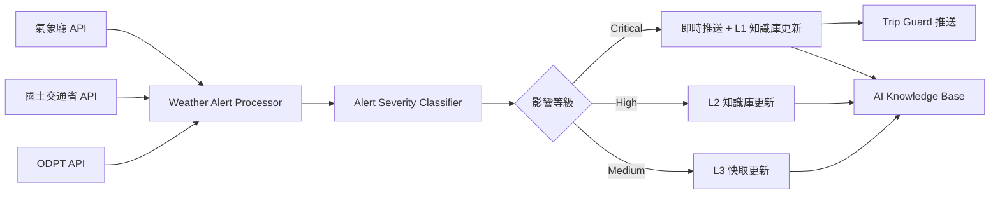

# LUTAGU 天氣警報整合提案

**建立日期**: 2026-01-19
**優先級**: High
**預計工作量**: 2-3 週

---

## 背景

基於 2025 年 1 月 19 日日本氣象廳發布的「最強・最長」寒流警報案例，LUTAGU 需要建立主動式天氣警報監控機制，確保在極端天氣事件（大雪、颱風、地震等）發生時，能夠：

1. **提前預警**: 在用戶查詢前就掌握交通停駛資訊
2. **知識更新**: 自動更新 AI 知識庫，提供準確的應對建議
3. **主動推送**: 透過 Trip Guard 向受影響用戶發送通知

---

## 技術架構

### 1. 資料來源整合

#### 1.1 日本氣象廳 API
- **API**: [気象庁防災情報 XML](https://www.data.jma.go.jp/developer/xml.html)
- **資料類型**:
  - 特別警報 (Special Warning)
  - 警報 (Warning)
  - 注意報 (Advisory)
  - 天氣預報 (Weather Forecast)
- **更新頻率**: 每 10 分鐘檢查一次
- **關鍵事件**:
  - 大雪警報 (Heavy Snow Warning)
  - 暴風雪警報 (Blizzard Warning)
  - 波浪警報 (High Wave Warning)
  - 颱風情報 (Typhoon Information)

#### 1.2 國土交通省道路情報
- **API**: [国土交通省道路情報提供システム](https://www.mlit.go.jp/road/)
- **資料類型**:
  - 道路封閉 (Road Closure)
  - 預防性管制 (Preventive Regulation)
  - 雪鏈強制裝備區域 (Chain Regulation)
- **更新頻率**: 每 5 分鐘

#### 1.3 ODPT 即時運行狀態（已有）
- **現有功能**: 延誤、停駛資訊
- **增強**: 新增「天氣原因」標記

### 2. 資料處理流程



### 3. 知識庫更新機制

#### 3.1 動態知識注入

**目標**: 當極端天氣事件發生時,自動更新 AI Agent 的系統提示詞

**實作方式**:

```typescript
// services/chat-api/src/lib/weather/WeatherKnowledgeInjector.ts

interface WeatherAlert {
  id: string;
  type: 'heavy_snow' | 'typhoon' | 'earthquake';
  severity: 'critical' | 'high' | 'medium';
  affectedRegions: string[]; // ['Tokyo', 'Kanagawa', ...]
  startTime: Date;
  endTime: Date;
  description: string;
  transportImpact: {
    lines: string[]; // ['JR Yamanote', 'Tokyo Metro Ginza']
    closures: string[];
    delays: string[];
  };
  recommendations: {
    avoid: string[]; // ['Avoid outdoor travel', ...]
    alternatives: string[]; // ['Use underground metro', ...]
  };
}

class WeatherKnowledgeInjector {
  private activeAlerts: WeatherAlert[] = [];

  // 定期從氣象廳抓取最新警報
  async fetchLatestAlerts(): Promise<WeatherAlert[]> {
    const jmaResponse = await fetch('https://www.jma.go.jp/bosai/warning/data/warning.json');
    const roadResponse = await fetch('https://www.mlit.go.jp/road/api/closure');

    // Parse and merge
    return this.parseAndMergeAlerts(jmaResponse, roadResponse);
  }

  // 生成注入到 AI 系統提示詞的知識
  generateSystemPromptInjection(): string {
    if (!this.activeAlerts.length) return '';

    const criticalAlerts = this.activeAlerts.filter(a => a.severity === 'critical');
    if (!criticalAlerts.length) return '';

    return `
## ⚠️ ACTIVE WEATHER EMERGENCY

**CRITICAL ALERTS (${criticalAlerts.length})**:

${criticalAlerts.map(alert => `
### ${alert.type.toUpperCase()} - ${alert.affectedRegions.join(', ')}
- **Period**: ${alert.startTime.toISOString()} ~ ${alert.endTime.toISOString()}
- **Description**: ${alert.description}
- **Affected Lines**: ${alert.transportImpact.lines.join(', ')}
- **Closures**: ${alert.transportImpact.closures.join(', ')}

**IMPORTANT INSTRUCTIONS**:
1. When users ask about routes in affected regions, IMMEDIATELY warn them about this weather emergency
2. Suggest ONLY indoor/underground alternatives if available
3. Recommend postponing non-essential travel
4. Provide specific advice: ${alert.recommendations.avoid.join('; ')}
5. Alternatives: ${alert.recommendations.alternatives.join('; ')}
`).join('\n')}

**RESPONSE PRIORITY**: Weather safety > Route efficiency
`;
  }
}
```

#### 3.2 L4 決策引擎整合

**修改 HybridEngine 以優先檢查天氣警報**:

```typescript
// services/chat-api/src/lib/l4/HybridEngine.ts

async processRequest(params: ProcessParams): Promise<EngineResult> {
  const { text, locale, context } = params;

  // 1. 優先檢查是否有影響用戶當前位置的警報
  const activeAlert = await weatherKnowledgeInjector.checkAlertForLocation(
    context.userLocation?.lat,
    context.userLocation?.lon
  );

  if (activeAlert && activeAlert.severity === 'critical') {
    // 立即返回警報訊息，不進行路線規劃
    return {
      source: 'weather_alert',
      type: 'emergency',
      content: this.generateEmergencyResponse(activeAlert, locale),
      data: { alert: activeAlert },
      confidence: 1.0,
      reasoning: 'Critical weather alert supersedes route planning'
    };
  }

  // 2. 繼續正常流程，但在 LLM 提示詞中注入天氣知識
  const systemPromptInjection = weatherKnowledgeInjector.generateSystemPromptInjection();

  // ... 原有邏輯
}
```

### 4. 主動推送機制（Trip Guard 整合）

#### 4.1 用戶訂閱管理

```typescript
// services/chat-api/src/lib/tripguard/WeatherAlertSubscription.ts

interface TripGuardSubscription {
  userId: string;
  origin: string; // Station ID
  destination: string;
  travelDate: Date;
  notificationChannels: ('line' | 'email' | 'sms')[];
}

class WeatherAlertNotifier {
  async notifyAffectedUsers(alert: WeatherAlert): Promise<void> {
    // 1. 查詢受影響路線的所有訂閱用戶
    const affectedSubscriptions = await db.query(`
      SELECT * FROM trip_subscriptions
      WHERE origin IN (${alert.transportImpact.lines.join(',')})
        OR destination IN (${alert.transportImpact.lines.join(',')})
        AND travel_date BETWEEN $1 AND $2
    `, [alert.startTime, alert.endTime]);

    // 2. 透過 LINE Messaging API 發送通知
    for (const sub of affectedSubscriptions) {
      await this.sendLineNotification(sub.userId, {
        type: 'flex',
        altText: `⚠️ 天氣警報：${alert.type}`,
        contents: this.buildFlexMessage(alert, sub)
      });
    }
  }

  private buildFlexMessage(alert: WeatherAlert, sub: TripGuardSubscription) {
    return {
      type: 'bubble',
      hero: {
        type: 'box',
        layout: 'vertical',
        contents: [
          { type: 'text', text: '⚠️ 緊急天氣警報', weight: 'bold', size: 'xl' }
        ],
        backgroundColor: '#FF4500'
      },
      body: {
        type: 'box',
        layout: 'vertical',
        contents: [
          { type: 'text', text: alert.description, wrap: true },
          { type: 'separator', margin: 'md' },
          { type: 'text', text: '受影響路線:', weight: 'bold', margin: 'md' },
          ...alert.transportImpact.lines.map(line => ({
            type: 'text', text: `• ${line}`, size: 'sm', color: '#666666'
          })),
          { type: 'separator', margin: 'md' },
          { type: 'text', text: '建議:', weight: 'bold', margin: 'md' },
          ...alert.recommendations.alternatives.map(rec => ({
            type: 'text', text: `✓ ${rec}`, size: 'sm', color: '#00AA00'
          }))
        ]
      },
      footer: {
        type: 'box',
        layout: 'vertical',
        contents: [
          {
            type: 'button',
            action: { type: 'uri', label: '查看替代路線', uri: `https://lutagu.app/routes?alert=${alert.id}` },
            style: 'primary'
          }
        ]
      }
    };
  }
}
```

### 5. 資料庫 Schema 擴充

```sql
-- 天氣警報儲存表
CREATE TABLE weather_alerts (
  id UUID PRIMARY KEY DEFAULT gen_random_uuid(),
  type VARCHAR(50) NOT NULL, -- 'heavy_snow', 'typhoon', etc.
  severity VARCHAR(20) NOT NULL, -- 'critical', 'high', 'medium'
  source VARCHAR(50) NOT NULL, -- 'jma', 'mlit'
  affected_regions JSONB NOT NULL, -- ['Tokyo', 'Kanagawa']
  start_time TIMESTAMPTZ NOT NULL,
  end_time TIMESTAMPTZ,
  description JSONB NOT NULL, -- Multilingual
  transport_impact JSONB, -- { lines: [], closures: [], delays: [] }
  recommendations JSONB, -- { avoid: [], alternatives: [] }
  is_active BOOLEAN DEFAULT TRUE,
  created_at TIMESTAMPTZ DEFAULT NOW(),
  updated_at TIMESTAMPTZ DEFAULT NOW()
);

CREATE INDEX idx_weather_alerts_active ON weather_alerts(is_active, start_time, end_time);
CREATE INDEX idx_weather_alerts_regions ON weather_alerts USING GIN(affected_regions);

-- Trip Guard 訂閱表（擴充）
ALTER TABLE trip_subscriptions
ADD COLUMN weather_alert_enabled BOOLEAN DEFAULT TRUE,
ADD COLUMN alert_advance_hours INTEGER DEFAULT 24; -- 提前 24 小時通知
```

### 6. 自動化流程（n8n Workflow）

#### 6.1 定期監控 Workflow

```json
{
  "name": "Weather Alert Monitor",
  "nodes": [
    {
      "name": "Schedule Trigger",
      "type": "n8n-nodes-base.cron",
      "parameters": { "cronExpression": "*/10 * * * *" } // 每 10 分鐘
    },
    {
      "name": "Fetch JMA Alerts",
      "type": "n8n-nodes-base.httpRequest",
      "parameters": {
        "url": "https://www.jma.go.jp/bosai/warning/data/warning.json",
        "method": "GET"
      }
    },
    {
      "name": "Fetch Road Closures",
      "type": "n8n-nodes-base.httpRequest",
      "parameters": {
        "url": "https://www.mlit.go.jp/road/api/closure",
        "method": "GET"
      }
    },
    {
      "name": "Parse & Classify",
      "type": "n8n-nodes-base.function",
      "parameters": {
        "functionCode": "// Parse JMA + MLIT data, classify severity"
      }
    },
    {
      "name": "Check New Alerts",
      "type": "n8n-nodes-base.postgres",
      "parameters": {
        "operation": "executeQuery",
        "query": "SELECT id FROM weather_alerts WHERE source_id = $1 AND is_active = TRUE"
      }
    },
    {
      "name": "Insert New Alert",
      "type": "n8n-nodes-base.postgres",
      "parameters": { "operation": "insert", "table": "weather_alerts" }
    },
    {
      "name": "Trigger Notification",
      "type": "n8n-nodes-base.webhook",
      "parameters": {
        "httpMethod": "POST",
        "path": "chat-api/weather/notify",
        "responseMode": "onReceived"
      }
    }
  ],
  "connections": {
    "Schedule Trigger": { "main": [[{ "node": "Fetch JMA Alerts" }, { "node": "Fetch Road Closures" }]] },
    "Fetch JMA Alerts": { "main": [[{ "node": "Parse & Classify" }]] },
    "Parse & Classify": { "main": [[{ "node": "Check New Alerts" }]] },
    "Check New Alerts": { "main": [[{ "node": "Insert New Alert" }]] },
    "Insert New Alert": { "main": [[{ "node": "Trigger Notification" }]] }
  }
}
```

---

## 實作階段規劃

### Phase 1: 基礎設施（1 週）
- [ ] 設定日本氣象廳 API 串接
- [ ] 建立 `weather_alerts` 資料表
- [ ] 實作 `WeatherKnowledgeInjector` 類別
- [ ] 建立 n8n 定期監控 workflow

### Phase 2: AI 整合（1 週）
- [ ] 修改 `HybridEngine` 優先檢查天氣警報
- [ ] 實作動態系統提示詞注入
- [ ] 測試 AI 回應品質（確保警報資訊正確傳達）
- [ ] 多語言支援（zh-TW, ja, en）

### Phase 3: 主動推送（1 週）
- [ ] 實作 `WeatherAlertNotifier` 類別
- [ ] LINE Messaging API 整合
- [ ] Trip Guard 訂閱擴充（新增天氣警報選項）
- [ ] 建立 Flex Message 範本

### Phase 4: 測試與優化（3-5 天）
- [ ] 模擬大雪場景測試
- [ ] 負載測試（同時推送 10,000+ 用戶）
- [ ] 錯誤處理與 fallback 機制
- [ ] 監控儀表板（Grafana）

---

## 成本估算

### API 成本
- **氣象廳 API**: 免費（公開資料）
- **國土交通省 API**: 免費（公開資料）
- **ODPT API**: 現有（已付費）
- **LINE Messaging API**:
  - Push Message: ¥0.25/則
  - 估計: 10,000 用戶 × 1 則 = ¥2,500/次事件

### 運算成本
- **n8n Workflow**: Zeabur 現有方案包含
- **Supabase 儲存**: 每月新增 ~1,000 筆警報資料 ≈ 1MB
- **Cloud Run**: 警報處理 < 1ms CPU time，成本可忽略

**總成本**: < $30/月（假設每月 2-3 次重大事件）

---

## 監控指標

### KPI
1. **警報偵測延遲**: 目標 < 10 分鐘（從氣象廳發布到 LUTAGU 偵測）
2. **推送成功率**: 目標 > 95%
3. **AI 回應準確率**: 目標 > 90%（人工抽樣驗證）
4. **用戶滿意度**: 透過 Trip Guard feedback 收集

### Grafana Dashboard
- 即時警報數量
- 受影響用戶數
- 推送失敗率
- API 回應時間

---

## 風險與緩解

| 風險 | 影響 | 緩解措施 |
|-----|------|---------|
| 氣象廳 API 變更 | High | 建立 API 版本檢測，設定 fallback 來源 |
| 推送過載（萬人同時） | Medium | 使用 Queue 機制（Redis），分批推送 |
| 誤報（False Positive） | High | 人工審核 Critical 等級警報 |
| AI 理解錯誤 | Medium | 建立測試案例庫，定期回歸測試 |

---

## 參考資料

- [気象庁防災情報 XML フォーマット](https://xml.kishou.go.jp/)
- [国土交通省道路情報提供システム](https://www.mlit.go.jp/road/)
- [LINE Messaging API - Push Message](https://developers.line.biz/en/reference/messaging-api/#send-push-message)
- [Supabase Realtime Subscriptions](https://supabase.com/docs/guides/realtime)

---

**預期成果**: 當下一次大雪或颱風來臨時，LUTAGU 用戶將在氣象廳發布警報後 10 分鐘內收到通知，並在與 AI 對話時獲得最新的交通建議，大幅提升安全性與用戶滿意度。
