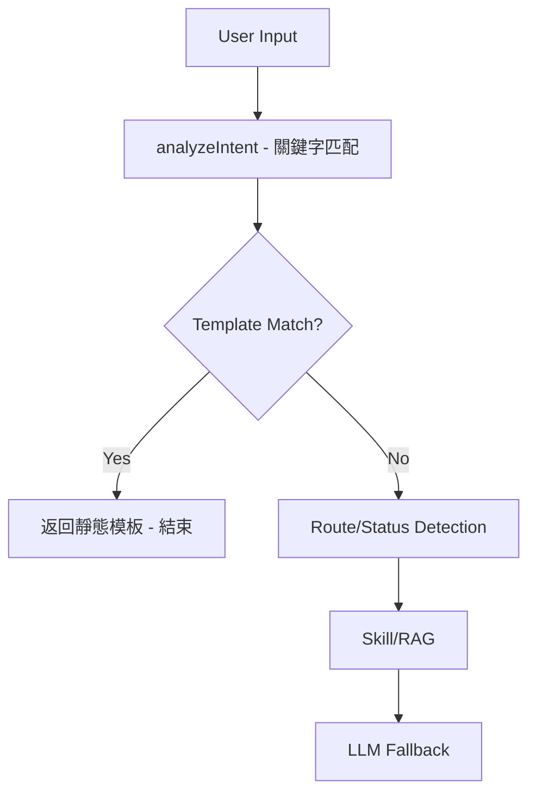
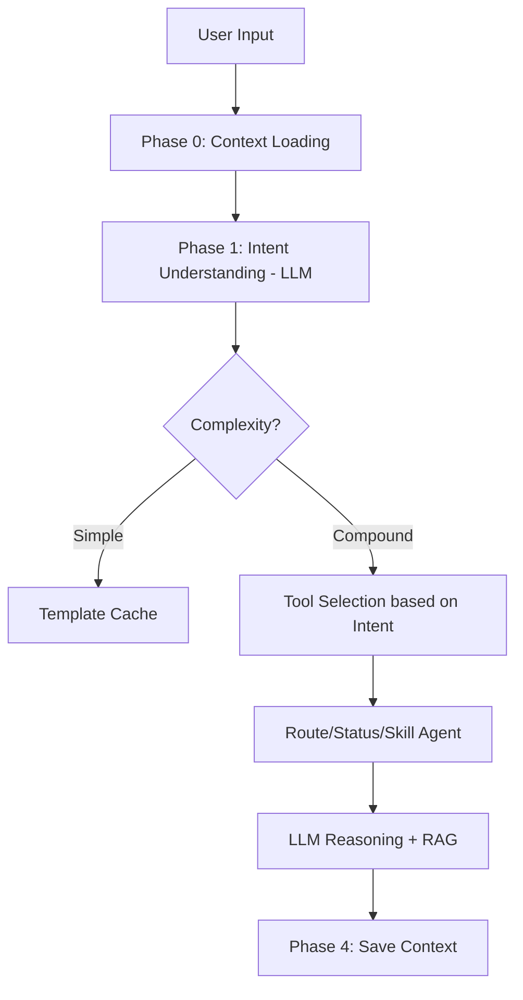

# ADK Agent 對話工作流程重構計畫

## 目標

重構 ADK Agent 的對話處理流程，使其符合產品核心理念：
- **意圖理解 > 資料匹配**：先理解「為什麼問這個」，再調用資料
- **判斷委託 > 資訊顯示**：給 1 個最佳建議，而非 10 條路線
- **流程導向 > 單點回答**：預見下一步、情境連貫性

---

## 問題根源分析

> [!CAUTION]  
> 現有架構完全違背產品核心理念

### 現有流程問題



**問題點**:
1. `analyzeIntent()` 只做關鍵字分類，不理解意圖
2. Template Engine 用 Regex 匹配後直接返回，阻斷 LLM
3. 無跨 Turn Context 傳遞（多輪對話無記憶）

### 具體案例

| 用戶輸入 | 期望行為 | 實際行為 |
|---------|---------|---------|
| "帶著行李去淺草" | 推薦少轉乘/電梯路線 | 返回「置物櫃介紹」Template |
| "那計程車多少錢" | 延續上文估算 | 要求重新輸入起終點 |
| "上野有什麼好玩" | 列出 L1 Node 景點 | 返回引導式佔位符 |

---

## 解決方案：Intent-First Workflow

> [!IMPORTANT]  
> 核心改動：讓 LLM 先理解意圖，再決定調用什麼工具

### 新架構流程



### 核心改動

| Phase | 組件 | 改動內容 |
|-------|------|----------|
| **Phase 1** | [NEW] `intent_understanding.go` | LLM 意圖分析，輸出 IntentResult |
| **Phase 2** | [MODIFY] `memory/store.go` | 新增 JourneyContext 追蹤 |
| **Phase 3** | [MODIFY] `layered_engine.go` | 重構 Process() 流程順序 |
| **Phase 4** | [MODIFY] `template_engine.go` | 加入 Complexity 閘門 |

---

## Proposed Changes

### Component 1: Intent Understanding Layer

#### [NEW] [intent_understanding.go](file:///Users/zhuangzixian/Documents/LUTAGU_MVP/services/adk-agent/internal/orchestrator/intent_understanding.go)

新增 LLM-based 意圖理解模組：
- 使用 FastAgent 進行快速意圖分析
- 輸出結構化 `IntentResult`
- 識別複合意圖（如：route + luggage + time_pressure）

```go
type IntentResult struct {
    PrimaryIntent     string            // e.g., "route_with_constraints"
    SecondaryIntents  []string          // e.g., ["luggage_concerns", "transfer_aversion"]
    ContextSlots      map[string]string // e.g., {"origin": "上野", "destination": "淺草"}
    Complexity        string            // "simple" | "compound" | "ambiguous"
    RequiresClarify   bool
    Confidence        float64
}
```

---

### Component 2: Context Carry-over

#### [MODIFY] [store.go](file:///Users/zhuangzixian/Documents/LUTAGU_MVP/services/adk-agent/internal/infrastructure/memory/store.go)

新增 JourneyContext 結構：

```go
type JourneyContext struct {
    Origin       string
    Destination  string
    Mode         string   // "train" | "taxi" | "walk"
    Constraints  []string // ["has_luggage", "needs_elevator", "time_pressure"]
    LastUpdated  time.Time
}
```

在 `SaveTurn()` 和 `LoadProfile()` 中處理 JourneyContext。

---

### Component 3: LayeredEngine Refactoring

#### [MODIFY] [layered_engine.go](file:///Users/zhuangzixian/Documents/LUTAGU_MVP/services/adk-agent/internal/orchestrator/layered_engine.go)

重構 `Process()` 流程：

1. **加入 Context Loading** (~Line 190)
2. **加入 Intent Understanding Phase** (~Line 210)
3. **修改 Template 條件** (~Line 293): 只有當 `Complexity == "simple"` 才使用
4. **傳遞 IntentResult 到 Agent** (~Line 540)

---

### Component 4: Template Engine Gating

#### [MODIFY] [template_engine.go](file:///Users/zhuangzixian/Documents/LUTAGU_MVP/services/adk-agent/internal/layer/template_engine.go)

修改 `Match()` 方法：

```go
func (e *TemplateEngine) Match(ctx TemplateContext, intentComplexity string) *MatchResult {
    // 若意圖複雜，跳過 Template
    if intentComplexity == "compound" || intentComplexity == "ambiguous" {
        return nil
    }
    // ... existing logic
}
```

---

## User Review Required

> [!WARNING]  
> 以下決策需要您確認

1. **LLM 延遲權衡**：新增 Intent Understanding 會增加 ~300-500ms latency。是否可接受？

2. **成本考量**：每次請求多一次 LLM 調用（使用 FastAgent/SLM）。預估成本增加 ~30%。

3. **實作優先級**：
   - **P0**: Intent Understanding Layer（核心）
   - **P1**: Context Carry-over（多輪對話）
   - **P2**: Template Gating（避免誤匹配）

4. **回退機制**：若 Intent Understanding 失敗，是否回退到現有關鍵字邏輯？

---

## Verification Plan

### Automated Tests

#### 1. 擴充現有測試

**檔案**: [intent_router_test.go](file:///Users/zhuangzixian/Documents/LUTAGU_MVP/services/adk-agent/internal/orchestrator/intent_router_test.go)

**新增測試案例**:
```bash
# 執行方式
cd services/adk-agent
go test -v ./internal/orchestrator/... -run TestAnalyzeIntent
```

- `TestAnalyzeIntent_CompoundIntent`: 測試複合意圖識別
- `TestAnalyzeIntent_ContextCarryover`: 測試上下文繼承

#### 2. E2E 對話測試

**檔案**: [NEW] `tests/multi_turn_e2e_test.go`

**測試場景**: 帶行李遊客多輪對話

```bash
# 執行方式
cd services/adk-agent
go test -v ./tests/... -run TestMultiTurnConversation
```

### Manual Verification

#### 手動測試腳本

使用 curl 執行以下測試（需先啟動 ADK Agent）：

**Turn 1**: 測試意圖理解
```bash
curl -X POST http://localhost:8080/api/chat \
  -H "Content-Type: application/json" \
  -d '{"messages":[{"role":"user","content":"我帶著大行李要去淺草"}],"locale":"zh-TW","session_id":"manual-test-001"}'
```
**期望**: 推薦考量行李的路線，而非置物櫃資訊

**Turn 2**: 測試上下文延續
```bash
curl -X POST http://localhost:8080/api/chat \
  -H "Content-Type: application/json" \
  -d '{"messages":[{"role":"user","content":"那計程車多少錢？"}],"locale":"zh-TW","session_id":"manual-test-001"}'
```
**期望**: 延續 Turn 1 的起終點，估算計程車費用

---

## 實作時程估計

| Phase | 工作項目 | 預估時間 |
|-------|---------|---------|
| Phase 1 | Intent Understanding Layer | 4-6 小時 |
| Phase 2 | Context Carry-over | 2-3 小時 |
| Phase 3 | LayeredEngine Refactoring | 3-4 小時 |
| Phase 4 | Template Gating | 1-2 小時 |
| Testing | 單元測試 + E2E | 2-3 小時 |
| **Total** | | **12-18 小時** |

---

**撰寫者**: Antigravity AI  
**日期**: 2026-02-07
