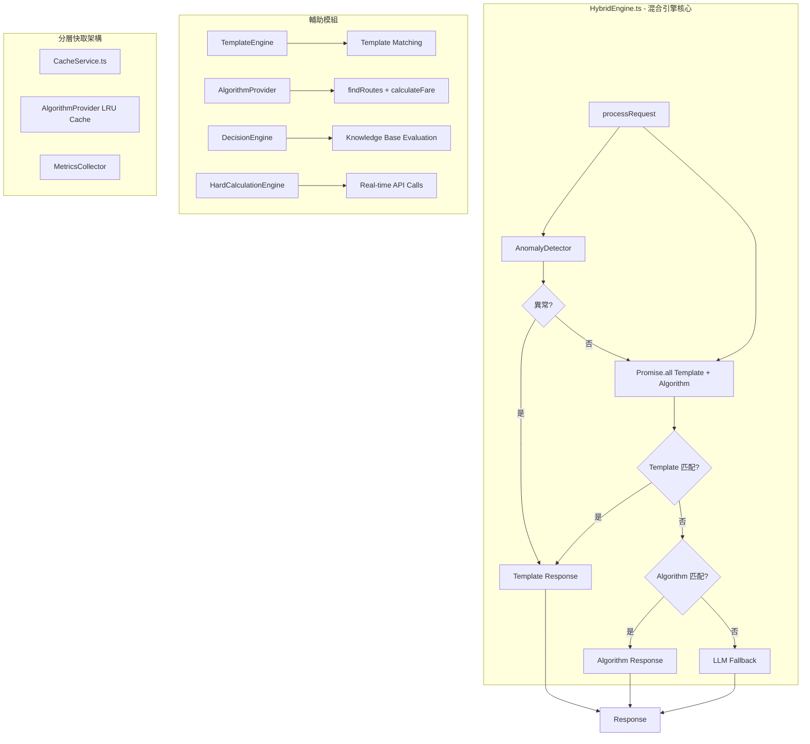

# AI 混合型智慧引擎全面測試與效能評估計劃

> **評估日期**: 2026-01-07
> **專案名稱**: LUTAGU/LUTAGU - 東京交通 AI 導航助手
> **評估範圍**: L4 混合型智慧引擎 (Hybrid Intelligence Engine)

---

## 1. 系統架構總覽

### 1.1 四層數據架構

```
┌─────────────────────────────────────────────────────────────────┐
│                    L4 Strategy Agent (大腦)                       │
│              混合智慧引擎 HybridEngine.ts                         │
│    ┌─────────────────────────────────────────────────────────┐   │
│    │  Template Engine  │ Algorithm Engine │ LLM Fallback      │   │
│    │  (優先級 0.9+)    │ (優先級 0.8+)    │ (回退)             │   │
│    └─────────────────────────────────────────────────────────┘   │
├─────────────────────────────────────────────────────────────────┤
│                    L3 Facility Graph                             │
│           hardCalculationEngine.ts + decisionEngine.ts           │
├─────────────────────────────────────────────────────────────────┤
│                    L2 Live Sense                                 │
│           ODPT API + Open-Meteo + Transit Dynamic                │
├─────────────────────────────────────────────────────────────────┤
│                    L1 Location DNA                               │
│           Station Wisdom + Static L1 Data + Seed Nodes           │
└─────────────────────────────────────────────────────────────────┘
```

### 1.2 混合引擎核心元件關係圖



### 1.3 核心檔案對應表

| 檔案路徑 | 功能說明 | 職責 |
|----------|----------|------|
| [`src/lib/l4/HybridEngine.ts`](src/lib/l4/HybridEngine.ts) | 混合引擎核心 | 協調 Template/Algorithm/LLM 三層，優先級決策 |
| [`src/lib/l4/assistantEngine.ts`](src/lib/l4/assistantEngine.ts) | 助理引擎 | Dijkstra 演算法、意圖分類、路線建議 |
| [`src/lib/l4/algorithms/AlgorithmProvider.ts`](src/lib/l4/algorithms/AlgorithmProvider.ts) | 演算法提供者 | LRU 快取、路由與票價計算封裝 |
| [`src/lib/l4/decisionEngine.ts`](src/lib/l4/decisionEngine.ts) | L4 決策引擎 | 專家知識庫匹配與策略卡片生成 |
| [`src/lib/l4/hardCalculationEngine.ts`](src/lib/l4/hardCalculationEngine.ts) | 硬計算引擎 | 即時 API 呼叫（列車運行、天氣） |
| [`src/lib/l4/intent/TemplateEngine.ts`](src/lib/l4/intent/TemplateEngine.ts) | 意圖模板引擎 | 正則表達式模板匹配 |
| [`src/lib/l4/monitoring/MetricsCollector.ts`](src/lib/l4/monitoring/MetricsCollector.ts) | 監控指標收集器 | 請求追蹤、命中率、平均響應時間 |
| [`src/lib/l4/utils/AnomalyDetector.ts`](src/lib/l4/utils/AnomalyDetector.ts) | 異常檢測器 | 過濾無意義/惡意輸入 |
| [`src/lib/l4/utils/Normalization.ts`](src/lib/l4/utils/Normalization.ts) | 數據正規化器 | 站點名稱標準化與模糊匹配 |
| [`src/lib/cache/cacheService.ts`](src/lib/cache/cacheService.ts) | 分層快取服務 | LRU + TTL 淘汰機制 |

---

## 2. 功能驗證測試計劃

### 2.1 測試矩陣

| 測試類別 | 測試項目 | 預期結果 | 測試方法 |
|----------|----------|----------|----------|
| **Template Engine** | 問候語匹配 | 命中 template 來源 | 函數測試 |
| | 常見問題模板 | 返回預設回覆 | 函數測試 |
| | 多語系支援 | 正確語系回覆 | 函數測試 |
| **Algorithm Engine** | 路線計算 | 產生 route 類型回覆 | 函數測試 |
| | 票價計算 | 產生 fare 類型回覆 | 函數測試 |
| | 多準則排名 | 同時返回最快/最便宜/最少轉乘 | 函數測試 |
| **Decision Engine** | 知識庫匹配 | 返回策略卡片 | 函數測試 |
| | 使用者偏好過濾 | 根據無障礙/行李需求篩選 | 函數測試 |
| | 優先級排序 | 正確排序策略卡片 | 函數測試 |
| **Hard Calculation** | 即時運行狀態 | 呼叫 ODPT API | API 測試 |
| | 末班車檢查 | 正確識別末班車時間 | API 測試 |
| | 天氣警告 | 正確識別惡劣天氣 | API 測試 |
| **Anomaly Detection** | 空輸入 | 偵測並返回錯誤回覆 | 邊界測試 |
| | 隨機字串 | 偵測並過濾 | 邊界測試 |
| | 重複字元 | 偵測並過濾 | 邊界測試 |
| **Data Normalization** | 站點名稱變體 | 正確解析不同格式 | 函數測試 |
| | 模糊匹配 | 找到正確站點 ID | 函數測試 |
| **Caching** | LRU 淘汰 | 正確移除最舊項目 | 單元測試 |
| | TTL 過期 | 正確過期並清除 | 單元測試 |
| | 分層策略 | 熱門/一般/冷門區分 | 單元測試 |

### 2.2 現有測試腳本

| 腳本檔案 | 用途 |
|----------|------|
| [`scripts/benchmark_hybrid_engine.ts`](scripts/benchmark_hybrid_engine.ts) | 混合引擎效能基準測試 |
| [`scripts/test_hybrid_engine_functional.ts`](scripts/test_hybrid_engine_functional.ts) | 混合引擎功能測試 |
| [`src/lib/l4/integration.test.ts`](src/lib/l4/integration.test.ts) | L4 整合測試 (Decision + HardCalculation) |
| [`src/lib/l4/assistantEngine.test.ts`](src/lib/l4/assistantEngine.test.ts) | AssistantEngine 單元測試 |

### 2.3 建議新增測試案例

#### 2.3.1 邊界條件測試

```typescript
// 邊界條件測試案例
const edgeCases = [
    // 空輸入測試
    { text: '', locale: 'zh-TW', expected: 'template' },

    // 極端長度輸入
    { text: 'a'.repeat(10000), locale: 'zh-TW', expected: 'anomaly' },

    // 多語系混合
    { text: '你好 from Tokyo to 渋谷', locale: 'zh-TW', expected: 'algorithm' },

    // 特殊字元
    { text: '從@#$%站到^&*站', locale: 'zh-TW', expected: 'anomaly' },

    // 相似站點名稱
    { text: '從上野到上野御徒町', locale: 'zh-TW', expected: 'algorithm' },
];
```

#### 2.3.2 壓力測試案例

```typescript
// 壓力測試配置
const stressTestConfig = {
    concurrentRequests: 100,
    totalRequests: 1000,
    rampUpPeriod: 10, // seconds
    testDuration: 60, // seconds
};
```

---

## 3. 效能評估計劃

### 3.1 基準測試指標

| 指標類別 | 指標名稱 | 測量方法 | 目標值 |
|----------|----------|----------|--------|
| **響應時間** | 平均延遲 (P50) | 時間戳差異計算 | < 100ms |
| | P95 延遲 | 百分位計算 | < 500ms |
| | P99 延遲 | 百分位計算 | < 1000ms |
| **吞吐量** | QPS (Queries Per Second) | 總請求數/時間 | > 50 QPS |
| | 最大並發數 | 同時處理的請求數 | > 100 |
| **快取效能** | 快取命中率 | hits / (hits + misses) | > 80% |
| | 平均存取時間 | 快取存取耗時 | < 5ms |
| **資源使用** | CPU 使用率 | 程序監控 | < 70% |
| | 記憶體使用量 | 程序監控 | < 500MB |
| **引擎分流** | Template 命中率 | templateHits / total | > 50% |
| | Algorithm 命中率 | algorithmHits / total | > 30% |
| | LLM 回退率 | llmRequests / total | < 20% |

### 3.2 效能測試腳本設計

```typescript
// scripts/hybrid_engine_performance_test.ts
interface PerformanceMetrics {
    totalRequests: number;
    successfulRequests: number;
    failedRequests: number;
    avgLatency: number;
    p50Latency: number;
    p95Latency: number;
    p99Latency: number;
    throughput: number;
    cacheHitRate: number;
    templateHitRate: number;
    algorithmHitRate: number;
    llmFallbackRate: number;
}

async function runPerformanceTest(
    concurrency: number,
    totalRequests: number
): Promise<PerformanceMetrics> {
    // 實現邏輯
}
```

### 3.3 壓力測試情境

| 情境 | 負載描述 | 測試目標 |
|------|----------|----------|
| **輕負載** | 10 QPS，持續 1 分鐘 | 驗證基本功能正常 |
| **正常負載** | 50 QPS，持續 5 分鐘 | 測量基準效能指標 |
| **高負載** | 100 QPS，持續 5 分鐘 | 發現效能瓶頸 |
| **峰值負載** | 200 QPS，持續 1 分鐘 | 測試系統極限與降級策略 |
| **持久負載** | 50 QPS，持續 30 分鐘 | 評估記憶體洩漏與穩定性 |

---

## 4. 現有程式碼分析

### 4.1 演算法效率評估

#### Dijkstra 最短路徑演算法 (`assistantEngine.ts`)

| 項目 | 評估 | 說明 |
|------|------|------|
| 時間複雜度 | O(E log V) | 使用 MinHeap 優化 |
| 空間複雜度 | O(V + E) | adjacency list + dist map |
| **優化點** | | |
| MaxHops 限制 | 預設 30 跳 | 合理，覆蓋東京捷運網路 |
| 權重函數 | 包含轉乘懲罰 | 符合實際路徑偏好 |
| **潛在瓶頸** | | |
| 每次請求重新建構 adjacency | WeakMap 快取已存在 | 可接受 |
| 多準則排名需執行多次 Dijkstra | 3 次 (最快/最便宜/最少轉乘) | 可考慮早期終止 |

#### LRU 快取 (`AlgorithmProvider.ts`)

| 項目 | 評估 | 說明 |
|------|------|------|
| Cache Size | 200 項目 | 需根據熱門站點數量調整 |
| Key Format | `${originId}-${destId}-${locale}` | 合理，避免 collision |
| **優化建議** | | |
| 可加入 TTL | 目前無過期機制 | 建議加入 5-10 分鐘 TTL |

### 4.2 資源消耗分析

| 元件 | 資源類型 | 評估 |
|------|----------|------|
| TemplateEngine | CPU (Regex matching) | 低，每次請求 5-10 個 pattern |
| AlgorithmProvider | CPU + Memory (Dijkstra) | 中，計算密集但有快取 |
| DecisionEngine | CPU (Knowledge base loop) | 低，約 50-100 條規則 |
| HardCalculationEngine | Network (API calls) | 高，依賴外部 API |
| CacheService | Memory | 中，根據 maxSize 決定 |

### 4.3 潛在效能瓶頸

| 優先級 | 瓶頸 | 影響 | 建議 |
|--------|------|------|------|
| **高** | ODPT API 延遲 | HardCalculationEngine 呼叫延遲 | 加入 async timeout + fallback |
| **高** | LLM 回退延遲 | 無法控制的外 部依賴 | 監控並優化 template/algorithm 命中率 |
| **中** | 缺少 Redis 快取 | 多程序間不共享快取 | 考慮引入 Redis |
| **中** | adjacency cache 記憶體 | WeakMap 可能累積 | 加入定期清理 |
| **低** | Console log 過多 | 影響 I/O 效能 | 生產環境關閉 debug log |

---

## 5. 測試執行清單

### 5.1 環境準備

- [ ] 確認 Node.js 版本 (需 v18+)
- [ ] 安裝依賴: `npm install`
- [ ] 設定環境變數: `.env.local`
- [ ] 確認 Supabase 連線正常
- [ ] 確認 ODPT API 金鑰有效

### 5.2 單元測試執行

```bash
# 執行所有單元測試
npm test

# 執行特定測試檔案
npm test -- src/lib/l4/assistantEngine.test.ts
npm test -- src/lib/l4/integration.test.ts

# 執行功能測試
npx tsx scripts/test_hybrid_engine_functional.ts

# 執行效能基準測試
npx tsx scripts/benchmark_hybrid_engine.ts
```

### 5.3 整合測試執行

```bash
# 執行整合測試 (需要 Supabase 連線)
npx tsx scripts/test_phase2_integration.ts

# 執行 API 響應測試
npx tsx scripts/test_api_response.ts
```

### 5.4 壓力測試執行

```bash
# 使用 k6 或 Artillery 等工具
# 範例: 使用自訂腳本
npx tsx scripts/hybrid_engine_stress_test.ts --concurrency=100 --duration=60
```

---

## 6. 交付成果清單

### 6.1 測試報告

- [ ] 完整測試報告 (`reports/hybrid-engine-test-report.md`)
- [ ] 包含所有測試案例與結果
- [ ] 失敗案例分析與建議修復方案

### 6.2 效能基準數據

- [ ] 基準測試結果 (`reports/performance-benchmark.md`)
- [ ] 響應時間分佈 (P50/P95/P99)
- [ ] 吞吐量與並發能力
- [ ] 快取命中率統計

### 6.3 優化建議清單

- [ ] 短期優化 (可立即實作)
- [ ] 中期優化 (需要規劃)
- [ ] 長期優化 (架構層面)

### 6.4 系統健康狀態評估

- [ ] 整體健康評分 (0-100)
- [ ] 各模組健康狀態
- [ ] 風險評估與建議

---

## 7. 建議測試工具

| 用途 | 工具 | 說明 |
|------|------|------|
| 單元測試 | Node.js `test` module | 內建，無需額外安裝 |
| 壓力測試 | `k6` 或 `artillery` | 可產生高併發負載 |
| 效能監控 | `clinic.js` | 分析 CPU/記憶體問題 |
| API 測試 | `curl` 或 Postman | 手動測試 API 端點 |

---

## 8. 風險識別與緩解

| 風險項目 | 發生機率 | 影響程度 | 緩解策略 |
|----------|----------|----------|----------|
| **ODPT API 不可用** | 中 | 高 | Mock 資料 + 重試機制 |
| **測試資料不足** | 中 | 中 | 擴充測試案例覆蓋率 |
| **環境差異** | 低 | 中 | 使用 Docker 標準化環境 |
| **LLM API 延遲** | 高 | 中 | 監控 LLM 回退率，優化 template/algorithm |

---

> **下一步**: 執行測試腳本並收集結果，更新此文件以反映實際測試數據。
