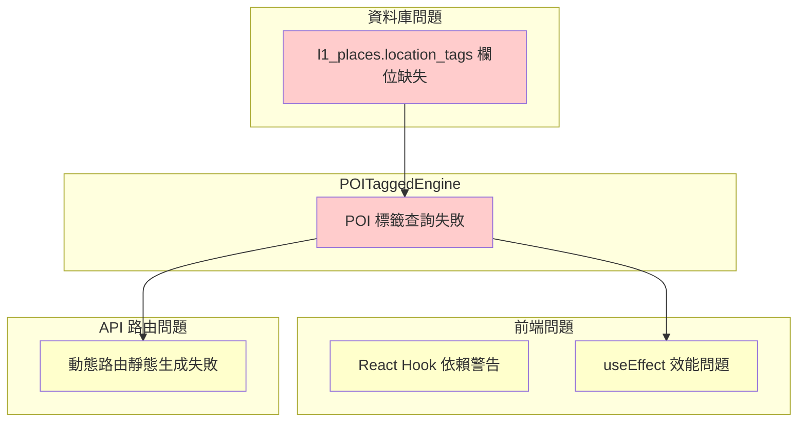

# 建置錯誤修復計畫

## 執行摘要

在建置日誌中發現了多個錯誤，主要分為四個類別：

| 優先順序 | 錯誤類型 | 影響程度 | 修復緊急性 |
|---------|---------|---------|-----------|
| P0 | 資料庫欄位缺失 | POI 標籤功能失效 | 立即處理 |
| P1 | React Hook 依賴警告 | 潛在效能問題 | 短期處理 |
| P2 | 動態路由靜態生成失敗 | 輕微效能影響 | 中期處理 |
| P3 | AI API Key 缺失 | 功能降級 | 按需處理 |

---

## 一、資料庫欄位缺失問題

### 1.1 錯誤描述

```
[POITaggedEngine] Query error: {
  code: '42703',
  message: 'column l1_places.location_tags does not exist'
}
```

### 1.2 根本原因

- PostgreSQL 錯誤碼 42703 表示「undefined_column」
- `POITaggedEngine` 引擎查詢 `l1_places` 表時嘗試存取 `location_tags` 欄位
- 該欄位不存在於資料庫 schema 中

### 1.3 觸發條件

- 任何需要根據 location_tags 進行 POI 篩選的查詢
- 首頁 POI 推薦功能
- 標籤式地點搜尋

### 1.4 修復方案

#### 1.4.1 建立資料庫遷移檔案

**檔案位置**: `supabase/migrations/20260110_add_location_tags_column.sql`

```sql
-- 新增 location_tags 欄位（使用 PostgreSQL 陣列類型）
ALTER TABLE l1_places ADD COLUMN IF NOT EXISTS location_tags TEXT[];

-- 建立 GIN 索引以優化陣列查詢效能
CREATE INDEX IF NOT EXISTS idx_l1_places_location_tags 
ON l1_places USING GIN (location_tags);

-- 建立更新觸發器（可選）
CREATE OR REPLACE FUNCTION update_l1_places_timestamp()
RETURNS TRIGGER AS $$
BEGIN
    NEW.updated_at = NOW();
    RETURN NEW;
END;
$$ LANGUAGE plpgsql;

-- 如果 updated_at 欄位存在，則建立觸發器
DO $$
BEGIN
    IF EXISTS (
        SELECT 1 FROM information_schema.columns 
        WHERE table_name = 'l1_places' AND column_name = 'updated_at'
    ) THEN
        CREATE TRIGGER trigger_update_l1_places_timestamp
        BEFORE UPDATE ON l1_places
        FOR EACH ROW
        EXECUTE FUNCTION update_l1_places_timestamp();
    END IF;
END;
$$ LANGUAGE plpgsql;
```

#### 1.4.2 更新類型定義

**檔案位置**: `src/types/database.ts` 或 `src/lib/supabase/types.ts`

```typescript
// 新增 location_tags 欄位類型
export interface L1Place {
  id: string;
  name: string;
  // ... 其他欄位
  location_tags: string[] | null;  // 新增
  created_at: string;
  updated_at: string;
}
```

### 1.5 驗證步驟

```sql
-- 確認欄位已新增
SELECT column_name, data_type 
FROM information_schema.columns 
WHERE table_name = 'l1_places' AND column_name = 'location_tags';

-- 測試索引
EXPLAIN ANALYZE 
SELECT * FROM l1_places 
WHERE location_tags @> '{"日本料理"}';
```

---

## 二、React Hook 依賴警告修復

### 2.1 受影響檔案清單

| 檔案路徑 | 行號 | 問題類型 |
|---------|------|---------|
| `src/app/[locale]/admin/l1-places/page.tsx` | 72, 77 | useEffect 缺少 fetchPlaces |
| `src/app/[locale]/admin/partners/page.tsx` | 49, 54 | useEffect 缺少 fetchPartners |
| `src/app/[locale]/page.tsx` | 113 | useEffect 缺少 setIsOnboardingOpen |
| `src/components/admin/NodeMerger.tsx` | 29, 47, 135 | useEffect 缺少多個依賴 |
| `src/components/chat/ChatPanel.tsx` | 176 | append 函式導致依賴不穩定 |
| `src/components/map/NodeMarker.tsx` | 116, 271 | useMemo 依賴問題 |
| `src/components/node/L3_Facilities.tsx` | 265 | useEffect 缺少 tL3 |
| `src/lib/design-tokens.ts` | 307 | export 問題 |

### 2.2 NodeMerger.tsx 修復範例

**檔案位置**: `src/components/admin/NodeMerger.tsx`

```typescript
// 修復前
useEffect(() => {
  fetchWards();
  // 缺少依賴陣列
}, []);

useEffect(() => {
  if (wardId) {
    getNodesByWard(wardId);
  }
}, [wardId]);

// 修復後
const fetchWards = useCallback(async () => {
  try {
    const { data, error } = await supabase
      .from('wards')
      .select('*')
      .order('name');
      
    if (error) throw error;
    setWards(data || []);
  } catch (err) {
    console.error('Error fetching wards:', err);
  }
}, []);  // 如果有外部依賴，在這裡添加

const getNodesByWard = useCallback(async (currentWardId: string) => {
  if (!currentWardId) return;
  
  try {
    const { data, error } = await supabase
      .from('nodes')
      .select('*')
      .eq('ward_id', currentWardId);
      
    if (error) throw error;
    setNodes(data || []);
  } catch (err) {
    console.error('Error fetching nodes:', err);
  }
}, []);  // 如果有外部依賴，在這裡添加

// 使用 useCallback 穩定的函式
useEffect(() => {
  fetchWards();
}, [fetchWards]);

useEffect(() => {
  if (selectedWardId) {
    getNodesByWard(selectedWardId);
  }
}, [selectedWardId, getNodesByWard]);
```

### 2.3 ChatPanel.tsx 修復範例

**檔案位置**: `src/components/chat/ChatPanel.tsx`

```typescript
// 修復前
const append = (...args) => {
  // append 函式實作
};

// 修復後
const append = useCallback((...args: Parameters<typeof streamable>) => {
  // append 函式實作
}, [/* 穩定的依賴 */]);
```

### 2.4 NodeMarker.tsx 修復範例

**檔案位置**: `src/components/map/NodeMarker.tsx`

```typescript
// 修復前
const markerColor = useMemo(() => {
  return node.id ? getColorForNode(node) : 'blue';
}, [node.id, node]);

// 修復後 - 移除不必要的依賴
const markerColor = useMemo(() => {
  return getColorForNode(node);
}, [node]);  // 只需要 node 作為依賴
```

### 2.5 design-tokens.ts 修復

**檔案位置**: `src/lib/design-tokens.ts`

```typescript
// 修復前
export default {
  colors: { ... }
};

// 修復後
const designTokens = {
  colors: { ... }
};

export default designTokens;
```

---

## 三、動態路由靜態生成問題

### 3.1 受影響的 API 路由

| API 路由 | 錯誤訊息 |
|---------|---------|
| `/api/admin/l1/places/analytics` | couldn't be rendered statically because it used `request.url` |
| `/api/admin/l1/places/pending` | couldn't be rendered statically because it used `request.url` |
| `/api/l3/accessibility` | couldn't be rendered statically because it used `request.url` |

### 3.2 修復方案

**檔案位置**: `src/app/api/admin/l1/places/analytics/route.ts`

```typescript
import { NextResponse } from 'next/server';

// 明確標記為動態路由
export const dynamic = 'force-dynamic';

export async function GET(request: Request) {
  const { searchParams } = new URL(request.url);
  // ... 現有邏輯
}
```

**檔案位置**: `src/app/api/admin/l1/places/pending/route.ts`

```typescript
import { NextResponse } from 'next/server';

export const dynamic = 'force-dynamic';

export async function GET(request: Request) {
  // ... 現有邏輯
}
```

**檔案位置**: `src/app/api/l3/accessibility/route.ts`

```typescript
import { NextResponse } from 'next/server';

export const dynamic = 'force-dynamic';

export async function GET(request: Request) {
  // ... 現有邏輯
}
```

---

## 四、AI API Key 缺失問題

### 4.1 錯誤描述

```
[WeatherAPI] No available AI API Keys for task: reasoning
```

### 4.2 修復方案

**檔案位置**: `.env.local` 或 Vercel 環境變數

```bash
# 新增環境變數
AI_API_KEYS=your-api-key-1,your-api-key-2
AI_API_KEY_TASK_REASONING=your-reasoning-key
```

**檔案位置**: `src/lib/ai/config.ts`（如果存在）

```typescript
export const aiConfig = {
  reasoning: {
    apiKey: process.env.AI_API_KEY_TASK_REASONING,
    model: process.env.AI_REASONING_MODEL || 'gemini-pro',
  },
};
```

---

## 五、錯誤關聯性分析



### 5.1 關聯說明

1. **資料庫問題影響多個功能**
   - `location_tags` 欄位缺失直接導致 `POITaggedEngine` 所有查詢失敗
   - 影響首頁 POI 推薦和標籤搜尋功能

2. **React Hook 警告可能是表徵**
   - `fetchPlaces`、`fetchWards` 等函式可能嘗試存取不存在的欄位
   - 修復資料庫問題後，部分警告可能自動消失

3. **動態路由是獨立問題**
   - 與資料庫問題無直接關聯
   - 是 Next.js 靜態生成機制的限制

---

## 六、修復優先順序

### 6.1 建議執行順序

| 順序 | 任務 | 預估工作量 | 風險等級 |
|-----|------|-----------|---------|
| 1 | 建立資料庫遷移檔案 | 低 | 低 |
| 2 | 執行資料庫遷移 | 低 | 中 |
| 3 | 修復 React Hook 警告 | 中 | 低 |
| 4 | 標記動態路由 | 低 | 低 |
| 5 | 配置 AI API Key | 低 | 低 |

### 6.2 建議時間線

- **立即執行**: 任務 1-2（資料庫遷移）
- **本週完成**: 任務 3（React Hook 修復）
- **按需處理**: 任務 4-5

---

## 七、驗證檢查清單

### 7.1 資料庫遷移驗證

- [ ] 確認 `location_tags` 欄位存在
- [ ] 確認 GIN 索引已建立
- [ ] 測試 POI 標籤查詢功能
- [ ] 驗證首頁 POI 推薦正常運作

### 7.2 前端修復驗證

- [ ] 執行 `npm run build`
- [ ] 確認所有 React Hook 警告已消除
- [ ] 檢查 ESLint 沒有新警告

### 7.3 API 路由驗證

- [ ] 測試 `/api/admin/l1/places/analytics`
- [ ] 測試 `/api/admin/l1/places/pending`
- [ ] 測試 `/api/l3/accessibility`

---

## 八、相關檔案清單

### 8.1 需要修改的檔案

```
supabase/migrations/
└── 20260110_add_location_tags_column.sql

src/
├── app/[locale]/admin/l1-places/page.tsx
├── app/[locale]/admin/partners/page.tsx
├── app/[locale]/page.tsx
├── app/api/admin/l1/places/analytics/route.ts
├── app/api/admin/l1/places/pending/route.ts
├── app/api/l3/accessibility/route.ts
├── components/admin/NodeMerger.tsx
├── components/chat/ChatPanel.tsx
├── components/map/NodeMarker.tsx
├── components/node/L3_Facilities.tsx
└── lib/design-tokens.ts

.env.local（或 Vercel 環境變數）
```

### 8.2 需要新增的檔案

```
無
```

---

## 九、風險評估

### 9.1 資料庫遷移風險

| 風險 | 機率 | 影響 | 緩解措施 |
|-----|-----|-----|---------|
| 現有資料相容性問題 | 低 | 中 | 先在 staging 環境測試 |
| 索引影響寫入效能 | 低 | 低 | 使用 GIN 索引，查詢效能更好 |
| 遷移失敗回滾 | 低 | 高 | 準備回滾脚本 |

### 9.2 前端修復風險

| 風險 | 機率 | 影響 | 緩解措施 |
|-----|-----|-----|---------|
| useCallback 改變行為 | 低 | 低 | 充分測試 |
| 依賴遺漏 | 中 | 中 | 逐一修復並驗證 |

---

## 十、聯絡窗口

如有任何問題，請聯繫：
- **資料庫相關**: 待定
- **前端相關**: 待定
- **DevOps 相關**: 待定

---

*建立日期: 2026-01-10*
*版本: 1.0*
