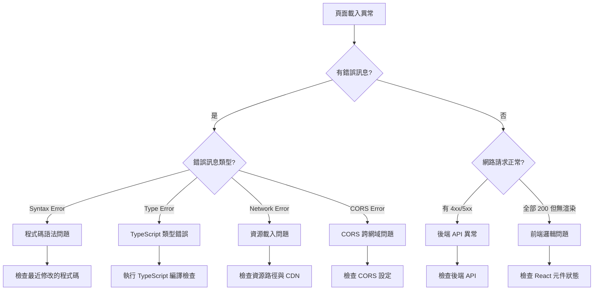
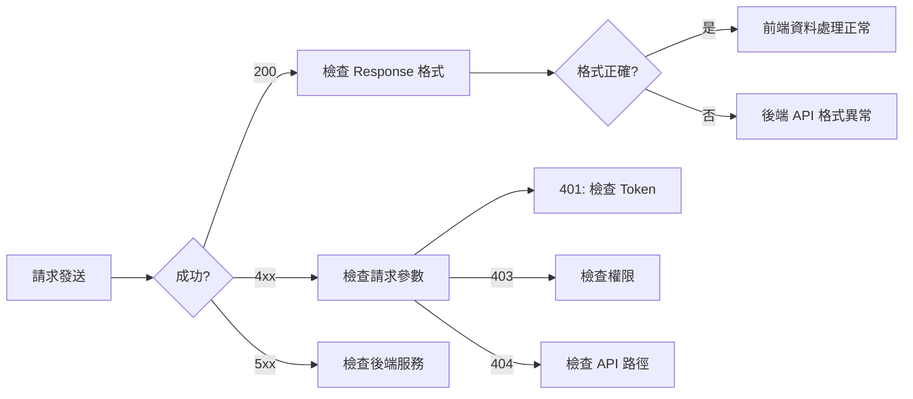

# LUTAGU 前端異常診斷與修復方案

## 📋 概述

本文檔提供 LUTAGU MVP 專案前端顯示異常的系統性分析與修復指南。專案技術棧為 **Next.js 14 + React 18 + TypeScript + TailwindCSS**。

---

## 🔍 第一部分：異常資訊收集方法

### 1.1 瀏覽器開發者工具錯誤訊息收集

#### Chrome DevTools Console 錯誤分類

| 錯誤類型 | 徵兆 | 收集位置 |
|---------|------|---------|
| **語法錯誤 (Syntax Errors)** | 頁面完全無法載入 | Console > Red errors |
| **執行時期錯誤 (Runtime Errors)** | 頁面部分功能失效 | Console > Red errors |
| **警告訊息 (Warnings)** | 功能異常但無錯誤 | Console > Yellow warnings |
| **資源載入錯誤** | 圖片/字型/樣式無法顯示 | Console > Red errors + Network failed |

#### 快速診斷指令

```javascript
// 在 Console 中執行以收集完整錯誤資訊
const errors = [];
window.addEventListener('error', (e) => {
  errors.push({
    message: e.message,
    filename: e.filename,
    lineno: e.lineno,
    colno: e.colno,
    timestamp: new Date().toISOString()
  });
});
console.table(errors);
```

### 1.2 網路請求狀態碼分析

#### 常用狀態碼對照表

| 狀態碼 | 意義 | 常見原因 |
|-------|------|---------|
| **200** | 成功 | 正常請求 |
| **301/302** | 重新導向 | URL 結構變更 |
| **400** | 錯誤請求 | 請求格式錯誤、參數缺失 |
| **401** | 未授權 | JWT token 過期、未登入 |
| **403** | 禁止存取 | 權限不足、CORS 阻擋 |
| **404** | 找不到 | API 路由不存在、檔案遺失 |
| **500** | 伺服器錯誤 | 後端程式碼異常 |
| **503** | 服務不可用 | 維護中、過載 |

#### Network 標籤診斷步驟

1. 打開 DevTools > Network 標籤
2. 勾選 "Preserve log" 保留請求記錄
3. 篩選 "XHR" 和 "Fetch" 查看 API 請求
4. 檢查每個請求的：
   - Request Headers（確認 Authorization token）
   - Response Headers（確認 Content-Type）
   - Response Tab（確認回傳資料格式）

### 1.3 JavaScript 執行時期例外狀況

#### React 專案常見錯誤模式

```typescript
// Error Boundary 範例 (src/app/error.tsx)
'use client';

import { useEffect } from 'react';

export default function Error({
  error,
  reset,
}: {
  error: Error & { digest?: string };
  reset: () => void;
}) {
  useEffect(() => {
    console.error('Application error:', error);
    // 可發送到錯誤追蹤服務如 Sentry
  }, [error]);

  return (
    <div className="p-4 text-center">
      <h2 className="text-xl font-bold text-red-600">頁面發生錯誤</h2>
      <p className="mt-2 text-gray-600">{error.message}</p>
      <button
        onClick={() => reset()}
        className="mt-4 px-4 py-2 bg-blue-500 text-white rounded"
      >
        重新整理
      </button>
    </div>
  );
}
```

### 1.4 CSS 樣式異常診斷

#### 樣式問題排查清單

| 問題類型 | 診斷方法 |
|---------|---------|
| **樣式未載入** | Network > 篩選 CSS 檔案，檢查 404 |
| **樣式覆蓋異常** | Elements > Computed > 查看最終樣式 |
| **Tailwind 未生效** | 檢查 `postcss.config.js` 和 `tailwind.config.ts` |
| **RWD 斷點問題** | DevTools > Toggle device toolbar |

---

## 🧩 第二部分：異常類型判斷方法論

### 2.1 決策樹分析



### 2.2 各類異常特徵與判斷標準

#### 2.2.1 前端程式碼邏輯問題

**特徵**：
- 頁面載入成功但無內容
- 特定功能點擊無反應
- 資料顯示不正確

**診斷指令**：
```bash
# 執行 TypeScript 類型檢查
npm run typecheck

# 執行 lint
npm run lint
```

#### 2.2.2 資源載入問題

**特徵**：
- 圖片顯示為破裂圖示
- 字型顯示為預設字體
- 部分區塊空白

**檢查點**：
- `public/` 資料夾檔案是否存在
- 圖片路徑是否正確（相對路徑 vs 絕對路徑）
- 靜態資源是否被正確複製到 `.next/static`

#### 2.2.3 CORS 跨網域問題

**特徵**：
- Console 顯示 `Access-Control-Allow-Origin` 錯誤
- API 請求被阻擋
- 預檢請求 (OPTIONS) 失敗

**檢查位置**：
1. `next.config.js` 的 `async headers()` 設定
2. 後端 API 的 CORS middleware
3. 第三方 API 的跨網域政策

#### 2.2.4 後端 API 回傳資料格式不符

**特徵**：
- Console 顯示 `Cannot read property of undefined`
- 頁面載入後閃爍錯誤
- 特定 API 請求後崩潰

**診斷步驟**：
```javascript
// 在 Network > Response 中檢查實際回傳格式
// 對比 TypeScript 定義類型
```

#### 2.2.5 建置部署配置錯誤

**特徵**：
- 開發環境正常，生產環境異常
- 特定環境變數未正確讀取
- 路徑別名 (@/*) 無法解析

**檢查點**：
- `.env.local` vs `.env.production`
- `tsconfig.json` 的 `paths` 設定
- `next.config.js` 的環境變數設定

---

## 🔧 第三部分：排查步驟與診斷工具

### 3.1 Chrome DevTools 進階使用

#### 3.1.1 Network 標籤深度分析



#### 3.1.2 Performance 標籤分析渲染效能

**記錄效能問題步驟**：
1. 打開 Performance 標籤
2. 點擊 Record 鈕
3. 執行問題操作
4. 點擊 Stop
5. 分析：
   - Main thread 的長任務（>50ms）
   - Largest Contentful Paint (LCP)
   - Total Blocking Time (TBT)

#### 3.1.3 Lighthouse 效能與可訪問性檢測

**執行方式**：
1. DevTools > Lighthouse 標籤
2. 勾選 "Performance" 和 "Accessibility"
3. 點擊 "Analyze page load"

**重點指標**：
| 指標 | 良好標準 | 需優化 |
|-----|---------|-------|
| LCP | < 2.5s | > 4s |
| FID | < 100ms | > 300ms |
| CLS | < 0.1 | > 0.25 |
| TBT | < 200ms | > 600ms |

### 3.2 Next.js 專用診斷工具

#### 3.2.1 建置分析

```bash
# 分析建置產物大小
npm run build
# 查看 .next/build-manifest.json
# 查看 .next/server/pages-manifest.json
```

#### 3.2.2 環境變數診斷

```bash
# 檢查環境變數載入
node -e "console.log({
  NEXT_PUBLIC_API_URL: process.env.NEXT_PUBLIC_API_URL,
  NEXT_PUBLIC_SUPABASE_URL: process.env.NEXT_PUBLIC_SUPABASE_URL,
})"
```

#### 3.2.3 類型檢查

```bash
# 完整類型檢查
npm run typecheck

# 快速類型檢查（清除快取後）
npm run typecheck
```

### 3.3 React 專屬除錯技巧

#### 3.3.1 React DevTools

- **Components Tab**：查看元件樹與 props
- **Profiler Tab**：記錄並分析渲染效能
- **Debugging**：設定中斷點逐步執行

#### 3.3.2 常見 React 問題診斷

```typescript
// 1. useEffect 依賴陣列問題
useEffect(() => {
  // 此 effect 會在每次渲染執行
  // 可能導致無限迴圈或效能問題
}, []); // 空的依賴陣列表示只在 mount 執行一次

// 2. 狀態更新非同步問題
const [data, setData] = useState(null);
useEffect(() => {
  fetchData().then(result => {
    setData(result);
    console.log(data); // 這裡的 data 仍是舊值
    // 應該使用 result 或在新的 useEffect 中處理
  });
}, []);

// 3. Key 問題導致渲染異常
{items.map(item => (
  <ListItem key={item.id} /> // 使用唯一 ID 作為 key
))}
```

### 3.4 地圖功能專項診斷（LUTAGU 使用 react-leaflet）

```typescript
// 常見地圖問題診斷

// 1. 地圖容器高度問題
// 確保父容器有明確的高度
<div className="h-[500px] w-full">
  <MapContainer style={{ height: '100%', width: '100%' }} />
</div>

// 2. SSR 兼容性問題（Next.js）
// 使用 dynamic import 延遲載入
import dynamic from 'next/dynamic';

const MapView = dynamic(
  () => import('./MapView'),
  { ssr: false } // 關閉 SSR
);

// 3. 圖示載入問題
import L from 'leaflet';
import icon from 'leaflet/dist/images/marker-icon.png';
import iconShadow from 'leaflet/dist/images/marker-shadow.png';

const DefaultIcon = L.icon({
  iconUrl: icon.src,
  shadowUrl: iconShadow.src,
  iconSize: [25, 41],
  iconAnchor: [12, 41]
});
```

---

## ✅ 第四部分：修復方案與預防機制

### 4.1 常見問題修復方案

#### 4.1.1 資源路徑問題修復

**問題**：圖片、樣式、字型無法載入

**解決方案**：

```typescript
// next.config.js 設定
module.exports = {
  images: {
    domains: ['your-cdn.com'],
    formats: ['image/avif', 'image/webp'],
  },
  // 確保靜態資源正確處理
  assetPrefix: process.env.NODE_ENV === 'production' 
    ? 'https://cdn.yourdomain.com' 
    : undefined,
};
```

#### 4.1.2 CORS 問題修復

**問題**：跨網域 API 請求被阻擋

**解決方案**：

```typescript
// next.config.js
module.exports = {
  async headers() {
    return [
      {
        source: '/api/:path*',
        headers: [
          { key: 'Access-Control-Allow-Credentials', value: 'true' },
          { key: 'Access-Control-Allow-Origin', value: '*' },
          { key: 'Access-Control-Allow-Methods', value: 'GET,OPTIONS,PATCH,DELETE,POST,PUT' },
          { key: 'Access-Control-Allow-Headers', value: 'X-CSRF-Token, X-Requested-With, Accept, Accept-Version, Content-Length, Content-MD5, Content-Type, Date, X-Api-Version' },
        ],
      },
    ];
  },
};
```

#### 4.1.3 環境變數問題修復

**問題**：環境變數在 build 後無法讀取

**解決方案**：

```typescript
// 使用 NEXT_PUBLIC_ 前綴使變數可在客戶端存取
// .env.local
NEXT_PUBLIC_API_URL=http://localhost:3000
NEXT_PUBLIC_SUPABASE_URL=https://your-project.supabase.co
NEXT_PUBLIC_SUPABASE_ANON_KEY=your-anon-key

// 在程式碼中使用
const apiUrl = process.env.NEXT_PUBLIC_API_URL;
```

#### 4.1.4 TypeScript 類型錯誤修復

**問題**：編譯錯誤導致建置失敗

**解決方案**：

```bash
# 執行類型檢查並修復錯誤
npm run typecheck

# 常見修復
# 1. 安裝缺少的類型定義
npm install --save-dev @types/react-leaflet

# 2. 修復介面定義
interface MyComponentProps {
  data: {
    id: string;
    name: string;
  }[];
}
```

### 4.2 錯誤邊界與監控

#### 4.2.1 全域錯誤邊界

```typescript
// src/app/global-error.tsx
'use client';

export default function GlobalError({
  error,
  reset,
}: {
  error: Error & { digest?: string };
  reset: () => void;
}) {
  return (
    <html>
      <body>
        <div className="flex min-h-screen items-center justify-center">
          <div className="text-center">
            <h1 className="text-4xl font-bold text-red-600">系統錯誤</h1>
            <p className="mt-4 text-gray-600">{error.message}</p>
            <button
              onClick={() => reset()}
              className="mt-6 rounded-lg bg-blue-600 px-6 py-3 text-white"
            >
              重新整理頁面
            </button>
          </div>
        </div>
      </body>
    </html>
  );
}
```

#### 4.2.2 API 錯誤處理

```typescript
// src/lib/api-error-handler.ts
export function handleApiError(error: unknown): string {
  if (error instanceof TypeError) {
    return '網路連線異常，請檢查網路設定';
  }
  if (error instanceof SyntaxError) {
    return '資料格式異常，請聯繫技術支援';
  }
  if (error instanceof Error) {
    return error.message;
  }
  return '發生未知錯誤';
}
```

### 4.3 預防機制建立

#### 4.3.1 CI/CD 自動化測試

```yaml
# .github/workflows/test.yml
name: Tests

on: [push, pull_request]

jobs:
  test:
    runs-on: ubuntu-latest
    steps:
      - uses: actions/checkout@v4
      - uses: actions/setup-node@v4
        with:
          node-version: '20'
      - run: npm ci
      - run: npm run typecheck
      - run: npm run lint
      - run: npm run build
      - run: npm run test
```

#### 4.3.2 建置前檢查清單

```bash
#!/bin/bash
# scripts/pre-build-check.sh

echo "=== 執行建置前檢查 ==="

# 1. 檢查環境變數
echo "1. 檢查環境變數..."
node -e "
const required = ['NEXT_PUBLIC_API_URL', 'NEXT_PUBLIC_SUPABASE_URL'];
const missing = required.filter(v => !process.env[v]);
if (missing.length > 0) {
  console.error('缺少環境變數:', missing.join(', '));
  process.exit(1);
}
"

# 2. TypeScript 類型檢查
echo "2. 執行 TypeScript 檢查..."
npm run typecheck || exit 1

# 3. ESLint 檢查
echo "3. 執行 ESLint..."
npm run lint || exit 1

echo "=== 檢查完成，準備建置 ==="
```

#### 4.3.3 監控與告警

```typescript
// 錯誤監控範例
export function setupErrorMonitoring() {
  if (typeof window !== 'undefined') {
    // 收集未處理的 Promise rejection
    window.addEventListener('unhandledrejection', (event) => {
      console.error('Unhandled Promise Rejection:', event.reason);
      // 可發送到監控服務
    });

    // 收集全域錯誤
    window.addEventListener('error', (event) => {
      console.error('Global Error:', event.error);
    });
  }
}
```

### 4.4 快速診斷腳本

建立一個快速診斷腳本來自動化常見檢查：

```bash
#!/bin/bash
# scripts/frontend-debug.sh

echo "=== LUTAGU 前端診斷工具 ==="

echo ""
echo "1. 檢查 Node 版本..."
node -v

echo ""
echo "2. 檢查 npm 依賴..."
npm ls --depth=0 2>/dev/null | head -20

echo ""
echo "3. 執行 TypeScript 檢查..."
npm run typecheck 2>&1 | tail -20

echo ""
echo "4. 執行 ESLint..."
npm run lint 2>&1 | tail -20

echo ""
echo "5. 檢查環境變數..."
node -e "
const vars = ['NEXT_PUBLIC_API_URL', 'NEXT_PUBLIC_SUPABASE_URL', 'NEXT_PUBLIC_SUPABASE_ANON_KEY'];
vars.forEach(v => console.log(v + ':', process.env[v] ? '已設定' : '未設定'));
"

echo ""
echo "6. 檢查建置..."
npm run build 2>&1 | tail -30

echo ""
echo "=== 診斷完成 ==="
```

---

## 📚 參考資源

### 官方文件
- [Next.js Documentation](https://nextjs.org/docs)
- [React DevTools](https://react.dev/learn/react-developer-tools)
- [Chrome DevTools](https://developer.chrome.com/docs/devtools)

### 專案特定文件
- [DEVELOPMENT_GUIDE.md](../DEVELOPMENT_GUIDE.md)
- [06_UI_SPEC.md](../06_UI_SPEC.md)

### 相關工具
- [Lighthouse](https://developer.chrome.com/docs/lighthouse)
- [Sentry](https://sentry.io/) - 錯誤追蹤
- [Webpack Bundle Analyzer](https://github.com/webpack-contrib/webpack-bundle-analyzer)

---

## 📝 更新紀錄

| 日期 | 版本 | 說明 |
|-----|------|------|
| 2024-01-07 | 1.0 | 初版文件建立 |
