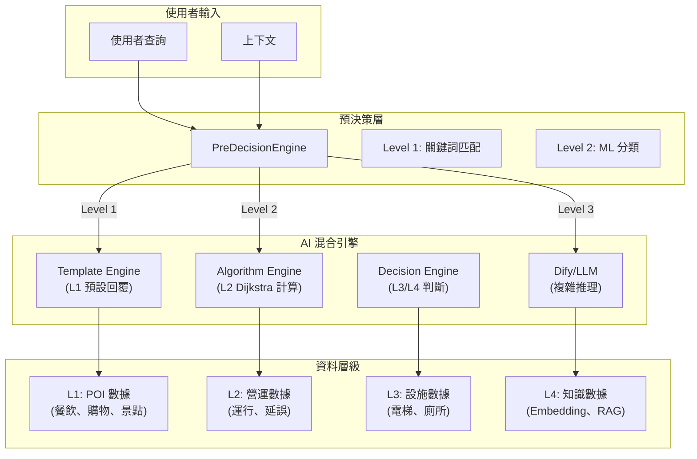
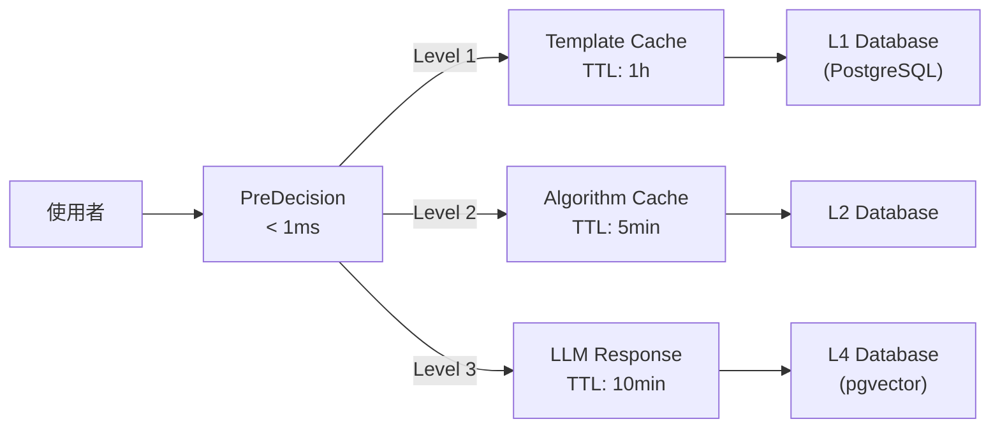

# L1~L4 資料結構與 AI 混合型智慧引擎應用對照文件

> **文件日期**: 2026-01-07
> **專案名稱**: LUTAGU/LUTAGU MVP
> **版本**: 1.0

---

## 1. 架構總覽：資料層級與 AI 引擎對應關係



---

## 2. L1 數據：POI 與站點周邊資訊

### 2.1 資料結構定義

```sql
-- L1 Places (OSM POI 數據)
CREATE TABLE l1_places (
    id UUID PRIMARY KEY,
    station_id TEXT NOT NULL,
    osm_id BIGINT NOT NULL,
    name TEXT NOT NULL,
    name_i18n JSONB,           -- 多語言名稱
    category TEXT NOT NULL,     -- dining, shopping, attraction, service, transit
    subcategory TEXT,          -- japanese_food, cafe, convenience, etc.
    tags TEXT[],               -- OSM tags
    location JSONB,            -- {coordinates: [lon, lat]}
    attributes JSONB,          -- 營業時間、價格等
    is_approved BOOLEAN DEFAULT FALSE,
    source TEXT DEFAULT 'osm'  -- osm, manual, partner
);

-- L1 Custom Places (合作夥伴數據)
CREATE TABLE l1_custom_places (
    id UUID PRIMARY KEY,
    station_id TEXT NOT NULL,
    name TEXT NOT NULL,
    name_i18n JSONB,
    category TEXT NOT NULL,
    description TEXT,
    description_i18n JSONB,
    images TEXT[],
    location JSONB,
    attributes JSONB,
    priority INT DEFAULT 0,     -- 顯示優先級
    is_partner BOOLEAN DEFAULT TRUE,
    partner_id UUID,
    affiliate_url TEXT,
    is_active BOOLEAN DEFAULT TRUE,
    status TEXT DEFAULT 'active'  -- active, inactive, suspended
);
```

### 2.2 L1 數據在 AI 引擎中的應用

| 應用場景 | AI 引擎元件 | 數據獲取方式 | 延遲目標 |
|---------|------------|-------------|----------|
| **站點周邊餐廳推薦** | LLM (Dify Agent) | RAG 查詢 l1_places + l1_custom_places | < 300ms |
| **景點介紹** | Decision Engine | l1_places.category = 'attraction' | < 50ms |
| **便利商店位置** | Algorithm Engine | l1_places.subcategory = 'convenience' | < 20ms |
| **合作夥伴店鋪** | Template Engine | l1_custom_places (高優先級) | < 5ms |
| **營業時間查詢** | Algorithm Engine | l1_places.attributes->'opening_hours' | < 20ms |

### 2.3 L1 數據查詢優化

```sql
-- 高效查詢站點周邊 POI (使用索引)
CREATE INDEX idx_l1_places_station_category ON l1_places(station_id, category);
CREATE INDEX idx_l1_custom_places_priority ON l1_custom_places(priority DESC);

-- 查詢函數
CREATE OR REPLACE FUNCTION search_l1_pois(
    p_station_id TEXT,
    p_category TEXT DEFAULT NULL,
    p_limit INT DEFAULT 20
)
RETURNS SETOF l1_places AS $$
BEGIN
    RETURN QUERY
    SELECT l.*
    FROM l1_places l
    WHERE l.station_id = p_station_id
        AND (p_category IS NULL OR l.category = p_category)
        AND l.is_approved = TRUE
    ORDER BY
        CASE WHEN l.source = 'manual' THEN 0 ELSE 1 END,  -- 手動數據優先
        l.name
    LIMIT p_limit;
END;
$$;
```

### 2.4 AI Prompt 整合範例

```typescript
// L1 POI 查詢 Prompt
const l1PoiPrompt = `
你是東京交通與旅遊助手。請根據以下站點周邊 POI 資訊回答問題：

站點: {station_name}
位置: {station_location}

周邊設施 (L1 數據):
{poi_list}

任務:
1. 推薦符合使用者需求的設施
2. 提供準確的交通指引
3. 包含實用資訊 (營業時間、價格等)

使用者問題: {user_question}

請用繁體中文回答，內容簡潔實用。
`;
```

---

## 3. L2 數據：營運與路網數據

### 3.1 資料結構定義

```sql
-- L2 運行數據
CREATE TABLE l2_routes (
    id TEXT PRIMARY KEY,           -- odpt:Route:JR-East.Yamanote
    operator TEXT NOT NULL,
    route_name JSONB,             -- 多語言路線名稱
    from_station TEXT,
    to_station TEXT,
    line_code TEXT,
    line_color TEXT,
    is_active BOOLEAN DEFAULT TRUE
);

-- L2 運行狀態歷史
CREATE TABLE l2_disruption_history (
    id UUID PRIMARY KEY,
    station_id TEXT NOT NULL,
    route_id TEXT,
    disruption_type TEXT,         -- delay, suspension, reduced_service
    severity TEXT,                -- minor, major, severe
    title TEXT,
    description TEXT,
    start_time TIMESTAMPTZ,
    end_time TIMESTAMPTZ,
    affected_stations TEXT[],
    status TEXT,                  -- ongoing, resolved, scheduled
    source TEXT,
    created_at TIMESTAMPTZ DEFAULT NOW()
);

-- L2 站點連接 (用於 Dijkstra 演算法)
CREATE TABLE l2_connections (
    id UUID PRIMARY KEY,
    from_station TEXT NOT NULL,
    to_station TEXT NOT NULL,
    route_id TEXT NOT NULL,
    travel_time_minutes INT,     -- 行駛時間
    distance_meters DECIMAL,
    transfer_time INT DEFAULT 2, -- 換乘時間
    is_active BOOLEAN DEFAULT TRUE
);
```

### 3.2 L2 數據在 AI 引擎中的應用

| 應用場景 | AI 引擎元件 | 數據獲取方式 | 延遲目標 |
|---------|------------|-------------|----------|
| **路線規劃** | Algorithm Engine | Dijkstra + l2_connections | < 50ms |
| **運行延誤查詢** | Decision Engine | l2_disruption_history | < 20ms |
| **換乘次數計算** | Algorithm Engine | l2_connections + routes | < 30ms |
| **總行駛時間** | Algorithm Engine | SUM(travel_time_minutes) | < 30ms |
| **複雜行程規劃** | LLM (Dify Agent) | 整合 L1+L2+L3 | < 500ms |

### 3.3 Dijkstra 演算法整合

```typescript
// src/lib/l4/algorithms/routeFinder.ts

interface RouteNode {
    id: string;
    name: string;
    connections: RouteEdge[];
}

interface RouteEdge {
    to: string;
    routeId: string;
    travelTime: number;
    transferTime: number;
}

export class RouteFinder {
    private connections: Map<string, RouteEdge[]> = new Map();

    /**
     * 使用 Dijkstra 演算法找最短路徑
     */
    async findShortestPath(
        origin: string,
        destination: string
    ): Promise<RouteResult | null> {
        const startTime = Date.now();

        // 初始化
        const distances = new Map<string, number>();
        const previous = new Map<string, RouteEdge | null>();
        const visited = new Set<string>();
        const pq = new PriorityQueue<{node: string; dist: number}>();

        distances.set(origin, 0);
        pq.enqueue({ node: origin, dist: 0 });

        while (!pq.isEmpty()) {
            const current = pq.dequeue()!;

            if (visited.has(current.node)) continue;
            visited.add(current.node);

            if (current.node === destination) {
                return this.reconstructPath(origin, destination, previous, startTime);
            }

            // 遍歷鄰居
            const neighbors = this.connections.get(current.node) || [];
            for (const edge of neighbors) {
                if (visited.has(edge.to)) continue;

                const newDist = distances.get(current.node)! +
                    edge.travelTime + edge.transferTime;

                if (newDist < (distances.get(edge.to) || Infinity)) {
                    distances.set(edge.to, newDist);
                    previous.set(edge.to, edge);
                    pq.enqueue({ node: edge.to, dist: newDist });
                }
            }
        }

        return null; // 無法到達
    }

    /**
     * 重構路徑
     */
    private reconstructPath(
        origin: string,
        destination: string,
        previous: Map<string, RouteEdge | null>,
        startTime: number
    ): RouteResult {
        const path: string[] = [];
        const details: RouteDetail[] = [];
        let totalTime = 0;
        let totalTransfers = 0;
        let current = destination;

        while (current !== origin) {
            path.unshift(current);
            const edge = previous.get(current);
            if (edge) {
                details.unshift({
                    from: current,
                    to: edge.to,
                    routeId: edge.routeId,
                    travelTime: edge.travelTime
                });
                totalTime += edge.travelTime + edge.transferTime;
                if (previous.has(edge.to)) {
                    totalTransfers++;
                }
                current = edge.to;
            }
        }
        path.unshift(origin);

        return {
            path,
            details,
            totalTime,
            totalTransfers,
            estimatedCost: this.estimateFare(details),
            latency: Date.now() - startTime
        };
    }
}
```

### 3.4 AI Prompt 整合範例

```typescript
// L2 路線規劃 Prompt
const routePlanningPrompt = `
你是東京交通專家。請根據以下即時數據規劃路線：

起點站: {origin_station}
終點站: {destination_station}
使用者偏好: {user_preferences}

可用路線 (L2 數據):
{routes}

即時運行狀態:
{disruptions}

請提供:
1. 最佳路線建議 (考慮換乘次數、時間)
2. 預估抵達時間
3. 繞行建議 (如有延誤)
4. 轉乘站點說明

回覆格式:
- 路線摘要
- 詳細轉乘指引
- 預估時間與費用
- 注意事項
`;
```

---

## 4. L3 數據：無障礙與設施資訊

### 4.1 資料結構定義

```sql
-- L3 設施數據
CREATE TABLE l3_facilities (
    id UUID PRIMARY KEY,
    station_id TEXT NOT NULL REFERENCES nodes(id),
    type TEXT NOT NULL,           -- elevator, escalator, toilet, locker, atm, ramp
    name_i18n JSONB,              -- 多語言設施名稱
    location TEXT,                -- 具體位置描述
    attributes JSONB,             -- {floor: "B1F-1F", accessible: true, etc.}
    floor_level TEXT,             -- B3F, B2F, B1F, 1F, 2F, etc.
    coordinates JSONB,            -- {coordinates: [lon, lat]}
    is_active BOOLEAN DEFAULT TRUE,
    updated_at TIMESTAMPTZ DEFAULT NOW()
);

-- L3 設施配置 (控制顯示)
CREATE TABLE node_l3_config (
    id UUID PRIMARY KEY,
    node_id TEXT NOT NULL,
    facility_type TEXT NOT NULL,
    is_approved BOOLEAN DEFAULT FALSE,
    display_order INT DEFAULT 0,
    notes TEXT
);

-- 無障礙路徑
CREATE TABLE pedestrian_nodes (
    id UUID PRIMARY KEY,
    node_id TEXT UNIQUE NOT NULL,     -- 行人網路節點 ID
    station_id TEXT REFERENCES nodes(id),
    coordinates GEOGRAPHY(Point, 4326),
    floor_level TEXT,
    is_accessible BOOLEAN DEFAULT TRUE,
    has_elevator BOOLEAN DEFAULT FALSE,
    has_ramp BOOLEAN DEFAULT FALSE
);

CREATE TABLE pedestrian_links (
    id UUID PRIMARY KEY,
    link_id TEXT UNIQUE NOT NULL,
    station_id TEXT REFERENCES nodes(id),
    start_node_id TEXT NOT NULL,
    end_node_id TEXT NOT NULL,
    link_type TEXT,              -- stair, ramp, elevator, escalator
    length_meters DECIMAL,
    is_accessible BOOLEAN DEFAULT TRUE,
    floor_level TEXT
);
```

### 4.2 L3 數據在 AI 引擎中的應用

| 應用場景 | AI 引擎元件 | 數據獲取方式 | 延遲目標 |
|---------|------------|-------------|----------|
| **電梯位置查詢** | Algorithm Engine | l3_facilities.type = 'elevator' | < 20ms |
| **無障礙路徑規劃** | Algorithm Engine | pedestrian_network + l3_facilities | < 50ms |
| **廁所位置** | Decision Engine | l3_facilities.type = 'toilet' | < 20ms |
| **寄物櫃查詢** | Decision Engine | l3_facilities.type = 'locker' | < 20ms |
| **輪椅使用者建議** | LLM (Dify Agent) | 整合 l3 + pedestrian | < 300ms |

### 4.3 無障礙路徑查詢

```sql
-- 查詢站點無障礙設施
CREATE OR REPLACE FUNCTION get_accessibility_info(
    p_station_id TEXT,
    p_require_elevator BOOLEAN DEFAULT FALSE,
    p_require_ramp BOOLEAN DEFAULT FALSE
)
RETURNS JSON AS $$
DECLARE
    v_facilities JSON;
    v_pedestrian JSON;
    v_accessible_routes JSON;
BEGIN
    -- 查詢設施
    SELECT json_agg(
        json_build_object(
            'type', f.type,
            'location', f.location,
            'floor', f.floor_level,
            'attributes', f.attributes
        )
    ) INTO v_facilities
    FROM l3_facilities f
    WHERE f.station_id = p_station_id
        AND f.is_active = TRUE
        AND (NOT p_require_elevator OR f.type = 'elevator')
        AND (NOT p_require_ramp OR f.type = 'ramp');

    -- 查詢行人網路
    SELECT json_agg(
        json_build_object(
            'node_id', pn.node_id,
            'accessible', pn.is_accessible,
            'has_elevator', pn.has_elevator
        )
    ) INTO v_pedestrian
    FROM pedestrian_nodes pn
    WHERE pn.station_id = p_station_id
        AND pn.is_accessible = TRUE;

    RETURN json_build_object(
        'station_id', p_station_id,
        'facilities', v_facilities,
        'pedestrian_network', v_pedestrian,
        'timestamp', NOW()
    );
END;
$$;
```

### 4.4 AI Prompt 整合範例

```typescript
// L3 無障礙查詢 Prompt
const accessibilityPrompt = `
你是無障礙旅遊專家。請為輪椅使用者/行動不便者規劃:

站點: {station_name}
需求: {accessibility_needs}

可用設施 (L3 數據):
{accessibility_info}

行人網路狀態:
{pedestrian_network}

請提供:
1. 無障礙設施位置與使用方式
2. 推薦的無障礙路徑
3. 可能的障礙與替代方案
4. 電梯/電扶梯位置圖

注意:
- 詳細說明樓層位置
- 標註可能的狹窄通道
- 提供替代方案
`;
```

---

## 5. L4 數據：AI 知識庫與嵌入

### 5.1 資料結構定義

```sql
-- L4 知識庫 v2 (含嵌入向量)
CREATE TABLE l4_knowledge_v2 (
    id UUID PRIMARY KEY,
    knowledge_type TEXT NOT NULL,     -- station_wisdom, travel_tip, local_info, etc.
    title TEXT NOT NULL,
    content TEXT NOT NULL,
    content_embedding VECTOR(1536),   -- Mistral/OpenAI embedding
    node_id TEXT REFERENCES nodes(id),
    node_vibe JSONB,                  -- ['culture', 'geek', 'luxury', 'nature']
    tag_category TEXT[],              -- ['food', 'shopping', 'nightlife']
    tag_subcategory TEXT[],           -- ['ramen', 'department_store', 'bar']
    user_context TEXT[],              -- ['budget', 'family', 'couple']
    importance INT DEFAULT 5,         -- 1-10
    language TEXT DEFAULT 'zh-TW',
    source TEXT,
    created_at TIMESTAMPTZ DEFAULT NOW(),
    updated_at TIMESTAMPTZ DEFAULT NOW()
);

-- L4 嵌入向量索引 (HNSW)
CREATE INDEX idx_l4v2_embedding_hnsw ON l4_knowledge_v2
USING hnsw (embedding vector_cosine_ops);
```

### 5.2 L4 數據在 AI 引擎中的應用

| 應用場景 | AI 引擎元件 | 數據獲取方式 | 延遲目標 |
|---------|------------|-------------|----------|
| **站點智慧問答** | Dify Agent + RAG | semantic_search(l4_knowledge_v2) | < 300ms |
| **旅遊建議** | LLM | vector_similarity | < 300ms |
| **在地知識** | Decision Engine | keyword_search | < 20ms |
| **行程規劃** | LLM (Dify Agent) | hybrid_search | < 500ms |
| **文化背景說明** | Template Engine | l4_knowledge_v2.cache | < 5ms |

### 5.3 RAG 查詢函數

```sql
-- 語義搜索 L4 知識
CREATE OR REPLACE FUNCTION search_knowledge_semantic(
    p_query TEXT,
    p_node_id TEXT DEFAULT NULL,
    p_limit INT DEFAULT 5
)
RETURNS TABLE (
    id UUID,
    title TEXT,
    content TEXT,
    knowledge_type TEXT,
    importance INT,
    relevance_score FLOAT
) AS $$
BEGIN
    RETURN QUERY
    SELECT
        k.id,
        k.title,
        k.content,
        k.knowledge_type,
        k.importance,
        1 - (k.embedding <=> p_query::vector) AS relevance_score
    FROM l4_knowledge_v2 k
    WHERE (p_node_id IS NULL OR k.node_id = p_node_id)
        AND k.importance >= 5
    ORDER BY relevance_score DESC
    LIMIT p_limit;
END;
$$;

-- 混合搜索 (語義 + 關鍵詞)
CREATE OR REPLACE FUNCTION search_knowledge_hybrid(
    p_query TEXT,
    p_node_id TEXT DEFAULT NULL,
    p_user_context TEXT[] DEFAULT NULL,
    p_limit INT DEFAULT 10
)
RETURNS TABLE (
    id UUID,
    title TEXT,
    content TEXT,
    knowledge_type TEXT,
    importance INT,
    hybrid_score FLOAT
) AS $$
DECLARE
    v_query_embedding vector;
BEGIN
    -- 生成查詢嵌入
    SELECT openai_embedding(p_query) INTO v_query_embedding;

    RETURN QUERY
    SELECT
        k.id,
        k.title,
        k.content,
        k.knowledge_type,
        k.importance,
        (
            -- 語義分數 (70%)
            (1 - (k.embedding <=> v_query_embedding)) * 0.7 +
            -- 重要性分數 (20%)
            (k.importance::float / 10.0) * 0.2 +
            -- 上下文匹配分數 (10%)
            CASE
                WHEN p_user_context IS NOT NULL AND
                     k.user_context && p_user_context
                THEN 0.1
                ELSE 0
            END
        ) AS hybrid_score
    FROM l4_knowledge_v2 k
    WHERE (p_node_id IS NULL OR k.node_id = p_node_id)
    ORDER BY hybrid_score DESC
    LIMIT p_limit;
END;
$$;
```

### 5.4 AI Prompt 整合範例

```typescript
// L4 RAG Prompt
const ragPrompt = `
你是東京旅遊達人。請結合以下知識庫內容回答問題:

站點資訊:
{station_info}

相關知識 (L4 RAG):
{knowledge_chunks}

使用者問題: {user_question}

回答原則:
1. 結合知識庫提供準確資訊
2. 推薦符合使用者偏好的內容
3. 提供實用的小提示
4. 避免hallucination，僅使用提供資訊

如果知識庫沒有相關資訊，請誠實告知，並提供一般性建議。
`;
```

---

## 6. L1~L4 數據整合應用矩陣

### 6.1 查詢類型與數據層級對應

| 查詢類型 | L1 | L2 | L3 | L4 | 主要引擎 |
|---------|----|----|----|----|----------|
| "附近有什麼好吃的" | ✅ | - | - | ✅ | LLM + RAG |
| "怎麼從東京到新宿" | - | ✅ | - | ✅ | Algorithm |
| "有電梯嗎" | - | - | ✅ | - | Decision |
| "現在營業嗎" | ✅ | - | - | - | Algorithm |
| "推薦行程" | ✅ | ✅ | - | ✅ | LLM (Dify) |
| "輪椅怎麼走" | - | - | ✅ | ✅ | LLM (Dify) |
| "門票多少錢" | ✅ | - | - | - | Template |
| "首班車幾點" | - | ✅ | - | - | Algorithm |
| "這裡有什麼歷史" | - | - | - | ✅ | RAG |

### 6.2 數據一致性策略

```typescript
// 數據一致性檢查
export async function validateDataConsistency(): Promise<ConsistencyReport> {
    const checks = [
        // L1 配置一致性
        {
            name: 'l1_config_consistency',
            query: 'SELECT validate_l1_views()',
            threshold: 0.99
        },
        // L3 設施同步
        {
            name: 'l3_facilities_sync',
            query: 'SELECT COUNT(*) FROM l3_facilities WHERE station_id NOT IN (SELECT id FROM nodes)',
            threshold: 0
        },
        // L4 嵌入完整性
        {
            name: 'l4_embedding_completeness',
            query: 'SELECT COUNT(*) FROM l4_knowledge_v2 WHERE embedding IS NULL',
            threshold: 0
        }
    ];

    const results = await Promise.all(
        checks.map(c => executeQuery(c.query))
    );

    return {
        timestamp: new Date(),
        checks: results.map((r, i) => ({
            ...checks[i],
            passed: r <= checks[i].threshold
        }))
    };
}
```

---

## 7. AI 引擎效能優化策略

### 7.1 快取層級



### 7.2 查詢優化建議

| 數據層 | 優化策略 | 預期改善 |
|--------|----------|----------|
| **L1** | 索引 station_id + category, 批量查詢 | 查詢時間 < 20ms |
| **L2** | Dijkstra 路徑快取, 連接池 | 路徑計算 < 50ms |
| **L3** | 複合索引, 物化視圖 | 設施查詢 < 20ms |
| **L4** | HNSW 索引, 結果快取 | 向量搜尋 < 100ms |

---

## 8. 數據品質監控

### 8.1 監控指標

```sql
-- 數據品質儀表板
CREATE VIEW v_data_quality_dashboard AS
SELECT
    'L1' AS layer,
    COUNT(*) AS total_records,
    COUNT(*) FILTER (WHERE is_approved = TRUE) AS approved,
    COUNT(*) FILTER (WHERE is_approved = FALSE OR is_approved IS NULL) AS pending,
    ROUND(
        COUNT(*) FILTER (WHERE is_approved = TRUE)::float /
        NULLIF(COUNT(*), 0) * 100, 1
    ) AS approval_rate
FROM l1_places
UNION ALL
SELECT
    'L2' AS layer,
    COUNT(*) AS total_records,
    COUNT(*) FILTER (WHERE status = 'resolved') AS resolved,
    COUNT(*) FILTER (WHERE status = 'ongoing') AS ongoing,
    ROUND(
        COUNT(*) FILTER (WHERE status = 'resolved')::float /
        NULLIF(COUNT(*), 0) * 100, 1
    ) AS resolution_rate
FROM l2_disruption_history
UNION ALL
SELECT
    'L3' AS layer,
    COUNT(*) AS total_records,
    COUNT(*) FILTER (WHERE is_active = TRUE) AS active,
    COUNT(*) FILTER (WHERE is_active = FALSE) AS inactive,
    ROUND(
        COUNT(*) FILTER (WHERE is_active = TRUE)::float /
        NULLIF(COUNT(*), 0) * 100, 1
    ) AS active_rate
FROM l3_facilities
UNION ALL
SELECT
    'L4' AS layer,
    COUNT(*) AS total_records,
    COUNT(*) FILTER (WHERE embedding IS NOT NULL) AS embedded,
    COUNT(*) FILTER (WHERE embedding IS NULL) AS missing_embedding,
    ROUND(
        COUNT(*) FILTER (WHERE embedding IS NOT NULL)::float /
        NULLIF(COUNT(*), 0) * 100, 1
    ) AS embedding_rate
FROM l4_knowledge_v2;
```

---

## 9. 總結與建議

### 9.1 數據與 AI 引擎對應總結

| 數據層 | 主要用途 | AI 引擎整合點 | 效能關鍵 |
|--------|----------|---------------|----------|
| **L1** | POI 查詢、推薦 | RAG Prompt、Template 回覆 | 快取 + 索引 |
| **L2** | 路徑規劃、運行狀態 | Dijkstra 演算法、Algorithm Engine | 路徑快取 |
| **L3** | 無障礙設施 | Decision Engine、LLM 上下文 | 預計算查詢 |
| **L4** | 知識問答、文化背景 | Dify Agent RAG、向量搜尋 | HNSW 索引 |

### 9.2 準確率與效率平衡策略

1. **高效查詢路徑**: L1/L2/L3 優先使用 Algorithm Engine (Template/ Dijkstra)
2. **複雜查詢**: LLM (Dify Agent) 整合 RAG
3. **快取策略**: 熱門查詢結果快取 5-60 分鐘
4. **漸進式降級**: LLM 失敗時回退到 Algorithm/Template

### 9.3 未來優化方向

1. **向量資料庫**: 評估使用 pgvector 或專用向量 DB
2. **圖神經網路**: 複雜路徑預測
3. **強化學習**: 動態調整 L1/L2/L3 權重
4. **聯邦學習**: 隱私保護的使用者偏好學習

---

> **文件維護**: AI Architect Mode
> **版本歷史**: v1.0 (2026-01-07) 初始版本
> **下次 Review**: 2026-02-07
