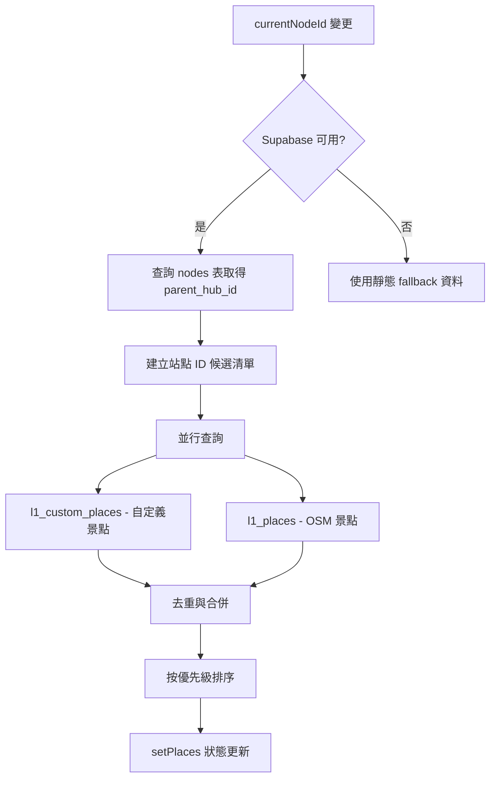
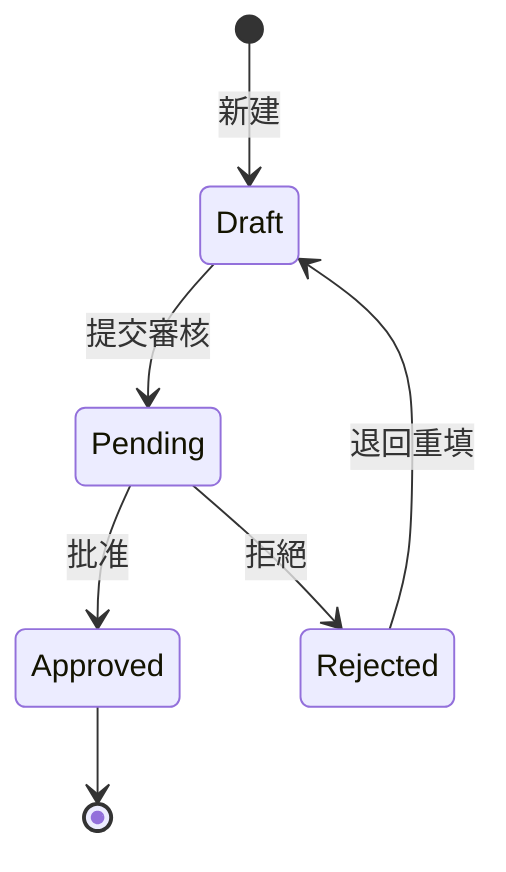

# LUTAGU(ルタグ) L1 數據系統架構確認報告

**建立日期**: 2026-01-06  
**版本**: v1.0  
**目的**: 為後續優化工作奠定基礎

---

## 1. 執行摘要

本報告針對 LUTAGU(ルタグ) 系統中的 L1 數據（站點周邊設施與景點資料）進行全面的系統架構分析，涵蓋資料庫結構設計、前端展示機制及後台管理系統三大面向。經過詳細調查後，確認系統採用雙資料來源架構（OSM 原始數據 + 自定義合作店家），並建立了完整的人工審核流程。

---

## 2. L1 數據庫結構設計分析

### 2.1 核心資料表架構

#### 2.1.1 `l1_places` - OSM 景點原始資料表

| 欄位名稱 | 資料類型 | 說明 |
|---------|---------|------|
| `id` | UUID | 主鍵，自動產生 |
| `station_id` | TEXT | 關聯站點 ID（如 `odpt:TokyoMetro.Ueno`） |
| `osm_id` | BIGINT | OpenStreetMap 節點 ID |
| `name` | TEXT | 原始名稱 |
| `name_i18n` | JSONB | 多語言名稱 `{ja, en, zh-TW, zh-CN, ko}` |
| `category` | TEXT | 設施類別（如 `restaurant`, `shop`） |
| `location` | geography(Point, 4326) | PostGIS 地理坐標 |
| `tags` | JSONB | OSM 原始標籤 |
| `created_at` | TIMESTAMPTZ | 建立時間 |
| `distance_meters` | NUMERIC | 與站點的距離（公尺） |

**完整性約束**:
- 唯一約束: `(station_id, osm_id)` 防止重複匯入
- RLS 策略: 允許公開讀取，服務角色可寫入

#### 2.1.2 `l1_custom_places` - 自定義景點/合作店家資料表

| 欄位名稱 | 資料類型 | 說明 |
|---------|---------|------|
| `id` | UUID | 主鍵 |
| `station_id` | TEXT | 所屬站點 ID |
| `name_i18n` | JSONB | 多語言名稱 |
| `description_i18n` | JSONB | 多語言描述 |
| `category` | TEXT | 類別 |
| `subcategory` | TEXT | 子類別 |
| `location` | geography(Point, 4326) | PostGIS 坐標 |
| `is_partner` | BOOLEAN | 是否為合作店家 |
| `partner_id` | UUID | 關聯合作店家 ID |
| `affiliate_url` | TEXT | 聯盟行銷連結 |
| `discount_info` | JSONB | 折扣資訊 |
| `business_hours` | JSONB | 營業時間 |
| `priority` | INTEGER | 顯示優先級（預設 100） |
| `status` | TEXT | 審核狀態 (`draft`/`pending`/`approved`/`rejected`) |
| `is_active` | BOOLEAN | 軟刪除標記 |

#### 2.1.3 `node_l1_config` - L1 數據審核配置表

| 欄位名稱 | 資料類型 | 說明 |
|---------|---------|------|
| `node_id` | TEXT | 站點節點 ID |
| `source_table` | TEXT | 來源資料表 (`l1_places`/`l1_custom_places`) |
| `source_id` | TEXT | 來源記錄 ID |
| `category` | TEXT | 類別 |
| `is_approved` | BOOLEAN | 審核通過狀態 |
| `is_featured` | BOOLEAN | 精選標記 |
| `notes` | TEXT | 審核備註 |
| `approved_at` | TIMESTAMPTZ | 審核時間 |
| `display_order` | INTEGER | 顯示順序 |

### 2.2 索引配置

```sql
-- 複合索引優化查詢效能
CREATE INDEX idx_l1_config_node_status ON node_l1_config(node_id, is_approved, category);
CREATE INDEX idx_l1_places_station_category ON l1_places(station_id, category);
CREATE INDEX idx_l1_custom_places_active ON l1_custom_places(is_active, status);

-- PostGIS 空間索引
CREATE INDEX idx_l1_places_location ON l1_places USING GIST(location);
```

### 2.3 視圖與函數

**關鍵視圖**:
- `v_l1_pending`: 待審核的 L1 數據
- `v_l1_approved`: 已批准的 L1 數據
- `v_l1_quick_stats`: 快速統計資訊
- `mv_l1_stats_cache`: 統計資料的物化視圖緩存

**關鍵函數**:
- `approve_l1_place(source_id, notes)`: 批准單條記錄
- `reject_l1_place(source_id, notes)`: 拒絕單條記錄
- `bulk_approve_l1_by_station(node_id, notes)`: 按站點批量批准
- `get_l1_global_stats()`: 獲取全局統計

### 2.4 資料流向

```
OSM 數據源 → Scraper 爬蟲 → /api/l1/ingest → l1_places 表
              ↓
         人工審核 → node_l1_config 表
              ↓
自定義店家 → /api/admin/l1/places → l1_custom_places 表
              ↓
         人工審核 → status = 'approved'
```

---

## 3. 前端展示機制分析

### 3.1 資料獲取 Hook: `useL1Places`

**位置**: [`src/hooks/useL1Places.ts`](src/hooks/useL1Places.ts)

**資料獲取流程**:



**優先級邏輯**:
1. 自定義景點 > OSM 景點
2. 合作店家 > 一般景點
3. 手動設定 priority > 距離排序

### 3.2 地圖圖層: `L1Layer`

**位置**: [`src/components/map/L1Layer.tsx`](src/components/map/L1Layer.tsx)

- 使用 React Leaflet Marker 渲染
- 合作店家使用特殊圖標（PARTNER_ICON）
- Popup 顯示基本資訊與導航連結

### 3.3 站點詳情組件: `L1_DNA`

**位置**: [`src/components/node/L1_DNA.tsx`](src/components/node/L1_DNA.tsx)

**UI 結構**:
```
L1_DNA 組件
├── DNA 標題區塊
│   ├── tagline（站點特色標語）
│   └── vibe_tags（氛圍標籤）
├── 類別統計區塊
│   └── categories 列表（可過濾）
└── 地點列表 Drawer
    ├── PlaceCard 組件
    └── 分類子過濾器
```

### 3.4 PlaceCard 組件

**功能**:
- 顯示景點名稱、類別、距離
- 顯示折扣資訊（合作店家）
- 導航連結與營業時間

### 3.5 API 端點

| 端點 | 方法 | 功能 |
|------|------|------|
| `/api/l1/places` | GET | 獲取站點周邊 L1 數據 |
| `/api/l1/ingest` | POST | 匯入 OSM 數據 |

**查詢參數**:
- `stationId`: 站點 ID（必要）
- `category`: 分類過濾
- `includePartnerOnly`: 只顯示合作店家

---

## 4. 後台管理系統架構分析

### 4.1 管理功能模組

**頁面結構**:
```
/admin/l1-places/
├── /                       L1 地點清單與管理
├── /new/                   新建地點
├── /[id]/                  編輯地點
├── /batch/                 批量匯入/匯出
└── /analytics/             數據分析儀表板

/admin/l1-audit/
└── L1 數據審核介面
```

### 4.2 API 端點矩陣

| 端點 | 方法 | 功能 |
|------|------|------|
| `/api/admin/l1/places` | GET | 列表查詢（分頁、過濾、排序） |
| `/api/admin/l1/places` | POST | 新建地點 |
| `/api/admin/l1/places` | PATCH | 批量更新 |
| `/api/admin/l1/places/[id]` | GET | 取得單筆 |
| `/api/admin/l1/places/[id]` | PUT | 更新單筆 |
| `/api/admin/l1/places/[id]` | DELETE | 軟刪除 |
| `/api/admin/l1/places/[id]/approve` | POST | 批准 |
| `/api/admin/l1/places/[id]/reject` | POST | 拒絕 |
| `/api/admin/l1/places/pending` | GET | 待審核清單 |
| `/api/admin/l1/places/pending/batch` | POST | 批量審核 |
| `/api/admin/l1/places/batch` | POST | 批量匯入 |
| `/api/admin/l1/places/batch` | GET | 匯出 CSV/JSON |
| `/api/admin/l1/places/analytics` | GET | 統計分析 |

### 4.3 人工審核流程



### 4.4 權限控制

- 使用 `service_role` 金鑰進行後台操作（跳過 RLS）
- 前端頁面需登入認證（依賴 NextAuth.js）
- 無細緻的 Role-Based Access Control（RBAC）

### 4.5 審核紀錄追蹤

- `approved_at`: 審核時間戳
- `approved_by`: 審核者（需擴充）
- `notes`: 審核備註
- `updated_at`: 自動更新

---

## 5. 完整資料流架構圖

```mermaid
flowchart TB
    subgraph 資料層
        DB[(Supabase PostgreSQL)]
    end
    
    subgraph OSM 數據源
        OSM[OpenStreetMap]
        Scraper[L1 V29 Scraper]
    end
    
    subgraph 後台管理
        AdminUI[後台管理介面]
        Audit[L1 審核模組]
        Analytics[分析儀表板]
    end
    
    subgraph API 層
        IngestAPI[/api/l1/ingest]
        PublicAPI[/api/l1/places]
        AdminAPI[/api/admin/l1/*]
    end
    
    subgraph 前端展示
        Map[地圖 L1Layer]
        DNAPanel[L1_DNA 面板]
        PlaceCard[PlaceCard 組件]
    end
    
    OSM --> Scraper
    Scraper --> IngestAPI
    IngestAPI --> DB
    
    AdminUI --> AdminAPI
    AdminAPI --> DB
    Audit --> DB
    Analytics --> DB
    
    PublicAPI --> DB
    Map --> PublicAPI
    DNAPanel --> PublicAPI
    PlaceCard --> PublicAPI
```

---

## 6. 相依性與介面規格

### 6.1 資料庫相依

| 依賴 | 版本 | 用途 |
|-----|------|------|
| PostgreSQL | 14+ | 主資料庫 |
| PostGIS | 3.x | 空間資料處理 |
| pgvector | 0.5+ | 向量搜尋（未來擴充） |

### 6.2 前端依賴

| 套件 | 版本 | 用途 |
|-----|------|------|
| React | 18+ | UI 框架 |
| react-leaflet | 4+ | 地圖渲染 |
| next-intl | 14+ | 多語言支援 |
| zustand | 4+ | 狀態管理 |

### 6.3 API 介面規格

**L1 Places 清單 API** (`/api/l1/places`):

```typescript
// Request
GET /api/l1/places?stationId=odpt:TokyoMetro.Ueno&category=restaurant

// Response
{
  places: [{
    id: string,
    name: string,
    name_i18n: Record<string, string>,
    category: string,
    location: { lat: number, lng: number },
    isPartner: boolean,
    affiliateUrl?: string,
    discountInfo?: { type, value, description },
    priority: number
  }]
}
```

---

## 7. 瓶頸、風險點與優化建議

### 7.1 效能瓶頸

| 項目 | 風險等級 | 說明 | 優化建議 |
|-----|---------|------|---------|
| `useL1Places` 多次查詢 | 中 | 每次渲染可能觸發多個查詢 | 實作 React Query 或 SWR 快取 |
| 空間索引未優化 | 低 | 大範圍查詢可能慢 | 考慮分區表或 Quadtree |
| 無分頁機制 | 中 | 大量 L1 數據一次載入 | 前端分頁 + Cursor-based 分頁 |
| 統計查詢即時計算 | 低 | `/analytics` 無法快取 | 使用物化視圖或 Redis |

### 7.2 架構風險

| 項目 | 風險等級 | 說明 | 緩解措施 |
|-----|---------|------|---------|
| 雙資料來源去重邏輯 | 中 | 50m 距離判斷可能誤判 | 加入名稱相似度比對 |
| 軟刪除 vs 硬刪除 | 低 | `is_active` 標記累積垃圾資料 | 建立定期清理任務 |
| 缺少事務管理 | 中 | 批量操作非原子性 | 使用 PostgreSQL 事務 |
| 無資料版本控制 | 低 | 無法追蹤修改歷史 | 加入 `updated_by` 欄位 |

### 7.3 安全性考量

| 項目 | 風險等級 | 說明 | 改善建議 |
|-----|---------|------|---------|
| 審核者身份記錄 | 中 | `approved_by` 未實作 | 擴充審核欄位 |
| API 缺少速率限制 | 中 | 無防濫用機制 | 實作 Rate Limiting |
| 合作店家敏感資料 | 低 | `affiliate_url` 可見 | 考慮資料脫敏 |

### 7.4 優先順序建議

| 優先級 | 任務 | 預期效益 |
|-------|------|---------|
| P0 | 實作資料快取機制 | 顯著提升載入效能 |
| P0 | 加入 API 速率限制 | 防止濫用與 DDoS |
| P1 | 實作審核者身份追蹤 | 符合合規要求 |
| P1 | 建立批量操作事務 | 資料一致性保障 |
| P2 | 實作分頁機制 | 支援大規模數據 |
| P2 | 建立資料清理排程 | 維護資料品質 |

---

## 8. 結論

經過全面分析，LUTAGU(ルタグ) 的 L1 數據系統已建立穩固的基礎架構：

**優勢**:
- 完善的雙資料來源架構（OSM + 自定義）
- 完整的人工審核流程
- 多語言支援完善
- 空間資料處理專業（PostGIS）

**待改善**:
- 前端效能優化（快取機制）
- 安全性加強（RBAC、審核追蹤）
- 批次作業可靠性（事務管理）

本報告所列之優化建議可作為後續開發工作的優先順序參考，確保系統在擴充性、效能與安全性方面持續精進。

---

**報告建立者**: Kilo Code (Architect Mode)  
**下次檢視日期**: 2026-02-06
