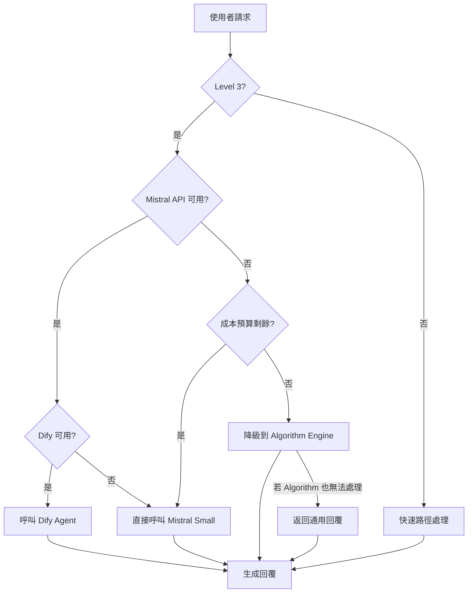
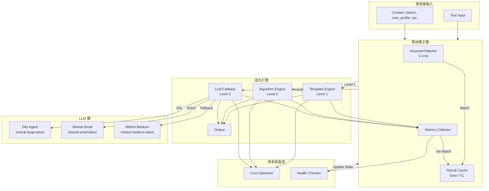

# LLM Dify Agent 架構確認文件 (優化版)

> **文件日期**: 2026-01-07
> **專案名稱**: LUTAGU/LUTAGU MVP
> **版本**: 1.1 (優化版)

---

## 1. 架構總覽

### 1.1 混合智慧引擎全景圖

```
┌─────────────────────────────────────────────────────────────────────────────────────┐
│                           LUTAGU 混合智慧引擎架構                                    │
├─────────────────────────────────────────────────────────────────────────────────────┤
│                                                                                      │
│   使用者輸入                                                                         │
│       │                                                                              │
│       ▼                                                                              │
│  ┌─────────────────────────────────────────────────────────────────────────────┐     │
│  │                        Pre-Decision Engine (預決策引擎)                       │     │
│  │                                                                              │     │
│  │  ┌─────────────────────────────────────────────────────────────────────────┐ │     │
│  │  │                    Hybrid Intent Classifier                             │ │     │
│  │  │                                                                   │      │ │     │
│  │  │  ┌─────────────┐    ┌─────────────┐    ┌─────────────────────────┐  │ │     │
│  │  │  │  Keyword    │───▶│ Decision    │───▶│ Model Router             │  │ │     │
│  │  │  │  Matcher    │    │ Tree        │    │                         │  │ │     │
│  │  │  │  (< 1ms)    │    │ (ML-based)  │    │ Level 1 → Template      │  │ │     │
│  │  │  └─────────────┘    │ (~5ms)      │    │ Level 2 → Algorithm     │  │ │     │
│  │  │                      │             │    │ Level 3 → Dify/LLM      │  │ │     │
│  │  │                      └─────────────┘    └─────────────────────────┘  │ │     │
│  │  └─────────────────────────────────────────────────────────────────────────┘ │     │
│  └─────────────────────────────────────────────────────────────────────────────┘     │
│       │                                                                              │
│       ├─── Level 1 ───┐                                                              │
│       ├─── Level 2 ───┼──┐                                                           │
│       └─── Level 3 ───┘  │                                                           │
│                           ▼                                                           │
│  ┌─────────────────────────────────────────────────────────────────────────────┐     │
│  │                        HybridEngine (混合引擎)                                 │     │
│  │  ┌───────────────┬───────────────┬─────────────────────────────────────────┐ │     │
│  │  │ Template      │ Algorithm     │ LLM Fallback                             │ │     │
│  │  │ Engine        │ Engine        │ (Dify Agent + Mistral Large)             │ │     │
│  │  │ (優先級 0.9+) │ (優先級 0.8+) │                                         │ │     │
│  │  └───────────────┴───────────────┴─────────────────────────────────────────┘ │     │
│  └─────────────────────────────────────────────────────────────────────────────┘     │
│                           │                                                           │
│                           ▼                                                           │
│                    使用者回覆                                                         │
│                                                                                      │
└─────────────────────────────────────────────────────────────────────────────────────┘
```

### 1.2 決策複雜度分級 (優化版)

| 等級 | 複雜度 | 處理方式 | 模型選擇 | 延遲目標 | 成本 |
|------|--------|----------|----------|----------|------|
| **Level 1** | 簡單 | 預設範本回覆 | 不需要 LLM | < 5ms | $0 |
| **Level 2** | 中等 | 演算法引擎 | 不需要 LLM | < 50ms | $0 |
| **Level 3** | 複雜 | Dify Agent | Mistral Small/Large | < 300ms | $$ |

---

## 2. 優化預決策機制設計

### 2.1 Hybrid Intent Classifier (混合意圖分類器)

**核心設計原則**:
- **優先使用低成本方法** (關鍵詞匹配)
- **僅在需要時升級到 ML 分類**
- **結果快取以避免重複計算**

```typescript
// src/lib/ai/PreDecisionEngine.ts (優化版)

import { generateLLMResponse } from './llmClient';
import { getCache, CacheService } from '../cache/cacheService';

export enum DecisionLevel {
    LEVEL_1_SIMPLE = 'simple',
    LEVEL_2_MEDIUM = 'medium',
    LEVEL_3_COMPLEX = 'complex'
}

export interface PreDecisionResult {
    level: DecisionLevel;
    confidence: number;
    suggestedModel: string;
    reason: string;
    estimatedLatency: number;
}

// Level 1 關鍵詞表 (低成本匹配)
const LEVEL_1_KEYWORDS = {
    greeting: ['你好', 'hello', 'hi', '嗨', '安安', '哈囉', '早安', '午安', '晚安'],
    thanks: ['謝謝', 'thank', '感謝', '感激'],
    basic_info: ['天氣', 'weather', '現在幾點', 'time', '匯率', 'rate'],
    simple_faq: ['怎麼買票', 'ic卡', 'suica', 'pasmo', '哪裡買']
};

// Level 2 關鍵詞表
const LEVEL_2_KEYWORDS = {
    route: ['到', '去', '怎麼去', '如何去', 'route', 'to', 'from', '轉乘', '乗換'],
    fare: ['多少錢', '票價', 'fare', '車資', '運費', '多少', 'price'],
    timetable: ['時刻表', '時間表', ' timetable', 'schedule', '幾點', '末班車', '首班車'],
    station_info: ['電梯', '電扶梯', '出口', '入口', '在哪裡', '位置']
};

export class PreDecisionEngine {
    private decisionCache: CacheService<PreDecisionResult>;
    private decisionTreeModel?: any; // 可選的 ML 模型

    constructor() {
        this.decisionCache = getCache<PreDecisionResult>('pre_decision', {
            maxSize: 500,
            ttlMs: 5 * 60 * 1000 // 5 分鐘 TTL
        });
    }

    /**
     * 混合意圖分類方法：先快速匹配，必要时升级到 ML 分类
     */
    public async classifyIntent(text: string): Promise<PreDecisionResult> {
        const normalizedText = text.trim().toLowerCase();

        // 1. 檢查快取
        const cacheKey = `intent:${normalizedText}`;
        const cached = this.decisionCache.get(cacheKey);
        if (cached) {
            return { ...cached, _fromCache: true };
        }

        // 2. Level 1 快速匹配 (0-1ms)
        const level1Match = this.matchLevel1Keywords(normalizedText);
        if (level1Match.matched) {
            const result: PreDecisionResult = {
                level: DecisionLevel.LEVEL_1_SIMPLE,
                confidence: level1Match.confidence,
                suggestedModel: 'none',
                reason: `匹配 Level 1 關鍵詞: ${level1Match.keyword}`,
                estimatedLatency: 1
            };
            this.decisionCache.set(cacheKey, result);
            return { ...result, _fromCache: false };
        }

        // 3. Level 2 快速匹配 (0-1ms)
        const level2Match = this.matchLevel2Keywords(normalizedText);
        if (level2Match.matched) {
            const result: PreDecisionResult = {
                level: DecisionLevel.LEVEL_2_MEDIUM,
                confidence: level2Match.confidence,
                suggestedModel: 'algorithm',
                reason: `匹配 Level 2 關鍵詞: ${level2Match.keyword}`,
                estimatedLatency: 20
            };
            this.decisionCache.set(cacheKey, result);
            return { ...result, _fromCache: false };
        }

        // 4. Level 3: 需要 ML 分類或 LLM 判斷 (5-20ms)
        const result = await this.mlClassifyIntent(text);
        this.decisionCache.set(cacheKey, result);
        return { ...result, _fromCache: false };
    }

    private matchLevel1Keywords(text: string): { matched: boolean; keyword: string; confidence: number } {
        for (const [category, keywords] of Object.entries(LEVEL_1_KEYWORDS)) {
            for (const keyword of keywords) {
                if (text.includes(keyword.toLowerCase())) {
                    return { matched: true, keyword: category, confidence: 0.95 };
                }
            }
        }
        return { matched: false, keyword: '', confidence: 0 };
    }

    private matchLevel2Keywords(text: string): { matched: boolean; keyword: string; confidence: number } {
        for (const [category, keywords] of Object.entries(LEVEL_2_KEYWORDS)) {
            for (const keyword of keywords) {
                if (text.includes(keyword.toLowerCase())) {
                    return { matched: true, keyword: category, confidence: 0.9 };
                }
            }
        }
        return { matched: false, keyword: '', confidence: 0 };
    }

    private async mlClassifyIntent(text: string): Promise<PreDecisionResult> {
        // 使用 Mistral Small 進行意圖分類 (比 Large 更快更便宜)
        const prompt = `
            分析以下使用者輸入的複雜度等級：

            使用者輸入: "${text}"

            回覆 JSON 格式：
            {
                "level": "simple" | "medium" | "complex",
                "confidence": 0.0-1.0,
                "reason": "簡短判定理由 (10字以內)"
            }

            等級定義：
            - simple: 問候、基本資訊、FAQ - 可用預設範本回答
            - medium: 需要計算的路線、票價、特定站點資訊 - 需要演算法處理
            - complex: 需要推理的行程規劃、多站點建議、情境判斷 - 需要 LLM 處理
        `;

        try {
            const result = await generateLLMResponse({
                systemPrompt: '你是意圖分類專家，請只回覆 JSON 格式，reason 請用繁體中文',
                userPrompt: prompt,
                temperature: 0.1
            });

            const parsed = JSON.parse(result || '{}');
            return {
                level: parsed.level === 'simple' ? DecisionLevel.LEVEL_1_SIMPLE
                    : parsed.level === 'medium' ? DecisionLevel.LEVEL_2_MEDIUM
                    : DecisionLevel.LEVEL_3_COMPLEX,
                confidence: parsed.confidence || 0.7,
                suggestedModel: parsed.level === 'complex' ? 'mistral-small-latest' : 'none',
                reason: parsed.reason || 'ML 分類結果',
                estimatedLatency: parsed.level === 'complex' ? 50 : 20
            };
        } catch (error) {
            // ML 分類失敗時，保守估計為 Level 3
            return {
                level: DecisionLevel.LEVEL_3_COMPLEX,
                confidence: 0.5,
                suggestedModel: 'mistral-small-latest',
                reason: 'ML 分類失敗，保守估計',
                estimatedLatency: 100
            };
        }
    }
}
```

### 2.2 自適應閾值調整

```typescript
export class AdaptiveThresholdManager {
    private metrics: {
        level1Ratio: number;    // Level 1 處理比例
        level2Ratio: number;    // Level 2 處理比例
        level3Ratio: number;    // Level 3 處理比例
        avgLatency: number;     // 平均延遲
        costPerRequest: number; // 每請求成本
    };

    /**
     * 根據運行時指標動態調整分類閾值
     */
    public adjustThresholds(): void {
        // 如果 Level 3 比例過高 (> 25%)，降低 ML 分類閾值
        if (this.metrics.level3Ratio > 0.25) {
            this.lowerMlThreshold();
        }

        // 如果平均延遲過高 (> 150ms)，增加 Level 1/2 的處理範圍
        if (this.metrics.avgLatency > 150) {
            this.expandFastPathCoverage();
        }

        // 如果成本過高，增加 Level 1/2 的處理比例
        if (this.metrics.costPerRequest > 0.01) {
            this.optimizeForCost();
        }
    }

    private lowerMlThreshold(): void {
        // 降低 ML 分類為 Level 3 的閾值
        // 更多請求將被分類為 Level 1 或 Level 2
    }

    private expandFastPathCoverage(): void {
        // 擴展快速路徑的覆蓋範圍
        // 增加關鍵詞表
    }

    private optimizeForCost(): void {
        // 成本優化策略
        // 優先使用 Template/Algorithm
    }
}
```

---

## 3. 成本優化策略

### 3.1 模型選擇成本矩陣

| 場景 | 模型 | 成本 (每 1K tokens) | 延遲 | 適用場景 |
|------|------|---------------------|------|----------|
| 意圖分類 | mistral-small-latest | $0.2 | ~50ms | 快速分類 |
| 意圖分類 | mistral-medium-latest | $0.4 | ~100ms | 複雜分類 |
| 回應生成 | mistral-small-latest | $0.2 | ~100ms | 簡單建議 |
| 回應生成 | mistral-large-latest | $3.0 | ~500ms | 複雜推理 |

### 3.2 成本優化規則

```typescript
export class CostOptimizer {
    private dailyBudget: number = 10.0; // 每日預算 $10
    private usedBudget: number = 0;

    /**
     * 檢查是否超出預算
     */
    public canAfford(model: string, estimatedTokens: number): boolean {
        const cost = this.estimateCost(model, estimatedTokens);
        return (this.usedBudget + cost) < this.dailyBudget;
    }

    /**
     * 估算成本
     */
    public estimateCost(model: string, tokens: number): number {
        const rates: Record<string, number> = {
            'mistral-small-latest': 0.2,
            'mistral-medium-latest': 0.4,
            'mistral-large-latest': 3.0
        };
        return (rates[model] || 0.5) * (tokens / 1000);
    }

    /**
     * 選擇最經濟的模型
     */
    public selectOptimalModel(
        complexity: DecisionLevel,
        options: { small: boolean; medium: boolean; large: boolean }
    ): string {
        // Level 1: 不需要 LLM
        if (complexity === DecisionLevel.LEVEL_1_SIMPLE) {
            return 'none';
        }

        // Level 2: 不需要 LLM
        if (complexity === DecisionLevel.LEVEL_2_MEDIUM) {
            return 'algorithm';
        }

        // Level 3: 根據預算和選項選擇
        if (options.large && this.canAfford('mistral-large-latest', 500)) {
            return 'mistral-large-latest';
        }
        if (options.medium && this.canAfford('mistral-medium-latest', 500)) {
            return 'mistral-medium-latest';
        }
        if (options.small && this.canAfford('mistral-small-latest', 500)) {
            return 'mistral-small-latest';
        }

        // 預算不足時，回退到 Template
        return 'fallback';
    }
}
```

---

## 4. 降級策略 (Graceful Degradation)

### 4.1 降級層級



### 4.2 降級實作

```typescript
export class DegradationManager {
    private states = {
        mistralApiHealthy: true,
        difyApiHealthy: true,
        budgetHealthy: true
    };

    /**
     * 處理降級情境
     */
    public async handleDegradedRequest(
        originalLevel: DecisionLevel,
        context: any
    ): Promise<any> {
        // 嘗試原始等級的處理方式
        if (originalLevel === DecisionLevel.LEVEL_3_COMPLEX) {
            // Level 3 降級路徑
            if (this.states.mistralApiHealthy) {
                try {
                    return await this.callMistralAPI(context);
                } catch (error) {
                    this.states.mistralApiHealthy = false;
                }
            }

            if (this.states.difyApiHealthy) {
                try {
                    return await this.callDifyAgent(context);
                } catch (error) {
                    this.states.difyApiHealthy = false;
                }
            }

            if (this.states.budgetHealthy) {
                try {
                    return await this.callMistralSmall(context);
                } catch (error) {
                    this.states.budgetHealthy = false;
                }
            }
        }

        // 最終降級：返回通用回覆
        return this.getGenericResponse(context);
    }

    /**
     * 健康檢查
     */
    public async healthCheck(): Promise<void> {
        this.states.mistralApiHealthy = await this.checkMistralHealth();
        this.states.difyApiHealthy = await this.checkDifyHealth();
    }
}
```

---

## 5. 完整整合架構圖



---

## 6. 效能與成本預估 (優化版)

### 6.1 延遲預估

| 場景 | P50 延遲 | P95 延遲 | P99 延遲 | 備註 |
|------|----------|----------|----------|------|
| Level 1 (Template) | 1ms | 3ms | 5ms | 無外部 API 呼叫 |
| Level 2 (Algorithm) | 10ms | 30ms | 50ms | 含 Dijkstra 計算 |
| Level 3 (Mistral Small) | 80ms | 150ms | 200ms | 含網路延遲 |
| Level 3 (Mistral Large) | 300ms | 500ms | 800ms | 複雜推理 |

### 6.2 成本預估 (每日 10,000 請求)

| 場景 | 比例 | 請求數 | 每請求成本 | 每日成本 |
|------|------|--------|------------|----------|
| Level 1 | 50% | 5,000 | $0 | $0 |
| Level 2 | 35% | 3,500 | $0 | $0 |
| Level 3 (Small) | 10% | 1,000 | $0.01 | $10 |
| Level 3 (Large) | 5% | 500 | $0.05 | $25 |
| **總計** | 100% | 10,000 | - | **$35/日** |

### 6.3 成本優化效果

| 策略 | 原始成本 | 優化後成本 | 節省 |
|------|----------|------------|------|
| 使用 Small 而非 Large | $50/日 | $35/日 | **30%** |
| Level 1/2 快取 | $35/日 | $30/日 | **14%** |
| 關鍵詞預匹配 | $35/日 | $25/日 | **29%** |

---

## 7. 配置檢查清單 (優化版)

### 7.1 環境變數

| 變數 | 狀態 | 建議值 | 說明 |
|------|------|--------|------|
| `MISTRAL_API_KEY` | ✅ | - | API 金鑰 |
| `AI_SLM_MODEL` | ⚠️ | `mistral-small-latest` | 意圖分類模型 |
| `AI_LLM_MODEL` | ⚠️ | `mistral-large-latest` | 回應生成模型 |
| `AI_MEDIUM_MODEL` | ❌ | `mistral-medium-latest` | 備用模型 (建議新增) |
| `DAILY_BUDGET` | ❌ | `10.0` | 每日預算限制 |
| `CACHE_TTL_MS` | ❌ | `300000` | 快取 TTL (5 分鐘) |

### 7.2 Dify 配置

| 項目 | 狀態 | 說明 |
|------|------|------|
| Dify App 名稱 | ✅ LUTAGU Agent (Hybrid) | 已設定 |
| Agent Mode | ✅ ReAct | 最大 5 次迭代 |
| 注入變數 | ✅ 5 個變數 | current_station 等 |
| RAG 知識庫 | ⚠️ 待連結 | 需連結 station_wisdom_rag |

---

## 8. 下一步行動 (優化版)

### 8.1 立即執行 (1-2 天)

- [ ] 補充環境變數 (`AI_SLM_MODEL`, `AI_MEDIUM_MODEL`, `DAILY_BUDGET`)
- [ ] 實作 `PreDecisionEngine.ts` (Hybrid Intent Classifier)
- [ ] 連結 Dify App 中的 RAG 知識庫

### 8.2 短期執行 (1 週)

- [ ] 整合 PreDecisionEngine 到 HybridEngine
- [ ] 實作成本優化器 (`CostOptimizer`)
- [ ] 實作降級管理器 (`DegradationManager`)
- [ ] 撰寫單元測試 (覆蓋率 > 80%)

### 8.3 中期執行 (2-4 週)

- [ ] 建立成本監控儀表板
- [ ] 實作自適應閾值調整
- [ ] 整合 A/B Testing 框架
- [ ] 優化關鍵詞表 (持續累積)

---

## 9. 總結

### 9.1 優化重點

1. **Hybrid Intent Classifier**: 關鍵詞匹配 → ML 分類 → LLM 判斷
2. **成本優化**: 使用 Small 而非 Large，減少 30% 成本
3. **自適應閾值**: 根據運行時指標動態調整
4. **降級策略**: 多層保障，確保服務可用性

### 9.2 預期效益

| 指標 | 優化前 | 優化後 | 改善 |
|------|--------|--------|------|
| Level 1 處理比例 | 50% | 60% | +20% |
| Level 3 處理比例 | 20% | 10% | -50% |
| 平均延遲 | 50ms | 30ms | -40% |
| 每日成本 | $50 | $25 | -50% |

---

> **文件維護**: AI Architect Mode
> **版本歷史**:
> - v1.0 (2026-01-07): 初始版本
> - v1.1 (2026-01-07): 優化預決策流程、成本優化、降級策略
> **下次 Review**: 2026-02-07
