# Lutagu 車站節點分組設計方案

> 版本：v1.0
> 日期：2026-01-03
> 狀態：設計定稿，待實作

## 1. 背景與問題陳述

### 1.1 現有問題

東京市中心車站極度密集，同一樞紐可能包含：
- 多個鐵道公司（JR、東京地下鐵、都營、私鐵）
- 同一公司多條路線
- 同一站名但不同出口/月台

**效能問題**：
- Zoom 14+ 渲染最多 1200 個節點
- 每個節點含複雜 SVG icon + 動畫
- 移動端 FPS 明顯下降

**視覺問題**：
- 多公司站點位置相同時標記堆疊
- Zoom 層級跳變時子節點突然湧現
- 用戶無法直觀理解換乘關係

### 1.2 設計目標

1. **效能優先**：地圖只渲染 Hub 節點，減少 60-80% DOM 元素
2. **資訊完整**：L2 頁面清楚呈現所有子站點及換乘關係
3. **轉乘引導**：區分「室內直通」vs「站外換乘」
4. **用戶體驗**：無縫切換，不會遺漏重要資訊

---

## 2. 子節點定義與分組規則

### 2.1 子節點類型

| 類型 | 說明 | 範例 |
|------|------|------|
| **同公司不同路線** | 同一樞紐內同一公司多條月台 | 大手町：丸之內線 + 東西線 + 半藏門線 |
| **不同公司同位置** | 不同公司站體在同一位置 | 上野：JR + 東京地下鐵 + 京成電鐵 |
| **相近站名** | 步行距離 < 300m 的同名站 | 新宿：JR新宿 + 京王新宿 + 小田急新宿 |

### 2.2 分組條件

```
IF 室內通道連接（步行 < 100m）→ 聚合為同一 Hub
ELSE IF 步行距離 ≤ 300m → 聚合為同一 Hub，標記「站外換乘」
ELSE → 獨立 Hub
```

### 2.3 資料模型擴展

```typescript
// nodes table 新增欄位
interface HubMetadata {
  transfer_type: 'indoor' | 'outdoor' | 'adjacent';
  walking_distance_meters?: number;
  indoor_connection_notes?: string; // e.g., "B1F 連絡通道"
  transfer_complexity: 'simple' | 'moderate' | 'complex';
}

// 子站點關聯
interface HubMember {
  member_id: string;
  member_name: LocalizedString;
  operator: string;
  line_name: string;
  transfer_type: 'indoor' | 'outdoor';
  walking_seconds?: number; // 預估步行時間
}
```

---

## 3. 地圖呈現設計（L1 層級）

### 3.1 渲染策略

**永遠只渲染 Hub 節點**，不論 Zoom 層級：

```
┌─────────────────────────────────────┐
│           地圖渲染邏輯               │
├─────────────────────────────────────┤
│  1. 載入時只請求 is_hub=true 的節點  │
│  2. 每個 Hub 顯示單一標記            │
│  3. Hub 旁邊顯示 🔗 符號（表示有子站）│
│  4. 子節點數量顯示在標記右上角badge  │
└─────────────────────────────────────┘
```

### 3.2 Hub 標記設計

```mermaid
graph LR
    A[Hub 標記] --> B[主標記 icon]
    A --> C[子站點數量 badge]
    A --> D[🔗 換乘符號]
    A --> E[站名字標籤]

    style B fill:#4F46E5,stroke:#fff,stroke-width:2px
    style C fill:#1F2937,stroke:#fff,stroke-width:2px
    style D fill:#F59E0B,stroke:#fff,stroke-width:1px
```



**規格**：
- **Icon**：Train icon（代表樞紐），顏色依主要運營商
- **Badge**：圓形背景，深色顯示數字（e.g., "+4"）
- **🔗 符號**：右上角金色小標記
- **站名標籤**：Zoom ≥ 13 時顯示

### 3.3 效能改進

| 指標 | 改進前 | 改進後 |
|------|--------|--------|
| DOM 節點數 | ~1200 | ~300 |
| Render Time | 500ms+ | <150ms |
| Memory | 高 | 低 |
| Zoom 切換流暢度 | 卡頓 | 流暢 |

---

## 4. L2 頁面設計

### 4.1 頁面結構

```
┌─────────────────────────────────────────────────────────┐
│  L2 頁面佈局                                             │
├─────────────────────────────────────────────────────────┤
│  ┌─────────────────────────────────────────────────────┐│
│  │ 🚇 換乘樞紐資訊                                      ││
│  │ [JR上野] + [東京地下鐵] + [京成電鐵]                 ││
│  │ 🔗 室內直通換乘  |  📍 3 個子站點                    ││
│  └─────────────────────────────────────────────────────┘│
│                                                         │
│  ┌─────────────────────────────────────────────────────┐│
│  │ 📍 子站點列表                                        ││
│  │ ├─ JR上野站（山手線・京濱東北線）                   ││
│  │ │     [室內直通] [即時電車資訊]                     ││
│  │ ├─ 東京地下鐵上野站（銀座線・日比谷線）             ││
│  │ │     [室內直通] [即時電車資訊]                     ││
│  │ ├─ 京成上野站                                       ││
│  │ │     [步行 3 分鐘] [站外換乘] [即時電車資訊]       ││
│  │ └─ ...                                              ││
│  └─────────────────────────────────────────────────────┘│
│                                                         │
│  ┌─────────────────────────────────────────────────────┐│
│  │ 🚃 即時電車資訊（主站點）                            ││
│  │ ...                                                  ││
│  └─────────────────────────────────────────────────────┘│
└─────────────────────────────────────────────────────────┘
```

### 4.2 子站點卡片設計

每個子站點卡片包含：

```
┌────────────────────────────────────────┐
│ 🏷️ 子站點名稱                           │
│    公司・路線名稱                        │
├────────────────────────────────────────┤
│ 🔗 換乘狀態標籤                          │
│    ├─ [室內直通] 綠色標籤               │
│    ├─ [步行 3 分鐘] 藍色標籤            │
│    └─ [站外換乘] 橙色標籤               │
├────────────────────────────────────────┤
│ 📍 位置說明                             │
│    "B1F 連絡通路，步行約 3 分鐘"        │
├────────────────────────────────────────┤
│ 🚃 即時電車按鈕                          │
│    [查看電車資訊]                        │
└────────────────────────────────────────┘
```

### 4.3 換乘狀態視覺化

| 狀態 | 標籤 | 顏色 | 說明 |
|------|------|------|------|
| 室內直通 | 🔗 Indoor | 綠色 | 同一建築內，可步行換乘 |
| 近距離 | 🚶 Nearby | 藍色 | 步行 1-3 分鐘 |
| 站外換乘 | 📍 Outdoor | 橙色 | 需要出站換乘 |
| 複雜換乘 | ⚠️ Complex | 紅色 | 步行 5+ 分鐘或多階段 |

---

## 5. 技術實作規劃

### 5.1 資料庫變更

```sql
-- 新增 hub_metadata 表
CREATE TABLE hub_metadata (
    hub_id VARCHAR(100) PRIMARY KEY,
    transfer_type VARCHAR(20) NOT NULL,
    walking_distance_meters INT,
    indoor_connection_notes TEXT,
    transfer_complexity VARCHAR(20),
    created_at TIMESTAMPTZ DEFAULT NOW()
);

-- 新增 hub_members 表
CREATE TABLE hub_members (
    id SERIAL PRIMARY KEY,
    hub_id VARCHAR(100) REFERENCES hub_metadata(hub_id),
    member_id VARCHAR(100) NOT NULL,
    member_name JSONB NOT NULL,
    operator VARCHAR(50) NOT NULL,
    line_name VARCHAR(100),
    transfer_type VARCHAR(20) NOT NULL,
    walking_seconds INT,
    sort_order INT DEFAULT 0,
    UNIQUE(hub_id, member_id)
);

-- 建立索引
CREATE INDEX idx_hub_members_hub_id ON hub_members(hub_id);
CREATE INDEX idx_nodes_parent_hub ON nodes(parent_hub_id);
```

### 5.2 API 變更

**GET /api/nodes/viewport**
```typescript
interface ViewportResponse {
    nodes: NodeDatum[];  // 只包含 is_hub=true
    hub_details: {
        [hubId: string]: {
            member_count: number;
            transfer_type: string;
            members: HubMember[];
        };
    };
}
```

### 5.3 前端組件變更

| 檔案 | 變更項目 |
|------|----------|
| `MapContainer.tsx` | 修改 `ClusteredNodeLayer`，永遠只渲染 Hub |
| `NodeMarker.tsx` | 新增 🔗 符號、badge 樣式 |
| `L2_Live.tsx` | 新增「換乘樞紐資訊」區塊 |
| `fetchNodeConfig()` | 回傳 `hub_members` 資料 |

### 5.4 實作優先順序

```
Phase 1: 基礎設施（1-2 天）
├── 資料庫遷移腳本
├── Hub 成員資料填充
└── API 回傳結構調整

Phase 2: 地圖優化（2-3 天）
├── 移除子節點渲染
├── Hub 標記樣式更新
└── Badge 與 🔗 符號

Phase 3: L2 頁面（3-4 天）
├── 換乘樞紐資訊區塊
├── 子站點卡片列表
└── 換乘狀態標籤

Phase 4: 打磨優化（1-2 天）
├── 載入狀態優化
├── 錯誤邊界處理
└── 動畫流暢度調整
```

---

## 6. 範例情境

### 6.1 上野站

```
┌─────────────────────────────────────────────────────┐
│  上野站（Ueno Station）                              │
│  🔗 室內直通換乘  |  📍 4 個子站點                   │
├─────────────────────────────────────────────────────┤
│                                                     │
│  ├─ 🏷️ JR上野站                                      │
│  │     山手線・京濱東北線・東北本線                  │
│  │     [室內直通]                                    │
│  │                                                     │
│  ├─ 🏷️ 東京地下鐵銀座線上野站                        │
│  │     [室內直通]                                    │
│  │                                                     │
│  ├─ 🏷️ 東京地下鐵日比谷線上野站                      │
│  │     [室內直通]                                    │
│  │                                                     │
│  ├─ 🏷️ 京成電鐵上野站                                │
│  │     [步行 3 分鐘] [站外換乘]                      │
│  │     "經不忍口出站，步行至京成售票處"               │
│  │                                                     │
│  └─ 🏷️ JR東日本上野入谷口                            │
│       [步行 2 分鐘]                                  │
│                                                     │
└─────────────────────────────────────────────────────┘
```

### 6.2 新宿站

```
┌─────────────────────────────────────────────────────┐
│  新宿站（Shinjuku Station）                          │
│  ⚠️ 複雜換乘  |  📍 7 個子站點                       │
├─────────────────────────────────────────────────────┤
│                                                     │
│  ├─ 🏷️ JR新宿站（南口・西口・東口）                  │
│  │     山手線・中央線・總武線・湘南新宿線             │
│  │     [室內直通]                                    │
│  │                                                     │
│  ├─ 🏷️ 東京地下鐵丸之內線新宿站                      │
│  │     [室內直通]                                    │
│  │                                                     │
│  ├─ 🏷️ 都營大江戶線新宿站                            │
│  │     [步行 5 分鐘] [站外換乘]                      │
│  │     "使用中央東口連絡通道"                        │
│  │                                                     │
│  ├─ 🏷️ 京王線新宿站                                  │
│  │     [步行 4 分鐘]                                 │
│  │                                                     │
│  ├─ 🏷️ 小田急線新宿站                                │
│  │     [步行 4 分鐘]                                 │
│  │                                                     │
│  ├─ 🏷️ 西武新宿站                                    │
│  │     [步行 6 分鐘] [複雜換乘]                      │
│  │     "需經地下道至西武新宿站"                      │
│  │                                                     │
│  └─ 🏷️ 新宿高速巴士總站                              │
│       [步行 3 分鐘]                                  │
│                                                     │
└─────────────────────────────────────────────────────┘
```

---

## 7. 未來擴展

1. **室內地圖整合**：未來可加入站內 Floor Plan
2. **即時換乘時間**：整合客流數據，顯示預估換乘時間
3. **無障礙路徑**：標註電梯/手扶梯位置
4. **擁擠度顯示**：顯示各月台即時擁擠程度

---

## 8. 驗收標準

- [ ] 地圖渲染節點數減少 60% 以上
- [ ] L2 頁面清楚顯示所有子站點
- [ ] 換乘狀態標籤準確無誤
- [ ] 移動端 FPS 提升至 50+
- [ ] Zoom 切換無閃爍或卡頓
